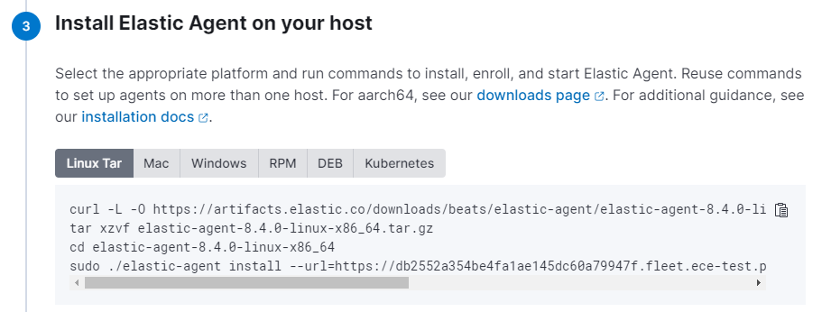

# Shipping data to Elastic

Once your deployment is created, you might want to ship data to it from your log sources with Elastic Agent and Fleet. This document guides you through the process.

## Definition of Terms

Before we start, let's define some terms you will encounter throughout this document.

|TERM    |DEFINITION |
|:-------------------------|:--------------------|
| Elastic Agent  | The log collection component that will be installed client-side on log sources. It is the only component to install since it brings all the beats and manages them and their configurations on the client.   |
| Fleet Server         | A component in your deployment that manages all agents downstream. All settings in Fleet are made in Kibana.|
| Integration   | In this context, it is a pre-configured (mostly provided by Elastic) set of agent settings, ingest pipelines and Kibana dashboards for a specific type of log source (e.g. Tomcat, nginx, MySQL, Cisco Equipment, ...). Integrations are readily available for most common log sources (see: [https://www.elastic.co/integrations/data-integrations](https://www.elastic.co/integrations/data-integrations))    |
|Agent Policy  | A collection of agent settings and integrations (in the form of a policy) that tells the agent and the underlying beats what data to collect and from where. You need a separate agent policy for each **type** of log source. When, for example, all your MySQL Databases store their logs in the same local path (which they should anyway), one agent policy for MySQL databases is sufficient. An agent policy can contain multiple integrations and thus an agent can collect logs from **multiple** applications on the same log source. You **cannot** have more than one policy for one agent. Let's assume that on some hosts you only have Apache httpd installed, while on other hosts you have httpd and Tomcat installed. Then you need (at least) two agent policies: one for httpd and one for httpd+tomcat.                |
| Enrollment Token | Is required by the agent when starting on the client node. It serves two purposes: First, it provides the initial authentication of the agent to the Fleet and Elastic servers. Second, it references exactly one agent policy, so that Fleet server can tell the agent which log sources to collect data from. Each agent policy has at least one enrollment token. Enrollment tokens are **sensitive** data by nature and should therefore be stored securely.|

## Create an Agent Policy

As the agent policy defines for the agent which logs to collect, it must be defined first. Define one agent policy per type of log source.

In Kibana, go to **Fleet → Agent Policies**. Create a new agent policy and give it a meaningful name (it should not be necessary to change the **Advanced** options). Then click on your new integration, and you will see that one integration is already pre-configured: the system integration, which collects system logs and metrics from the client machine itself. Linux, Windows or macOS? No need to worry, the agent will figure this out and configure correctly.

Depending on the type of log source you want to collect data from, add other integrations, e.g. here for Apache products:

By clicking on the tile, you will not only get an overview of the integration's features and components. After clicking on **Add Integration**, you can also customize its settings on the following page. The content of that page of course depends a lot on the type of Integration. However, if - for example - you store your MySQL Logs in a different path than the default, you can change that here. It will probably look something like this:

## Get the Enrollment Token

For each agent policy, an enrollment token named Default is automatically created. It can be retrieved from Kibana anytime.

## Install the Agent on your Client Node

A wizard in Kibana guides you through the process of installing the agent on the client. For the first rollout of such type, start the installation from **Kibana → Fleet → Agents → Add Agent**. For more agents using the same policy, you can also automate this, as the installation commands and parameters are identical.

Select the correct agent policy for the client you want to deploy. Keep **Enroll in Fleet** checked. Then, Kibana will present you with different options for the commands to run on the client machine:

The URL Parameter is automatically set to the deployment you are currently in, and the enrollment token points to the agent policy. Once these commands are executed on the client machine, the agent registers itself at the Fleet server and appears in the agent list in Kibana.

All subsequent deployments of agents with the same agent policy have the same set of commands and parameters. You don't have to go through the wizard again. This means you can automate this part in the tool of your choice.

## Post-Installation Tasks

Make sure to check the Lifecycle Policies (ILM), including **all** those deployed by the system like **logs** and **metrics**. By default, they are deployed with **infinite** lifetime. We recommend to change that.

Discover the fancy new dashboards that come with each additional integration.

Familiarize yourself with the Fleet Menu in Kibana. Check for possible updates of agent versions or integrations. All of this can be done through Fleet in Kibana, you don't have to log in on the client computers.
