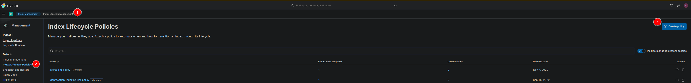
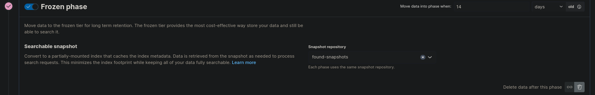
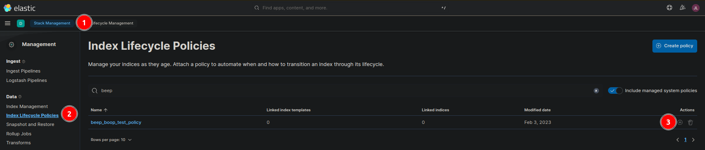

# Anpassen von Lifecycle Policies
{: .no_toc}

Dieses Dokument beschreibt, wie Sie die (Standard) Index Lifecycle Policies (ILM) anpassen können.

- Content
{:toc}

## Begriffsklärung

Bevor wir beginnen, möchten wir einige Begriffe erklären, die in diesem Dokument verwendet werden.

|Begriff             |Definition           |
|:-------------------------|:--------------------|
| ILM           | Abkürzung für Index Lifecycle Management. Bestimmt den Lebenszyklus Ihrer Daten sowie deren Zuordnung zu den verschiedenen Phasen. Wird in Richtlinien definiert ("Index Lifecycle Policies"). |
| Data stream  | Der Datenstrom ist eine Sammlung einzelner Indizes. Man könnte es fast als kleines DNS (Domain Name System) für das Routing von Anfragen an Indizes betrachten. Ein Datenstrom kann mehrere Indizes enthalten.     |
| Rollover     | Prozess der (automatischen) Erstellung eines neuen Indexes innerhalb eines Datenstroms in der Hot Phase, sodass ein einzelner Index nicht unbegrenzt wächst. Er ist in der Hot Phase der ILM-Richtlinie definiert. |

## Auffinden der zugeordneten ILM-Richtlinie

Bei Verwendung des Elastic Agents und Fleet gelten Standardrichtlinien für die Datenströme. Diese Richtlinien sind einfach gehalten und beinhalten nur wenige Phasen, oft sogar nur die Hot Phase.

Die auf die Datenströme angewendete Richtlinie finden Sie in Kibana.


1. Öffnen Sie Kibana.
1. Wählen Sie im Menü **Stack Management** aus.
1. Öffnen Sie **Index Management** und gehen Sie zu **Data Streams**.
1. Im Popup rechts sehen Sie die zugeordnete ILM Richtlinie.


## Erstellen einer neuen ILM Richtlinie

### Verwenden der Benutzeroberfläche (UI)

1. Um eine neue ILM-Richtlinie zu erstellen, wählen Sie **Stack Management**.
2. Wählen Sie **Index Lifecycle Management** und klicken Sie auf **Create Policy**.
3. Geben Sie einen neuen Namen für die Richtlinie ein.



#### Hot Phase

In der Hot Phase werden alle Daten gespeichert, die neu indiziert werden und auf die ständig zugegriffen wird. Sie ist immer die erste Phase und daher verpflichtend. In unserem Beispiel haben wir den Schalter "Use recommended default" deaktiviert, um das maximale Alter der Daten bis zum Rollover vom Standardwert von 30 Tagen auf 7 Tage zu verkürzen.


#### Warm Phase

Nachdem 7 Tage lang Daten gesammelt wurden oder der Index eine Größe von 50 GB erreicht hat, sollen die Indizes unmittelbar in die zweite Phase, die sogenannte Warm Phase, übergehen. In dieser Stufe wird die Priorität der Indizes reduziert und auf "schreibgeschützt" gesetzt.


#### Cold Phase

Nach 7 Tagen in der Warm Phase gehen die Daten in die nächste Phase über, die sogenannte Cold Phase. In dieser Phase können durchsuchbare Snapshots verwendet werden, um den Platzbedarf auf den Elastic Instanzen zu verringern. Die Snapshots sind im Object Storage gespeichert, der selbst schon hochverfügbar ausgelegt ist. Daher können wir die Anzahl der Replikate und die Priorität auf Null setzen.


#### Frozen Phase

In dieser Phase werden die Daten von den Elastic Knoten entfernt und nur ein kleiner Cache verbleibt hier. Wenn auf die Daten zugegriffen wird, werden diese aus dem Snapshot geholt und bereitgestellt.



#### Delete Phase

In dieser Phase werden die Indizes entfernt, die ein bestimmtes Alter erreicht haben.


### Verwenden von Dev Tools

Alternativ kann auch in den Dev Tools von Kibana eine neue ILM-Richtlinie erstellt werden. Die Konsole finden Sie in Kibana unter **Management → Dev Tools**.

```bash
PUT _ilm/policy/<add-some-name-here>
{
  "policy": {
    "phases": {
      "hot": {
        "min_age": "0ms",
        "actions": {
          "rollover": {
            "max_primary_shard_size": "50gb",
            "max_age": "7d"
          },
          "set_priority": {
            "priority": 100
          }
        }
      },
      "warm": {
        "min_age": "0d",
        "actions": {
          "set_priority": {
            "priority": 50
          },
          "readonly": {}
        }
      },
      "cold": {
        "min_age": "7d",
        "actions": {
          "readonly": {},
          "searchable_snapshot": {
            "snapshot_repository": "found-snapshots",
            "force_merge_index": true
          },
          "set_priority": {
            "priority": 0
          },
          "allocate": {
            "number_of_replicas": 0
          }
        }
      },
      "frozen": {
        "min_age": "14d",
        "actions": {
          "searchable_snapshot": {
            "snapshot_repository": "found-snapshots",
            "force_merge_index": true
          }
        }
      },
      "delete": {
        "min_age": "70d",
        "actions": {
          "delete": {
            "delete_searchable_snapshot": true
          }
        }
      }
    }
  }
}
```

## Zuweisen der Richtlinie zu einem Index

Die neu erstellte Richtlinie kann dann über das Menü **Index Lifecycle Policies** z.B. einem Index Template zugewiesen werden.




## Rollover des Data Streams

Damit die neue ILM-Richtlinie sofort benutzt wird, muss ein Rollover für den Datenstrom angestoßen werden. Dies kann auch in den Dev Tools von Kibana erfolgen, hier am Beispiel für den Datenstrom auditbeat-8.5.0:

```bash
POST auditbeat-8.5.0/_rollover
```
