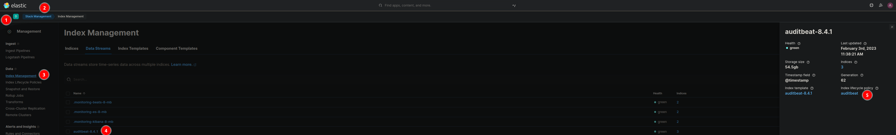
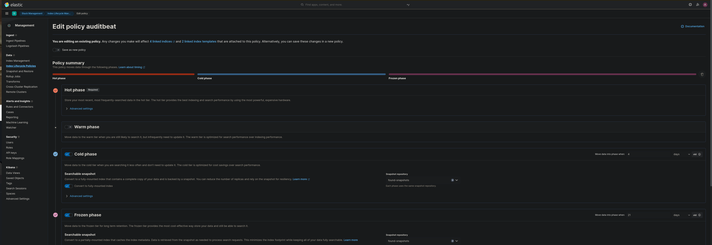
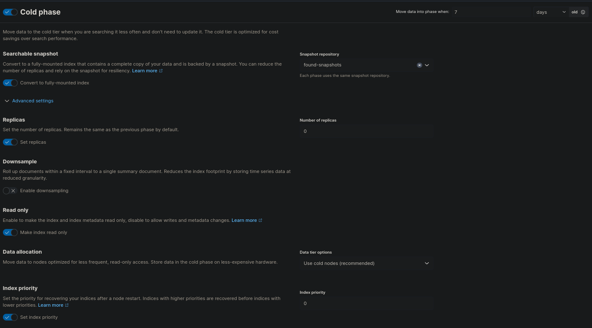
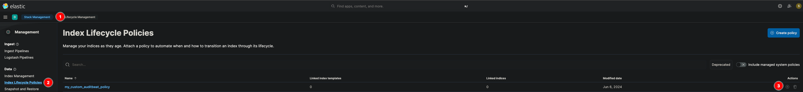
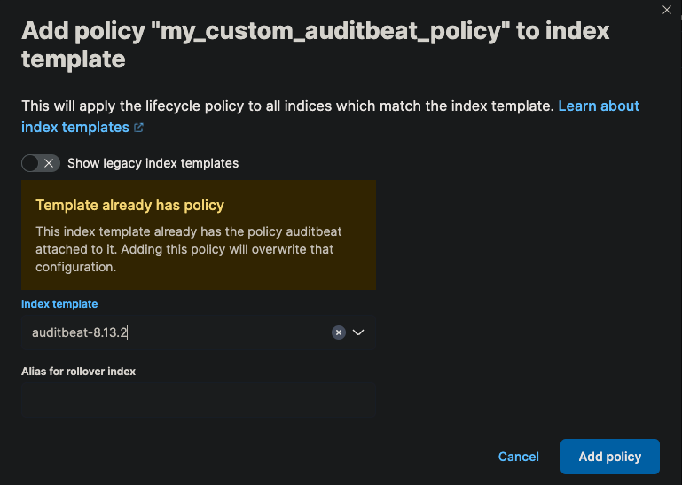

# Changing (default) Lifecycle Policies
{: .no_toc}

This little guide will show you how to adapt the standard Index Lifecycle Policies to your specific needs.

- Content
{:toc}

## Definition of Terms

Before we start, let's define some terms you will encounter throughout this guide.

|Term             |Definition           |
|:-------------------------|:--------------------|
| ILM           | Abbreviation for Index Lifecycle Management. Determines the lifecycle of data and its allocation to the Elastic Data tiers. It is defined in Index Lifecycle Policies. |
| Data stream  | A collection of single indices. It could be viewed as a small DNS (Domain Name System) for index routing requests. A data stream can contain multiple indices.     |
| Rollover     | Process of (automatically) creating a new index within a data stream in the Hot Phase so a single index does not grow indefinitely. It is defined in the Hot Phase of the Index Lifecycle Policy. |

## Getting the Current ILM Policy

When using the Elastic Agent and Fleet, default policies are automatically applied to the data streams. These policies are kept simple and contain only a few phases, often only the hot phase.

The policy applied to the data streams can be found in Kibana.



1. Go to Kibana.
1. Open the menu and go to **Stack Management**.
1. Open **Index Management** and go to **Data Streams**.
1. On the popup on the right you can see the assigned ILM.



## Creating a New ILM Policy

### Using the UI

1. To create a new ILM, select **Stack Management**.
1. Select **Index Lifecycle Management** and click **Create Policy**.
1. Provide a new name for the policy.


#### Hot Phase

The hot phase stores all data that is newly indexed and data that is accessed very frequently. It is always the first phase and thus mandatory. In our example, we have deactivated the setting "Use recommended defaults" to reduce the maximum age of data before rollover from the default 30 days to 7 days.


#### Warm Phase

After the data has been collected in the index for 7 days or the index reaches a size of 50 GB, we want the index to immediately transition to the second phase, called the warm phase. In this tier we lower the priority of the indices and set them to read-only.


#### Cold Phase

After 7 days in the warm phase, data moves to the next phase, called the cold phase. In this phase, we enable searchable snapshots to reduce the storage footprint on the elastic instances. The data is now a searchable snapshot stored in the Object Storage which is already highly available itself. Therefore, we can set the number of replicas and the priority to zero.



#### Frozen Phase

In this phase, actual data is removed from the Elasticsearch nodes and only a small cache remains. When the data is accessed, it is retrieved from the snapshot to make it accessible.


#### Delete Phase

This phase removes indices that have reached a certain age.


### Using Dev Tools

A new ILM Policy can also be created in the Kibana Dev Tools. The console can be found at **Management → Dev Tools**.

```bash
PUT _ilm/policy/<add-some-name-here>
{
  "policy": {
    "phases": {
      "hot": {
        "min_age": "0ms",
        "actions": {
          "rollover": {
            "max_primary_shard_size": "50gb",
            "max_age": "7d"
          },
          "set_priority": {
            "priority": 100
          }
        }
      },
      "warm": {
        "min_age": "0d",
        "actions": {
          "set_priority": {
            "priority": 50
          },
          "readonly": {}
        }
      },
      "cold": {
        "min_age": "7d",
        "actions": {
          "readonly": {},
          "searchable_snapshot": {
            "snapshot_repository": "found-snapshots",
            "force_merge_index": true
          },
          "set_priority": {
            "priority": 0
          },
          "allocate": {
            "number_of_replicas": 0
          }
        }
      },
      "frozen": {
        "min_age": "14d",
        "actions": {
          "searchable_snapshot": {
            "snapshot_repository": "found-snapshots",
            "force_merge_index": true
          }
        }
      },
      "delete": {
        "min_age": "70d",
        "actions": {
          "delete": {
            "delete_searchable_snapshot": true
          }
        }
      }
    }
  }
}
```

## Assigning the Policy to an Index

The newly created policy can then be assigned to an Index Template from the **Index Lifecycle Policies** menu.





## Rollover the Data Stream

In order to use the new ILM Policy immediately, we need to trigger a rollover for the data stream. This can be done in the Dev Tools, here for the data stream auditbeat-8.5.0:

```bash
POST auditbeat-8.5.0/_rollover
```
