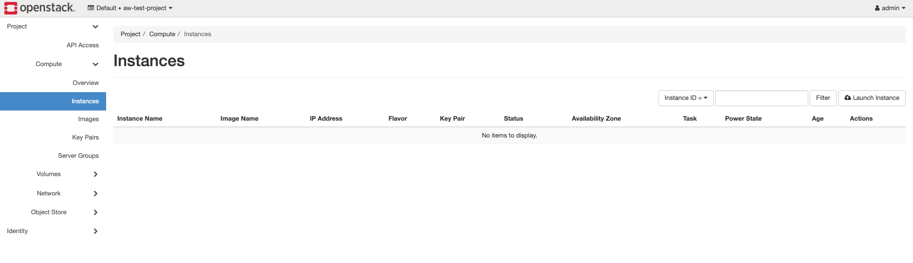
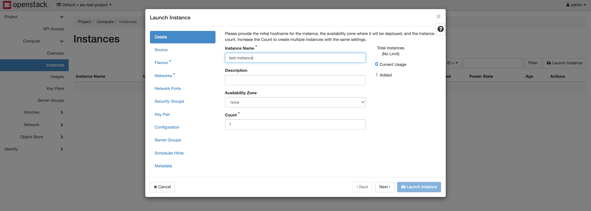
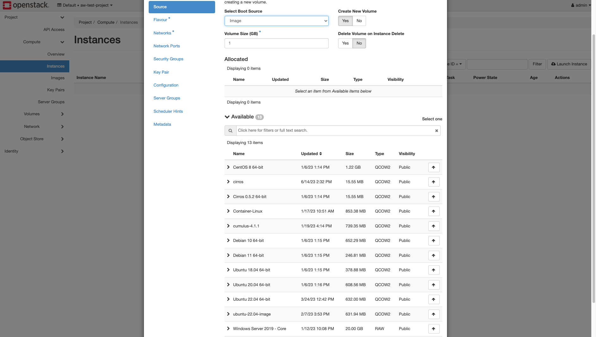
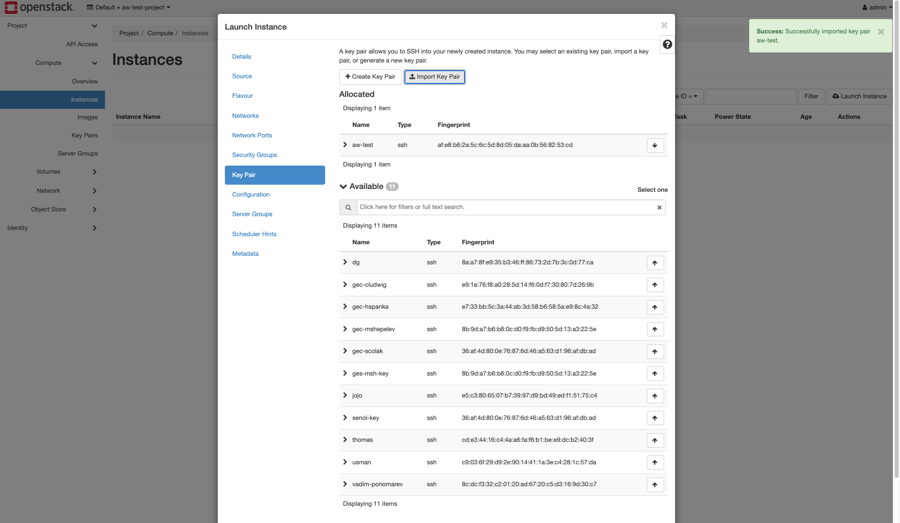

# Erstellung einer VM

Zum erstellen einer neue Virtuele Machine im Openstack muss man sich im Openstack Dashboard einloggen.
Diesen Zugriff haben nur Administratoren.

Nach dem einloggen, können neue VMs im Reiter Instances erstellt werden.

Man klickt auf "Launch Instance" um mit einen Wizard durch die Erstellung der VM durch geführt zu werden.

## Details

Hier kann der Name ausgesucht werden, welche die VM erhält.
Desweiteren kann die Anzahl der VMs geändert werden, der standard ist eine.

## Source

Hier kann ausgewählt werden ob die Instance aus einem existierenden Volume erstellt werden soll.

Oder ob die VM aus einem Image erstellt werden soll.

Desweiteren kann eingestellt werden ob für die VM ein neues Volume erstellt werden soll und ob dieses Volume nach der Löschung der VM mit gelöscht werden soll.

## Flavour

Hier kann eingestellt werden welche größe die VM haben soll und ob diese gegebenfalls mit einer Grafikkarte oder TSN Karte ausgestattet werden soll.

## Network

Hier kann das Netzwerk ausgewählt werden mit welcher die VM bei der Erstellung verbunden ist.

## Key Pair

Hier kann der SSH Key ausgewählt werden, mit welchen man sich über SSH verbinden kann.
Desweiteren können hier neue SSH keys importiert werden.

