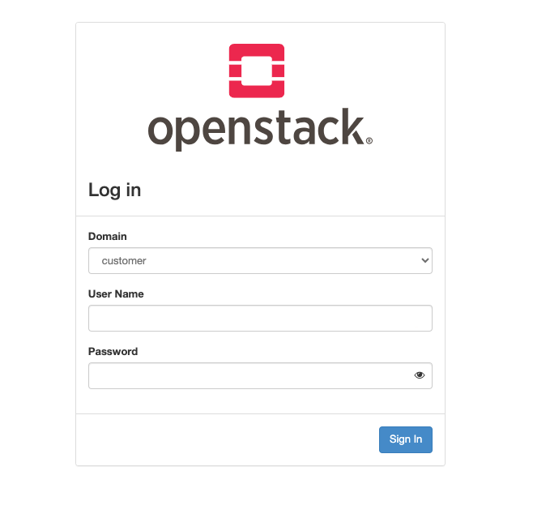
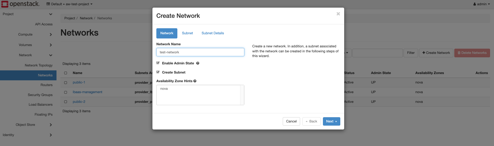
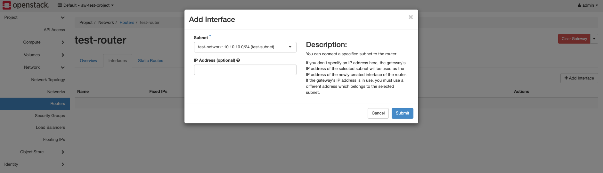

# Openstack

OpenStack is the software used for the Infrastructure as a Service layer.
All VMs are created in OpenStack, which is directly connected to CEPH for providing storage.

## Openstack - Horizon

The Dashboard for Openstack is called Horizon.

### Horizon Login

All Admins gain login credentials to the Openstack Dashboard after Handover

### Horizon Instances

In the instance overview, you can view the VMs running in the selected project.

### Horizon Network

In the "Network" tab, you can see the networks in the current project, including the provider networks. The provider networks are the networks that connect the VMs to the customer network.

Furthermore, you can view the network topology, showing how the VMs are connected and how the networks are interconnected.

### Horizon New Network

To create a new network, click on "Create Network" in the "Network" tab.
Then, you can choose the name.

And you need to create a subnet.

To work with the network or connect the network externally, a router must be created.

The router must then be connected to a network.
This is done by creating an interface on the router, which then connects the router to a network.

To connect two networks, the router needs an interface in both networks.

