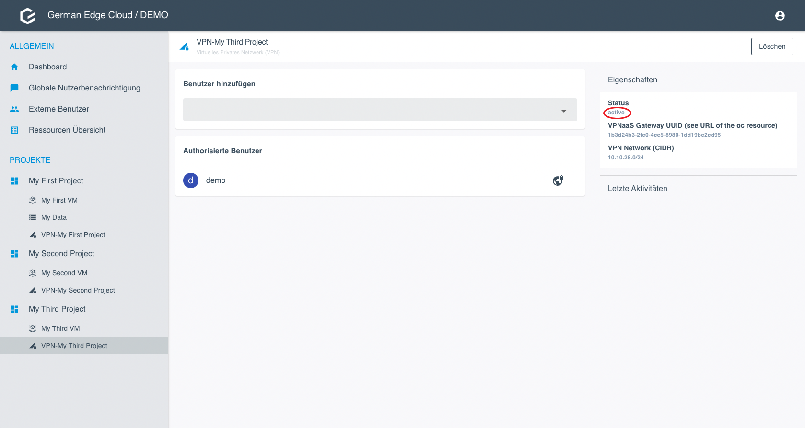
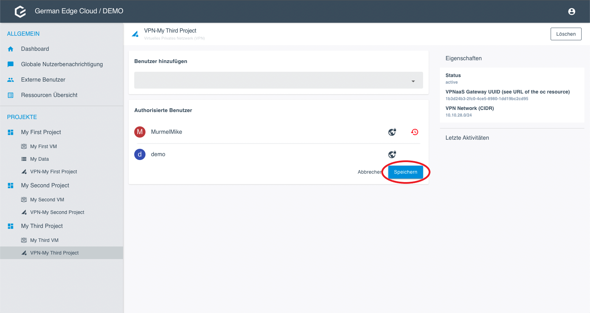

# VPN as a Service

## Overview

Here you see how the customer OpenStack projects and the Operations Center communicate via the OpenStack Project VPN Gateway.
The OpenStack Project VPN Gateway has one public IP address.
It autenticates and leads the traffic by the different ports to the respective VPN server.
Usually, each project has one VPN server.
In this configuration, each VPN Gateway has one public IP adress that is valid for all VPN servers.

## Purpose

GEC provides a VPNaaS solution which allows the customer to integrate their applications and systems with project partner systems.
An external partner is either a person accessing the project with his or her computer, or a communication system.

## Requirements

The VPNaaS solution must meet the following requirement to the system and the customer:

* The Gateway needs a publicly reachable floating IP.

## Limitations

The VPNaaS solution has the following limitations:

* The amount of VPN server counts is limited by the preconfigured port range in the gateway.
* The amount of users in a network is limited to 250.
* The gateway and server configuration cannot be changed after creation and have to be recreated.
* After recreation, all OVPN configurations are invalid.

## Components and Communication Flow

Here you see the communication flow between the Operations Center and the Customer VPN Servers.
The customer sends a request, and the VPN gateway authenticates and distributes the requests to the respective VPN server.

### VPN Gateway

The VPN gateway is the GEC central management hub.
It is used to manage VPN servers and allows external connections.
Since only one public IP address is available, IPtable rules are used to make sure that the connections arrive at the correct VPN server.
This requires a Wide Area Network (WAN) network and a VPN Transfer Network connected to the VPN Gateway.
The VPN Gateway only manages vpn servers and proxy connections to and from the VPN servers, so traffic only ends up where it is needed.

### VPN Server

The VPN Server uses OpenVPN for the VPN connection to the customer network.
That network connection is in a different Virtual Routing and Forwarding (VRF) to provide additional isolation without opening any other ports.
Outside connections are routed via the VPN Gateway.
The API Server for the VPN Server manages the OpenVPN Server that is running on the machine.

## Security

### WAN

* Only ports that are required for the existing VPN Servers are open
* SSH is not used
* Virtual Routing and Forwarding (VRF) separation is available
* Security Groups only allow the VPN Server port ranges
* FW rules are in place and adjusted as needed

### VPNaaS

* Separate VRF to WAN
* Firewall rules are in place and adjusted as needed
* SSH and API are available
* SSH-Key is used

## Server and User Management

### Server Status

1. Click on the VPN resource.
2. Under Properties, check the status. To be able to edit the configuration, the status has to be active.

### Add a User

*Note*: The project owner is automatically added for remote access and cannot be removed.

*Prerequisites*: You can only select users who have previously been added to the project.

1. Go to the VPN configuration.
2. Select the user you want to add as VPN User.

3. Click Save. The user is added immediately.

### Get the OVPN Configuration and Passphrase

*Note*: You can only download the OVPN configuration and reveal a passphrase for yourself or as project owner for external users. You cannot download the OVPN configuration or reveal passphrases for other users.

1. Go to the VPN configuration.
2. Click on the world icon link and choose between Download and Passphrase.

### Delete a User

1. Click on the Delete icon next to the user you want to delete.

1. Click Save.

