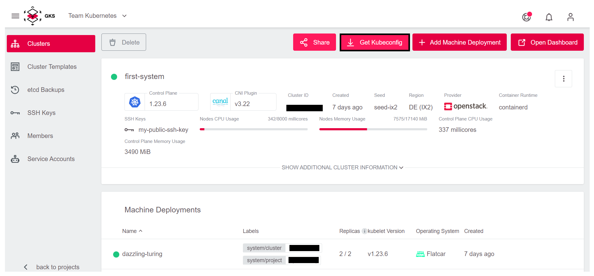
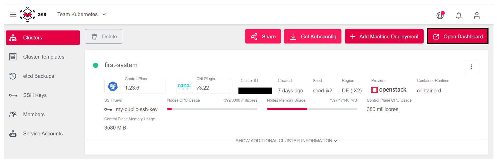
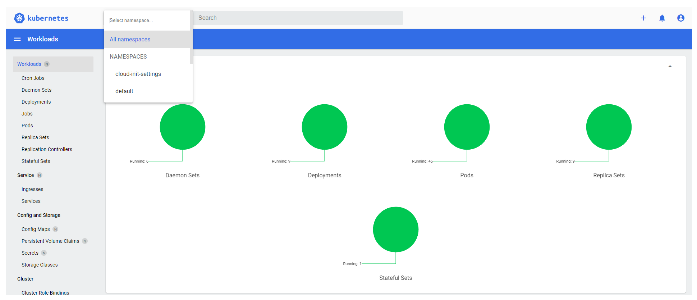

<!-- LTeX:  language=de-DE -->
# Projekt-Basierter Zugriff

**Hinweis:** Dies ist die empfohlene Methode, anderen Benutzern Zugriff auf einen Cluster zu gewähren.

Erteilt man Benutzern Zugriff auf ein gesamtes GKS-Projekt, bekommen Benutzer automatisch Zugriff auf **alle** Cluster innerhalb dieses Projektes. Die Benutzer können sich in GKS einloggen und nach Auswahl des Projektes alle Cluster sehen bzw. je nach gewährten Zugriffsrechten auch bestehende Cluster editieren oder neue Cluster anlegen.

Dabei teilen sich alle Benutzer mit den gleichen Zugriffsrechten eine `kubeconfig`-Datei. Diese Datei nutzt eine Token-basierte Authentifizierung und abhängig vom Access-Level (read-only/admin access) wird ein Token erstellt.

## Mit einem Cluster verbinden

Nachdem Sie in GKS einen Cluster angelegt haben, müssen Sie sich mit diesem verbinden. Das ist notwendig, um
Applikationen zu deployen und zu managen.

Um einen Cluster zu finden, müssen Sie in die Detailansicht
des Clusters gehen.
Hierfür klicken Sie auf den Eintrag `first-system`.


Klicken Sie anschließend rechts oben auf `Get Kubeconfic`.



Damit laden Sie `kubeconfig`-Datei herunter. In dieser Datei stehen alle Endpunkte,
Zertifikate sowie Bereiche des Clusters. Mit dieser Datei kann
`kubectl` sich mit dem Cluster verbinden.

Um diese Datei zu nutzen, müssen Sie diese auf der Konsole
registrieren. Dafür gibt es zwei Möglichkeiten:

1. `kubectl` schaut als Standard in die Datei `.kube/config`
    im Heimat-Verzeichnis des Benutzers
1. Sie können die `kubeconfig` temporär mittels einer Umgebungsvariable
    exportieren

Der Einfachheit halber und um auf Ihrem System die Standards
nicht zu verändern, nehmen Sie hier Variante 2.

Dafür benutzen Sie eine Konsole. In den Screenshots wurde
iTerm2 auf macOS verwendet, es funktioniert jedoch auf Linux und Windows
bash genau so.

Als Erstes müssen Sie die heruntergeladene Datei finden.
Chrome und Firefox laden diese normalerweise in den Downloads-Ordner. Der Dateiname setzt sich aus den zwei folgenden Komponenten zusammen:

* `kubeconfig-admin-`
* Ihre Cluster ID

Um diese dann zu registrieren, nutzen Sie folgendes Kommando:

```bash
cd Downloads
export KUBECONFIG=$(pwd)/kubeconfig-admin-CLUSTERID
```

Nun können Sie mit Ihrem Cluster kommunizieren. Das einfachste Kommando ist
hier: "zeige mir alle Nodes meines Clusters":

```bash
kubectl get nodes

NAME                           STATUS   ROLES    AGE   VERSION
musing-kalam-XXXXXXXXX-ks4xz   Ready    <none>   10m   v1.20.7
musing-kalam-XXXXXXXXX-txc4w   Ready    <none>   10m   v1.20.7
musing-kalam-XXXXXXXXX-vc4g2   Ready    <none>   10m   v1.20.7
```

## Kubernetes Dashboard

In GKS können Sie mit einem Klick auf das Kubernetes Dashboard zugreifen.
Um dies im Browser zu öffnen, klicken Sie oben rechts auf die Schaltfläche `Open Dashboard`.


Nun sehen Sie das Kubernetes Dashboard und können
Ihren Cluster grafisch erkunden.


## Weiterführende Informationen

* [GKS-Projekte verwalten](/gks/managingprojects/creatingaproject/)
* [Revoking Tokens](/gks/accessmanagement/connectingtoacluster/)
