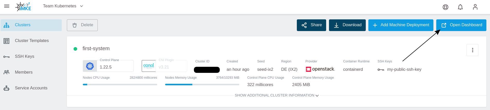
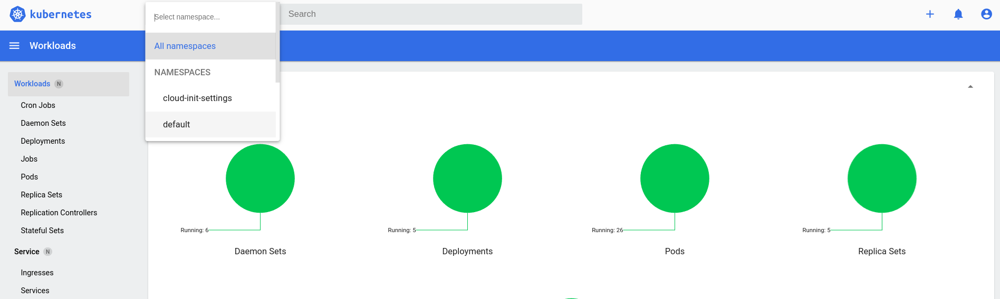

After we created a cluster in GKS, it is time to connect to
it. This is necessary to deploy and manage our applications.

## Finding our Cluster

To find a cluster, we need to go to the detail view of the cluster.
For that, we click on the entry `first-system`:


## Getting Access

We click on the downwards facing arrow in the top right corner:


This way we download a file which is called `kubeconfig` in
Kubernetes jargon. This file contains all end points, certificates
and other information about the cluster. The `kubectl`command uses
this file to connect to the cluster.

To use the `kubeconfig`, we need to register it on the console.
There are two ways to do this:

1. `kubectl` by default tries to use the file `.kube/config`
   in your home directory.
1. We can temporarily use the `kubeconfig` by exporting it to
   an environment variable.

To keep things straightforward and to avoid changing standards
on our system, we choose the second method in the example.

For this we need to open a Terminal. In the screenshots we use
iTerm2 on macOS, but the examples work the same way when using
bash on Linux or Windows.

First, we need to find the downloaded `kubeconfig` file. Browsers
like Chrome or Firefox usually store it in the Downloads folder.
The name is constructed from two parts:

* `kubeconfig-admin-`
* plus the cluster id.

To register the `kubeconfig`, we use the following command:

```bash
cd Downloads
export KUBECONFIG=$(pwd)/kubeconfig-admin-CLUSTERID
```

Now we can interact with the cluster. The simplest command is: "show
all the nodes that comprise my cluster":

```bash
kubectl get nodes

NAME                           STATUS   ROLES    AGE   VERSION
musing-kalam-XXXXXXXXX-ks4xz   Ready    <none>   10m   v1.20.7
musing-kalam-XXXXXXXXX-txc4w   Ready    <none>   10m   v1.20.7
musing-kalam-XXXXXXXXX-vc4g2   Ready    <none>   10m   v1.20.7
```

## Kubernetes Dashboard

In GKS we can access the Kubernetes Dashboard with one click.
We only need to click on the `Open Dashboard` button on the top right of the cluster view:



Now we see the Kubernetes Dashboard and can explore our cluster
graphically:



## Summary

By completing this guide you've learned the following:

* How to get the `kubectl` configuration file
* How to configure `kubectl` to use the `kubeconfig`file
* How to access the Kubernetes Dashboard for a cluster

Congratulations! Now you know all that's needed to connect to a
Kubernetes Cluster.
