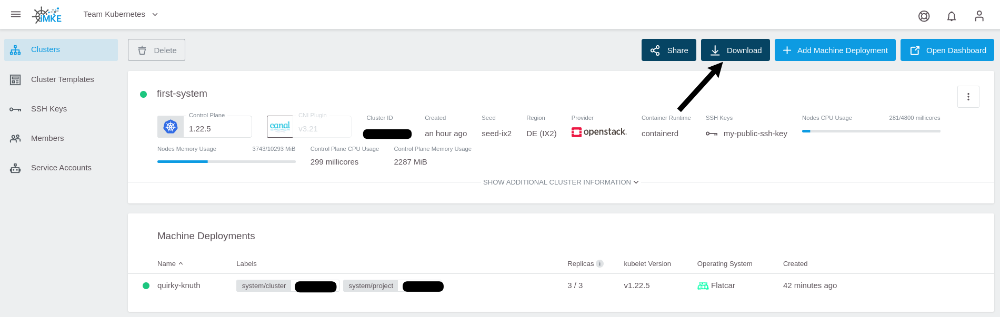
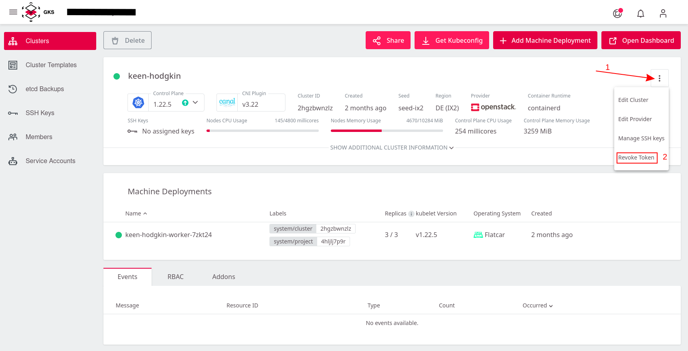
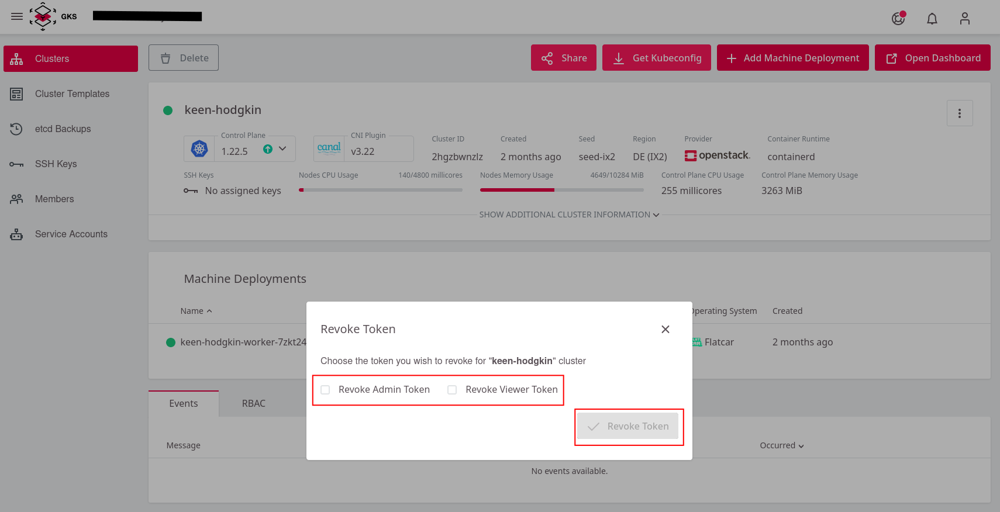

# Access Management

There are two ways how to grant other users access to an GKS cluster:

* Granting users access to a complete GKS project (which grants access to all clusters in that project as well)
* Using role-based access control (RBAC) to define more fine-grained access control directly to the cluster

## Project-Based Access

> This is the recommended method of granting other users access to a cluster.

Giving users access on project level (as described [here](/gks/managingprojects/creatingaproject)) provides them access to **all** clusters in this project. Users with this level of access can log in to the GKS dashboard, view, edit (dependent on the level of access), or create clusters. They can also [download their kubeconfig](connectingtoacluster/) directly:

All users with the same level of project-access effectively share the same `kubeconfig`. This `kubeconfig` uses a token-based authentication, and the token is bound to the level of access (read-only/admin access). In case access needs to be removed for such a user, the tokens needs to be revoked, and all users need to download their `kubeconfig` again.

## Role-Based Access Control (RBAC)

Using role-based access control allows a project admin to provide more fine-grained access based on predefined `ClusterRoles` and `Roles`. With the GKS dashboard, the admin can easily create (cluster-wide) `ClusterRoleBindings` and (namespace-scoped) `RoleBindings`:

A user with this level of access can download a specific `kubeconfig`, which can be directly downloaded with a direct link (see below). Such a user does not need access to the GKS dashboard at all.

More information on Kubernetes RBAC is available [here](https://kubernetes.io/docs/reference/access-authn-authz/rbac/).

## Revoke Tokens

If you need to rotate the Kubeconfig Login tokens.

Then select the Token and press revoke

Then download new [Kubeconfig][#Project-Based Access], the old one is now invalid.

## Learn More

* [Project access: Connecting to a Cluster](/gks/accessmanagement/connectingtoacluster/)
* [Role-Based Access Control (RBAC)](/gks/accessmanagement/usingrbac/)
