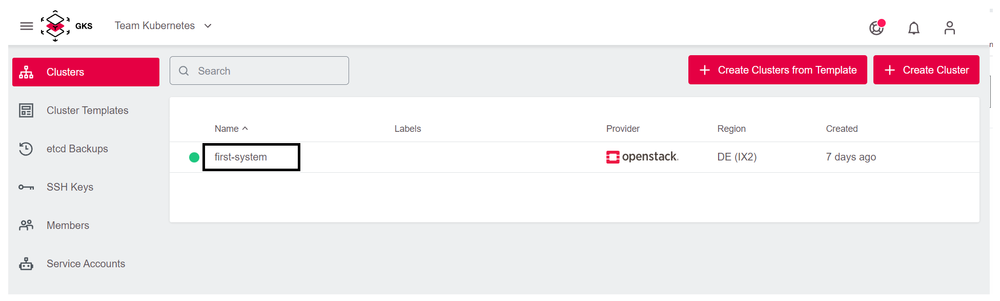
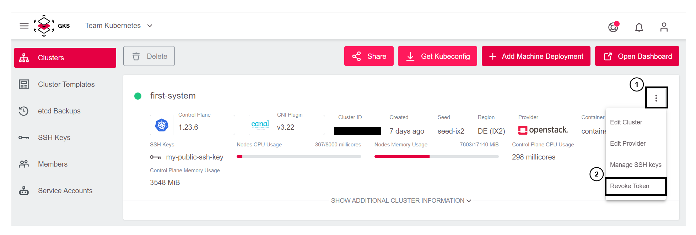

# Revoking Tokens

All users with the same level of [project-access](/gks/accessmanagement/connectingtoacluster/) effectively share the same `kubeconfig` file. This `kubeconfig` uses a token-based authentication, and the token is bound to the level of access (read-only/admin access). In case access needs to be removed for such a user, the tokens needs to be revoked, and all users need to download their `kubeconfig` again.

## Revoke Tokens

If you need to rotate the Kubeconfig login token, proceed as follows:

1. Select your cluster.

1. On the cluster detail page, click the three dots to open the cluster submenu. Then select `Revoke Token`.

1. Select the token and press `Revoke Token`.

1. Finally, download the new Kubeconfig file as the old one is now invalid.
