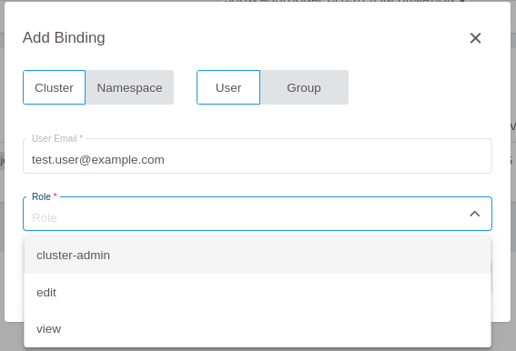
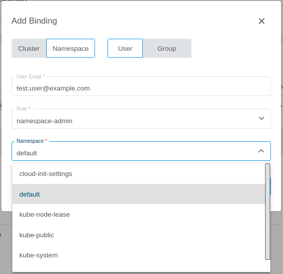
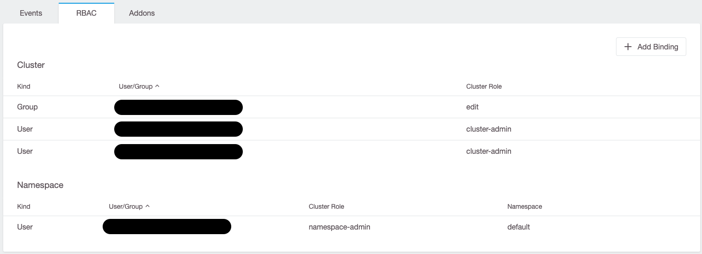
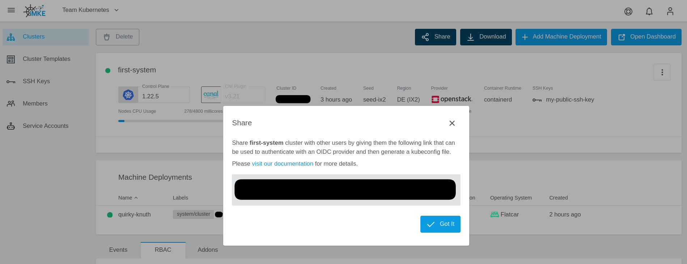
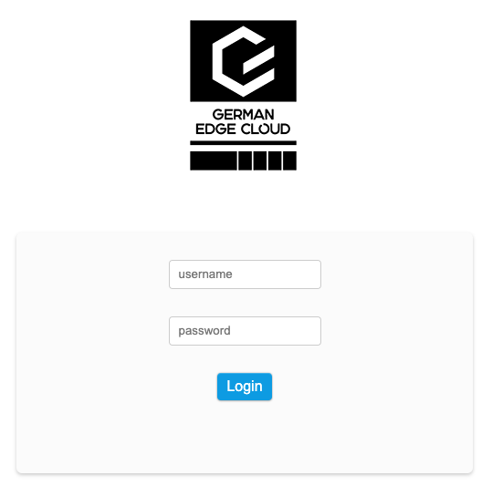

<!-- LTeX:  language=de-DE -->
# Role-Based Access Control (RBAC)

Um einem Benutzer RBAC-basierten Zugriff auf einem Cluster einzurichten, klicken Sie im RBAC-Widget auf `Add Binding`.


## Cluster-weiter Zugriff

Um einen Cluster-weiten Zugriff zu gewähren, wählen Sie im folgenden Pop-up `Cluster` aus, tragen die E-Mail-Adresse des Benutzers ein und wählen die entsprechende Rolle aus.



Dabei sollten Sie jedoch beachten, dass der Benutzer prinzipiell für GKS autorisiert ist. Dieser Zugriff ist notwendig, um die
`kubeconfig`-Datei herunterladen zu können. Die auswählbaren Rollen sind übrigens als `ClusterRoles` angelegt und können mit `kubectl` betrachtet werden.

```bash
kubectl get clusterrole $NAME_OF_CLUSTERROLE -o yaml
```

## Namespace-weiter Zugriff

Wenn der Zugriff auf einen Namespace beschränkt werden soll, müssen Sie im `Add Binding`-Dialog zu `Namespace` wechseln und die E-Mail-Adresse angeben.

Im nächsten Schritt müssen Sie die Rolle auswählen, die dem Benutzer zugewiesen werden soll.


Zuletzt müssen Sie noch den Namespace auswählen, in dem diese Berechtigung gelten soll.



Die für diese Rollen gewährten Zugriffsberechtigungen können Sie ebenfalls mit `kubectl` abfragen. Da `Roles` im Gegensatz zu `ClusterRoles` auf einen bestimmten Namespace bezogen sind, müssen Sie in diesem Fall auch den Namespace mit angeben.

```bash
kubectl get role $NAME_OF_ROLE -n $NAMESPACE -o yaml
```

Nachdem Sie den Zugriff entsprechend gewährt haben, sollten die gewährten Rechte im Dashboard sichtbar sein.



## Den Benutzern die kubeconfig-Datei zur Verfügung stellen

Sobald einem Benutzer RBAC-Rechte zugewiesen wurden, können Sie diesem seine persönliche `kubeconfig`-Datei über einen speziellen Link zur Verfügung stellen.

Dazu müssen Sie den `Share kubeconfig` Link im GKS Dashboard öffnen.


Im nächsten Schritt müssen Sie den angezeigten Link kopieren und an den Nutzer schicken.



Der Link zeigt zu einer Login-Seite. Dort muss sich der Benutzer authentifizieren und kann danach direkt seine `kubeconfig`-Datei herunterladen:



Sobald ein Benutzer seine `kubeconfig`-Datei heruntergeladen hat, werden alle eventuellen weiteren Änderungen an den RBAC-Rechten sofort aktiv. Insbesondere ein Entziehen der Rechte ist sofort umgesetzt, ein `Revoke Token` ist damit nicht notwendig.
