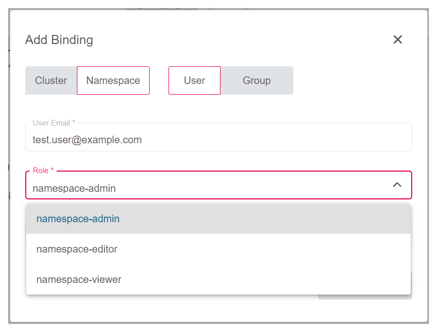
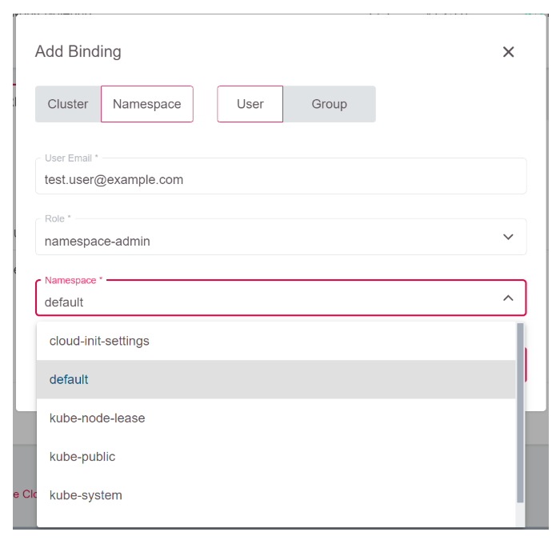
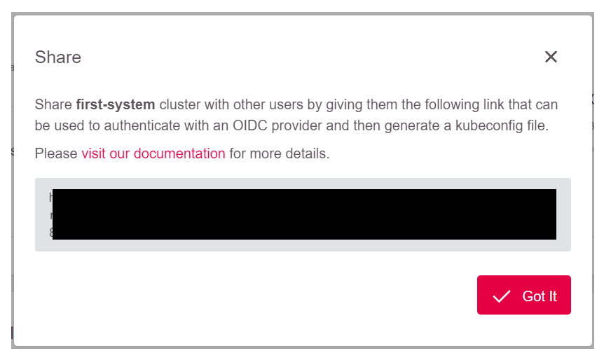

# Role-Based Access Control (RBAC)

Using role-based access control allows a project admin to provide more fine-grained access based on predefined `ClusterRoles` and `Roles`. With the GKS dashboard, the admin can easily create (cluster-wide) `ClusterRoleBindings` and (namespace-scoped) `RoleBindings`:


A user with this level of access can download a specific `kubeconfig`, which can be directly downloaded with a direct link (see below). Such a user does not need access to the GKS dashboard at all.

More information on Kubernetes RBAC is available [here](https://kubernetes.io/docs/reference/access-authn-authz/rbac/).

## Granting User Access with RBAC

To grant a user access with RBAC, expand the RBAC-widget, and click `Add Binding`:


## Cluster-Wide Permissions

To grant users cluster-wide permissions, leave the switch on `Cluster`, add the email of the user, and select the role for the user:


Note that the user must exist in GKS, or otherwise he or she will not be able to log in to download `kubeconfig` later on.
The selectable roles are predefined `ClusterRoles` which can be viewed by running `kubectl`:

```bash
kubectl get clusterrole $NAME_OF_CLUSTERROLE -o yaml
```

## Namespace-Wide Permissions

When access shall be granted on a namespace-level, switch to `Namespace` and add the user email there.

First, you have to select the role which should be assigned to the user:



Finally, you need to select the namespace where this should be valid:



In case you want to see and understand the level of access granted here, you can view the mentioned roles with `kubectl` as well. Unlike `ClusterRoles`, `Roles` are scoped to a namespace, so you have to specify the namespace as well:

```bash
kubectl get role $NAME_OF_ROLE -n $NAMESPACE -o yaml
```

After you completed these steps, the rights should be visible in the RBAC widget of the Dashboard:


## Providing Users with Their Kubeconfig

Once you assigned the user a cluster- or namespace-wide role, you can provide the user a link to download  `kubeconfig`.

To do so, click the `Share` button on the top of the dashboard:


Next, copy the link and send it to the user:



After the user has logged in, the download of `kubeconfig` will start directly:


Once a user has downloaded `kubeconfig`, any further changes made on the RBAC will have *immediate* effect. Especially there is no need to revoke cluster tokens to remove access for a user. Just remove the RoleBindings and access is no longer possible.
