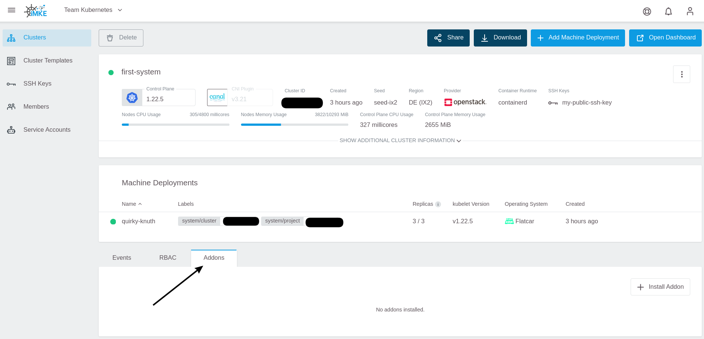
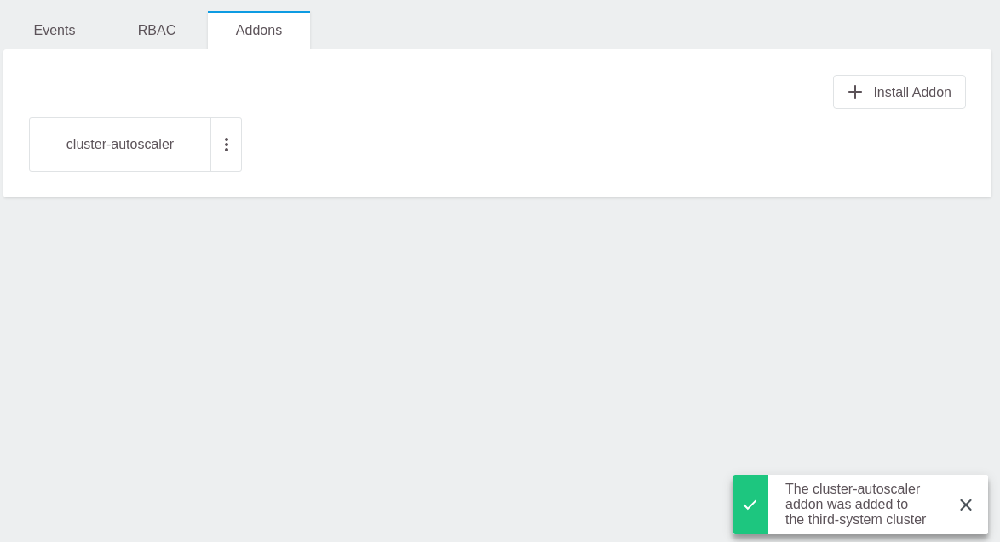

<!-- LTeX:  language=de-DE -->

## Was ist ein Cluster Autoscaler in Kubernetes?

Der Kubernetes Cluster Autoscaler ist ein Tool, das die Anzahl der Worker-Knoten je nach Verbrauch automatisch nach oben oder unten anpasst. Das bedeutet, dass der Autoscaler zum Beispiel einen Cluster automatisch hochskaliert, indem er die Anzahl der Knoten erhöht, wenn nicht genügend Knotenressourcen für das Cluster-Workload-Scheduling vorhanden sind. Aber auch herunterskaliert, wenn die Knotenressourcen ständig im Leerlauf sind oder mehr als genügend Knotenressourcen für das Cluster-Workload-Scheduling vorhanden sind. Kurz gesagt handelt es sich um eine Komponente, die die Größe eines Kubernetes-Clusters automatisch so anpasst, dass alle Pods einen Platz zum Ausführen haben und keine überflüssigen Knoten vorhanden sind.

## Cluster-Autoscaler-Verwendung

Der Kubernetes-Autoscaler im GKS-Cluster skaliert automatisch nach oben/unten, wenn eine der folgenden Bedingungen erfüllt ist:

* Einige Pods konnten im Cluster aufgrund unzureichender Ressourcen nicht ausgeführt werden
* Es gibt Knoten im Cluster, die über einen längeren Zeitraum (standardmäßig 10 Minuten) nicht ausgelastet waren und ihre Pods auf anderen vorhandenen Knoten platzieren können

## Anforderungen

Die Verwendung eines Kubernetes Cluster Autoscalers im GKS-Cluster muss bestimmte Mindestanforderungen erfüllen:

* Kubernetes-Cluster mit Kubernetes v1.18 oder neuer ist erforderlich

## Installieren von Kubernetes-Autoscaler auf GKS-Cluster

Sie können den Kubernetes Autoscaler auf einem laufenden GKS-Cluster mithilfe des GKS Add-on Mechanismus installieren, der bereits in das GKS Cluster Dashboard integriert ist.


### Schritt 1

Erstellen Sie einen GKS Cluster, indem Sie Ihr Projekt auf dem Dashboard auswählen und auf `Create Cluster` klicken. Weitere Details finden Sie auf [unserer Dokumentationsseite](/gks/clusterlifecycle/creatingacluster/).

### Schritt 2

Wenn der Cluster bereit ist, überprüfen Sie die Pods im kube-system Namespace, um festzustellen, ob ein Autoscaler läuft.

```bash
$ kubectl get deployment -n kube-system
NAME                            READY   UP-TO-DATE   AVAILABLE   AGE
coredns                         2/2     2            2           1d
flatcar-linux-update-operator   1/1     1            1           1d
openvpn-client                  1/1     1            1           1d
```

Wie oben dargestellt, ist der Autoscaler nicht Teil der laufenden Kubernetes-Komponenten innerhalb des Namspaces.

### Schritt 3

Fügen Sie den Autoscaler zum Cluster hinzu, indem Sie im Dashboard im Bereich `Addons` auf `Install Addon` klicken.



`cluster-autoscaler` auswählen:


Auf `Install` klicken:




### Schritt 4

Gehen Sie zum Cluster und überprüfen Sie die Pods im kube-system Namespace mit dem folgenden `kubectl` Kommando:

```bash
$ kubectl get deployment -n kube-system
NAME                            READY   UP-TO-DATE   AVAILABLE   AGE
cluster-autoscaler              1/1     1            1           6m27s
coredns                         2/2     2            2           1d
flatcar-linux-update-operator   1/1     1            1           1d
openvpn-client                  1/1     1            1           1d
```
Wie oben dargestellt, wurde der Autoscaler provisioniert und läuft.

## MachineDeployments für die automatische Skalierung mit Anmerkungen versehen

Der Cluster-Autoscaler berücksichtigt nur MachineDeployments mit gültigen Annotationen. Die Annotationen werden verwendet, um die minimale und maximale Anzahl von Replikas pro MachineDeployment zu steuern. Sie müssen diese Anmerkungen nicht auf alle MachineDeployment-Objekte anwenden, sondern nur auf MachineDeployments, die der Cluster Autoscaler berücksichtigen soll.

```
cluster.k8s.io/cluster-api-autoscaler-node-group-min-size - die kleinste Anzahl an Worker-Knoten im Cluster (muss größer als Null sein!)
cluster.k8s.io/cluster-api-autoscaler-node-group-max-size - die höchste Anzahl an Worker-Knoten im Cluster
```

Sie können die Anmerkungen auf MachineDeployments anwenden, sobald der Cluster bereitgestellt ist und die MachineDeployments erstellt und ausgeführt werden, indem Sie die folgenden Schritte ausführen.

### Schritt 1

Führen Sie den folgenden `kubectl` Befehl aus, um die verfügbaren MachineDeployments zu überprüfen:

```
$ kubectl get machinedeployments -n kube-system
NAME                            AGE   DELETED   REPLICAS   AVAILABLEREPLICAS   PROVIDER    OS        VERSION
epic-goldwasser-worker-289mgt   1d              2          2                   openstack   flatcar   1.21.5
```

### Step 2

Der Annotatierungsbefehl wird zusammen mit einer der obigen MachineDeployments verwendet, um die gewünschten MachineDeployments mit Anmerkungen zu versehen. In diesem Fall wird `test-cluster-worker-v5drmq` annotiert, um das Minimum und Maximum festzulegen.

Minimum Annotation:

```bash
$ kubectl annotate machinedeployment -n kube-system epic-goldwasser-worker-289mgt cluster.k8s.io/cluster-api-autoscaler-node-group-min-size="1"
machinedeployment.cluster.k8s.io/epic-goldwasser-worker-289mgt annotated
```

Maximum Annotation:

```bash
$ kubectl annotate machinedeployment -n kube-system epic-goldwasser-worker-289mgt cluster.k8s.io/cluster-api-autoscaler-node-group-max-size="5"
machinedeployment.cluster.k8s.io/epic-goldwasser-worker-289mgt annotated
```

### Schritt 3

Überprüfen Sie die Beschreibung von MachineDeployment:

```bash
$ kubectl describe machinedeployments -n kube-system epic-goldwasser-worker-289mgt
Name:         epic-goldwasser-worker-289mgt
Namespace:    kube-system
Labels:       <none>
Annotations:  cluster.k8s.io/cluster-api-autoscaler-node-group-max-size: 5
              cluster.k8s.io/cluster-api-autoscaler-node-group-min-size: 1
              machinedeployment.clusters.k8s.io/revision: 1
API Version:  cluster.k8s.io/v1alpha1
Kind:         MachineDeployment
Metadata:
  Creation Timestamp:  2021-10-04T09:44:48Z
  Finalizers:
    foregroundDeletion
  Generation:  1
  Managed Fields:
    API Version:  cluster.k8s.io/v1alpha1
    Fields Type:  FieldsV1

[...]
```

Wie oben gezeigt, wurde die MachineDeployment mit einem Minimum von 1 und einem Maximum von 5 annotiert. Daher wird der Autoscaler nur die kommentierte MachineDeployment auf dem Cluster berücksichtigen.

## Autoscaler deinstallieren

Um den Autoscaler zu deinstallieren, klicken Sie im Abschnitt Addons des Cluster-Dashboards auf die drei Punkte vor dem Cluster-Autoscaler und wählen Sie Löschen.


Nach dem Löschen können Sie den Cluster mit dem Befehl `kubectl get deployment -n kube-system` überprüfen, um sicherzustellen, dass der Autoscaler gelöscht wurde.

## Zusammenfassung

Das war's! Sie haben erfolgreich einen Kubernetes Autoscaler auf einem GKS Cluster bereitgestellt und das gewünschte MachineDeployment annotiert, so das der Autoscaler es berücksichtigen kann. Weitere Ressourcen zu Kubernetes Autoscaler und zur Bereitstellung eines GKS Clusters finden Sie im Abschnitt "Weitere Informationen" weiter unten.

## Weitere Informationen

* Erfahren Sie mehr zum Kubernetes Autoscaler [hier](https://github.com/kubernetes/autoscaler/blob/master/cluster-autoscaler/FAQ.md#what-is-cluster-autoscaler)
