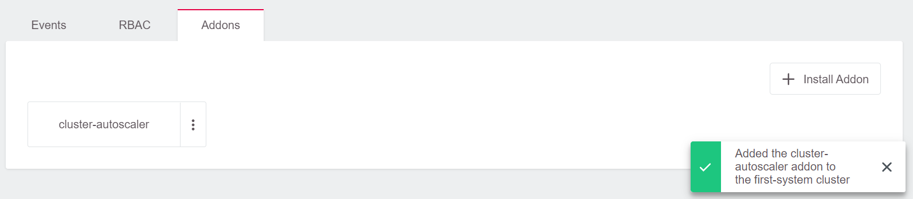
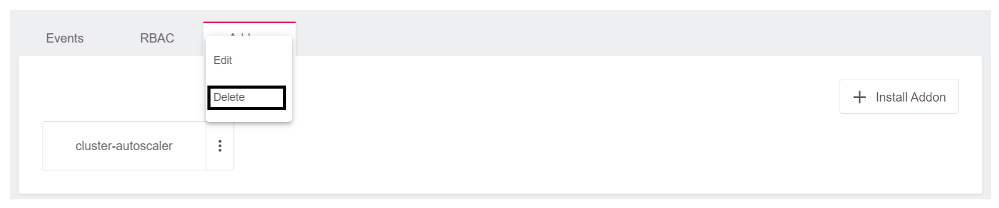
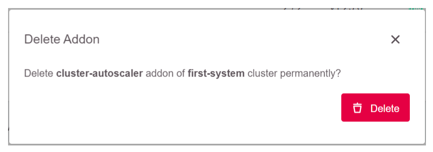

# Cluster Autoscaler

## What is a Kubernetes Cluster Autoscaler?

Kubernetes Cluster Autoscaler is a tool that automatically adjusts the number of worker nodes in a cluster up or down depending on the consumption. The Autoscaler, for example, scales up a cluster by increasing the amount of nodes automatically when there are not enough node resources for cluster workload scheduling. It scales down when the node resources have continuously stayed idle or more than enough node resources were available for cluster workload scheduling. In a nutshell, it is a component that automatically adjusts the size of a Kubernetes cluster so that all pods have a place to run and there are no unneeded nodes.

## Cluster Autoscaler Usage

The Kubernetes Autoscaler in the GKS cluster automatically scaled up/down when one of the following conditions is fulfilled:

* Some pods failed to run in the cluster due to insufficient resources
* There are nodes in the cluster that have been underutilized for an extended period (10 minutes by default) and can place their Pods on other existing nodes

## Requirements

Using a Kubernetes cluster Autoscaler in the GKS cluster must meet specific minimum requirement:

* Kubernetes cluster running Kubernetes v1.18 or newer is required

## Installing Kubernetes Autoscaler on GKS Clusters

You can install Kubernetes Autoscaler on a running GKS cluster using the GKS addon mechanism, which is already built into the GKS cluster dashboard.

### Step 1

Create a GKS cluster by selecting your project on the dashboard and click on “Create Cluster”. More details is available [here](/gks/clusterlifecycle/creatingacluster/).

### Step 2

When the cluster is ready, check the pods in the kube-system namespace to know if any Autoscaler is running.

```bash
$ kubectl get deployment -n kube-system
NAME                            READY   UP-TO-DATE   AVAILABLE   AGE
coredns                         2/2     2            2           1d
flatcar-linux-update-operator   1/1     1            1           1d
openvpn-client                  1/1     1            1           1d
```

As shown above, the Autoscaler is not part of the running Kubernetes components within the namespace.

### Step 3

Add the Autoscaler to the cluster under the addon section on the dashboard by clicking on  `Addons` and then `Install Addon`.


Select `cluster-autoscaler`.


Select `Install`.




### Step 4

Go to the cluster and check the pods in the kube-system namespace using the `kubectl` command.

```bash
$ kubectl get deployment -n kube-system
NAME                            READY   UP-TO-DATE   AVAILABLE   AGE
cluster-autoscaler              1/1     1            1           6m27s
coredns                         2/2     2            2           1d
flatcar-linux-update-operator   1/1     1            1           1d
openvpn-client                  1/1     1            1           1d
```

As shown above, the Autoscaler has been provisioned and is running.

## Annotating Machine Deployments for Autoscaling

The Cluster Autoscaler only considers Machine Deployments with valid annotations. The annotations are used to control the minimum and the maximum number of replicas per Machine Deployment. You don’t need to apply those annotations to all Machine Deployment objects, but only on Machine Deployments that Cluster Autoscaler should consider.

```
cluster.k8s.io/cluster-api-autoscaler-node-group-min-size - the minimum number of replicas (must be greater than zero)
cluster.k8s.io/cluster-api-autoscaler-node-group-max-size - the maximum number of replicas
```

You can apply the annotations to Machine Deployments once the  cluster is provisioned and the Machine Deployments are created and running by following the steps below.

### Step 1

Run the following `kubectl` command to check the available Machine Deployments:

```
$ kubectl get machinedeployments -n kube-system
NAME                            AGE   DELETED   REPLICAS   AVAILABLEREPLICAS   PROVIDER    OS        VERSION
epic-goldwasser-worker-289mgt   1d              2          2                   openstack   flatcar   1.21.5
```

### Step 2

The annotation command is used with one of the Machine Deployments above to annotate the desired Machine Deployments. In this case the `test-cluster-worker-v5drmq` is annotated and the minimum and maximum is set.

Minimum annotation:

```bash
$ kubectl annotate machinedeployment -n kube-system epic-goldwasser-worker-289mgt cluster.k8s.io/cluster-api-autoscaler-node-group-min-size="1"
machinedeployment.cluster.k8s.io/epic-goldwasser-worker-289mgt annotated
```

Maximum annotation:

```bash
$ kubectl annotate machinedeployment -n kube-system epic-goldwasser-worker-289mgt cluster.k8s.io/cluster-api-autoscaler-node-group-max-size="5"
machinedeployment.cluster.k8s.io/epic-goldwasser-worker-289mgt annotated
```

### Step 3

Check the Machine Deployment description:

```bash
$ kubectl describe machinedeployments -n kube-system epic-goldwasser-worker-289mgt
Name:         epic-goldwasser-worker-289mgt
Namespace:    kube-system
Labels:       <none>
Annotations:  cluster.k8s.io/cluster-api-autoscaler-node-group-max-size: 5
              cluster.k8s.io/cluster-api-autoscaler-node-group-min-size: 1
              machinedeployment.clusters.k8s.io/revision: 1
API Version:  cluster.k8s.io/v1alpha1
Kind:         MachineDeployment
Metadata:
  Creation Timestamp:  2021-10-04T09:44:48Z
  Finalizers:
    foregroundDeletion
  Generation:  1
  Managed Fields:
    API Version:  cluster.k8s.io/v1alpha1
    Fields Type:  FieldsV1

[...]
```

As shown above, the Machine Deployment has been annotated with a minimum of 1 and a maximum of 5. Therefore, the Autoscaler considers only the annotated Machine Deployment on the cluster.

## Deleting the Autoscaler

To delete the Autoscaler, click on the three dots in front of the Cluster Autoscaler in the Addons section of the cluster dashboard and select `Delete`.




Once it has been deleted, you can check the cluster to ensure that the Autoscaler has been deleted with the `kubectl get deployment -n kube-system` command.

## Summary

You have successfully deployed a Kubernetes Autoscaler on a GKS cluster and annotated the desired Machine Deployment, which Autoscaler should consider. Check the *Learn More* section below for more resources on Kubernetes Autoscaler and how to provision a GKS cluster.

## Learn More

* Read more on Kubernetes Autoscaler [here](https://github.com/kubernetes/autoscaler/blob/master/cluster-autoscaler/FAQ.md#what-is-cluster-autoscaler).
