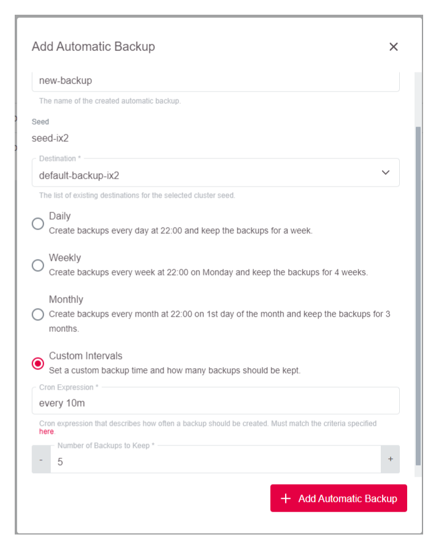
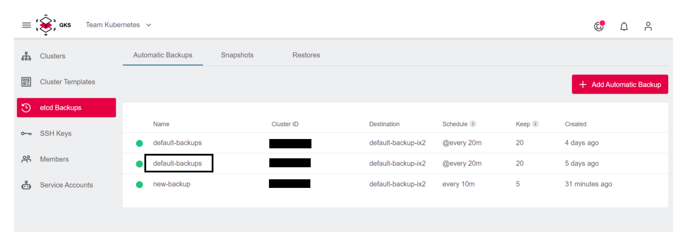
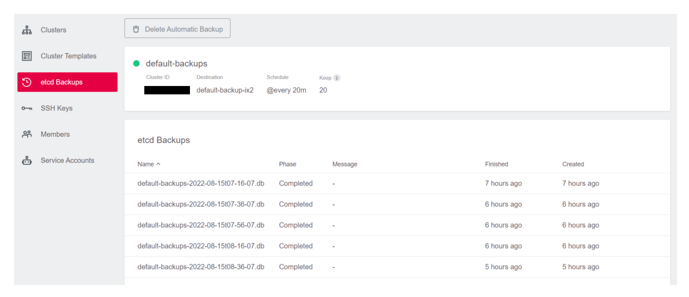
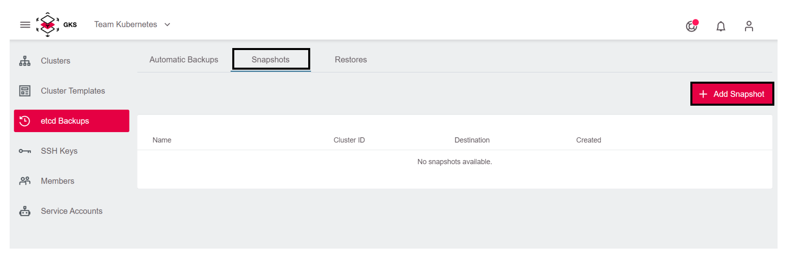
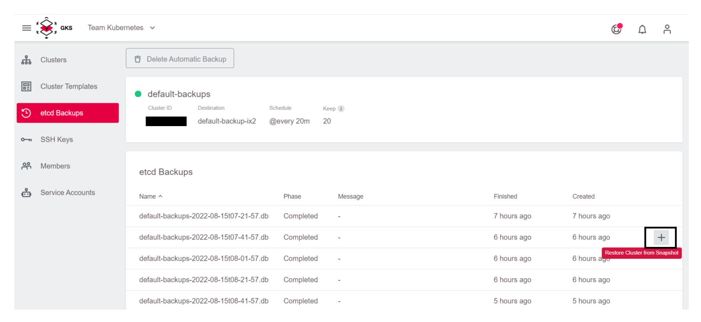
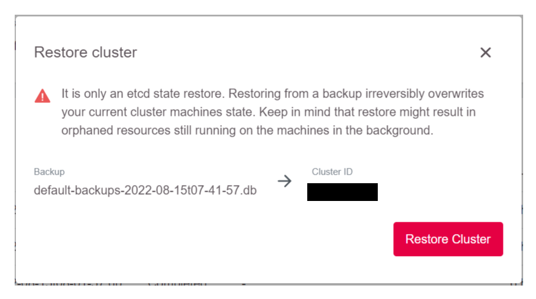
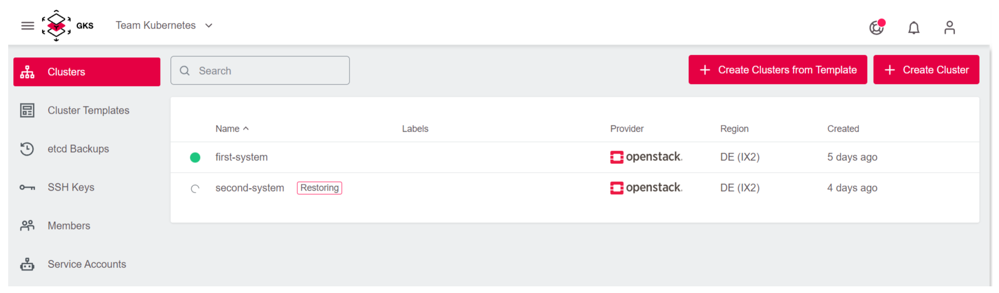
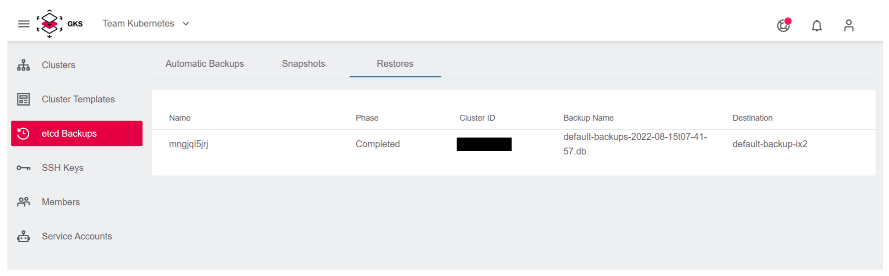

<!-- LTeX:  language=de-DE -->

# Etcd Backup und Wiederherstellung

GKS hat eine etcd Backup- und Wiederherstellungsfunktion, die standardmäßig für alle Cluster aktiviert ist.
Die Standardkonfiguration des Backups wird mit einem Standardintervall von @alle 20m und einer Aufbewahrung der letzten 20 Backups erstellt.

Es ist jedoch möglich, bei Bedarf zusätzliche Backup-Schedules zu erstellen.

> **Hinweis:** Bedenken Sie, dass es sich *nur* um ein etcd-Backup und -Wiederherstellung handelt. Das einzige, was wiederhergestellt wird, ist der etcd-Status, nicht die PVC-Volumes mit Anwendungsdaten oder ähnlichem.

## Etcd Backup

### Etcd Backup-Schedules anlegen

Etcd Backups und Wiederherstellungen sind an ein Projekt gebundene Ressourcen, die Sie in der Projektansicht verwalten können.

Um eine neue Sicherung zu erstellen, müssen Sie auf die Schaltfläche `Add Automatic Backup` hinzufügen klicken. Sie haben die Wahl zwischen voreingestellten täglichen, wöchentlichen oder monatlichen Backups, oder einem Backup mit einem benutzerdefinierten Intervall und einer bestimmten Zeit.

Um alle verfügbaren Backups zu sehen, klicken Sie auf ein Backup, das Sie interessiert.

Sie sehen dann die Liste der abgeschlossenen Backups.

### Etcd Backup-Snapshot anlegen

Sie können auch einmalige Backup-Snapshots erstellen, die ähnlich wie die automatischen Snapshots eingerichtet sind, mit dem Unterschied, dass für sie kein Zeitplan und keine Aufbewahrungszeit festgelegt sind.

## Etcd Backups wiederherstellen

Wenn Sie ein Backup wiederherstellen möchten, müssen Sie auf das Wiederherstellungssymbol für das Backup in der Benutzeroberfläche klicken (Restore Cluster from Snapshot).

### Wiederherstellung von Etcd Backup-Schedules

### Wiederherstellung von Etcd Backup-Snapshot

Danach wird der Cluster angehalten, etcd wird gelöscht und dann aus dem Backup neu erstellt. Danach wird die Pause des Clusters wieder aufgehoben.
In der Zwischenzeit wird ein Etcd-Wiederherstellungsobjekt im Projekt erstellt, dessen Fortschritt Sie in der Etcd-Wiederherstellungsliste beobachten können.

In der Cluster-Ansicht werden Sie feststellen, dass sich Ihr Cluster in einem Wiederherstellungszustand befindet und Sie nicht mit ihm interagieren können, bis der Vorgang abgeschlossen ist.

Wenn die Wiederherstellung abgeschlossen ist, wird der Cluster wieder freigegeben, so dass Sie ihn verwenden können.
Die etcd-Wiederherstellung geht in den Zustand "Completed" über.

