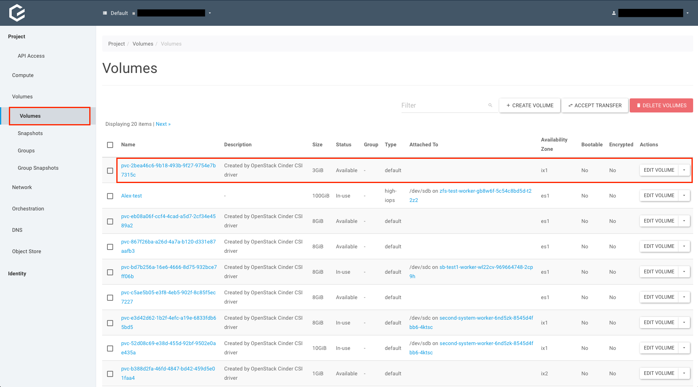

<!-- LTeX:  language=de-DE -->

# Ein PVC von einem existierenden Openstack Volume wiederherstellen

Wird ein PersistentVolumeClaim (PVC) in einem Ihrer Cluster angelegt, wird daraufhin normalerweise automatisch ein *neues* PersistentVolume (PV) in Kubernetes sowie ein entsprechendes *neues* Volume in Openstack angelegt. Das neue Volume ist leer und kann direkt genutzt werden. Es ist allerdings auch möglich, ein *bereits existierendes* Openstack-Volume in einem Kubernetes Cluster zu benutzen. Hier beschreiben wir eine Möglichkeit, wie dies erreicht werden kann.

## Voraussetzungen

Die wichtigste Voraussetzung ist ein freies, aktuell nicht benutztes Openstack-Volume. Dies könnte zum Beispiel der Fall sein, wenn ein alter Cluster gelöscht, aber im Löschen-Dialog die Option explizit selektiert wurde, dass verbundene Volumes *nicht* gelöscht werden sollen oder wenn ein Volume von einem Cluster in ein anderes umgezogen werden soll. In jedem Fall wird es nicht um das Volume an sich gehen, sondern um die darauf vorhandenen Daten, die dem Kubernetes Cluster jetzt als PVC zur Verfügung gestellt werden sollen.

Um ein existierendes Openstack-Volume als PVC in ein Kubernetes-Cluster einzubinden, benötigen Sie die ID des Volumes. Um diese herauszufinden, müssen Sie sich zuerst in das [Openstack/Optimist Dashboard](https://dashboard.optimist.gec.io/auth/login/) einloggen.


Die Zugangsdaten sind identisch mit den Zugangsdaten, die Sie für das GKS/GKS-Dashboard benutzen. Navigieren Sie nach dem Login zu `Volumes` und suchen Sie das Volume, welches Sie anbinden wollen. Das Volume darf aktuell an keine andere Instanz/VM gebunden sein und muss den Status "Available" haben. Da ein Volume immer nur an eine Instanz gebunden sein kann, muss das Volume ggf. erst von der alten Instanz getrennt (detached) werden, bevor es im Kubernetes-Cluster verwendet werden kann.



Nachdem Sie das Volume gefunden haben, klicken Sie auf den Namen. Auf der Detailseite finden Sie dann die ID des Volumes, die Sie für den nächsten Schritt benötigen.


## Erstellen eines PV auf Basis eines existierenden Openstack-Volumes

Um das Volume im Cluster verfügbar zu machen, müssen Sie im ersten Schritt ein `PersistentVolume`-Manifest vorbereiten, welches die ID des Openstack-Volumes im `spec.csi.volumeHandle`-Schlüssel enthält.

```yaml
apiVersion: v1
kind: PersistentVolume
metadata:
  name: test-pv-restore
spec:
  accessModes:
  - ReadWriteOnce
  capacity:
    storage: 3Gi
  csi:
    driver: cinder.csi.openstack.org
    volumeHandle: 6515d33b-287d-43e1-a3c5-e347d2fc8135
  persistentVolumeReclaimPolicy: Delete
  storageClassName: cinder-csi
  volumeMode: Filesystem
```

Anschließend erstellen Sie das PV mit `kubectl` und überprüfen, ob das PV erfolgreich erstellt wurde.

```bash
# kubectl apply -f restore-pv.yaml
persistentvolume/test-pv-restore created
# kubectl get pv
NAME              CAPACITY   ACCESS MODES   RECLAIM POLICY   STATUS      CLAIM   STORAGECLASS   REASON   AGE
test-pv-restore   3Gi        RWO            Delete           Available           cinder-csi              3s
```

In diesem Beispiel haben Sie das PV `test-pv-restore` erstellt, das ein bereits existierendes Openstack-Volume referenziert.

## Erstellen eines PVC, das auf das korrekte PV verweist

Im nächsten Schritt müssen Sie ein PVC erstellen, welches das eben erzeugte PV referenziert. Dazu müssen Sie im PVC-Manifest den Schlüssel `spec.volumeName` auf den Namen des gerade erstellten PVs setzen.

```yaml
apiVersion: v1
kind: PersistentVolumeClaim
metadata:
  name: test-pvc
spec:
  accessModes:
    - ReadWriteOnce
  resources:
    requests:
      storage: 3Gi
  volumeName: test-pv-restore
```

Nach dem Erstellen des PVCs mit `kubectl` sollte sich das PVC im Status "Bound" befinden.

```bash
# kubectl apply -f restore-pvc.yaml
persistentvolumeclaim/test-pvc created
# kubectl get pvc
NAME       STATUS   VOLUME            CAPACITY   ACCESS MODES   STORAGECLASS   AGE
test-pvc   Bound    test-pv-restore   3Gi        RWO            cinder-csi     2s
```

Das PVC "test-pvc" ist damit zur Verwendung bereit.

## Erstellen eines Test-Pods, der das PVC benutzt

Um die Daten vor der tatsächlichen Verwendung zu überprüfen, können Sie einen Test-Pod erstellen, der das PVC benutzt.

```yaml
apiVersion: v1
kind: Pod
metadata:
  name: test-pod
spec:
  containers:
    - name: test-pod
      image: ubuntu
      command:
        - "sleep"
        - "604800"
      volumeMounts:
        - mountPath: "/restore"
          name: test-pvc
  volumes:
    - name: test-pvc
      persistentVolumeClaim:
        claimName: test-pvc
```

Der wichtige Teil des Manifests ist dabei, dass der `claimName` korrekt auf den Namen des eben erstellten PVCs gesetzt ist. Nachdem der Pod mit `kubectl` erzeugt wurde, können Sie sich  mit dem Pod verbinden. Das Volume ist im o.g. Beispiel im Pfad */restore* gemounted, so dass Sie die Daten des Volumes dort finden.

```bash
# kubectl apply -f pvc-example/test-pod.yaml
pod/test-pod created
# kubectl get pod -w
NAME       READY   STATUS              RESTARTS   AGE
test-pod   0/1     ContainerCreating   0          5s
test-pod   0/1     ContainerCreating   0          17s
test-pod   1/1     Running             0          22s
^C
# kubectl exec -ti test-pod -- /bin/bash
root@test-pod:/# ls /restore/
lost+found  my_data.txt
root@test-pod:/# exit
exit
```

Damit haben Sie erfolgreich ein bereits existierendes Openstack-Volume an einen Pod in Ihrem Kubernetes Cluster angebunden.
