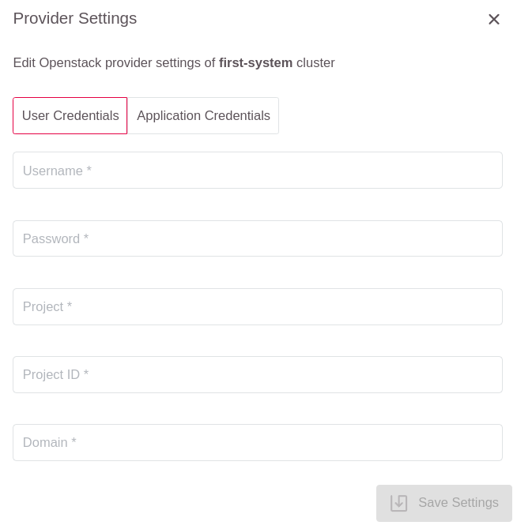
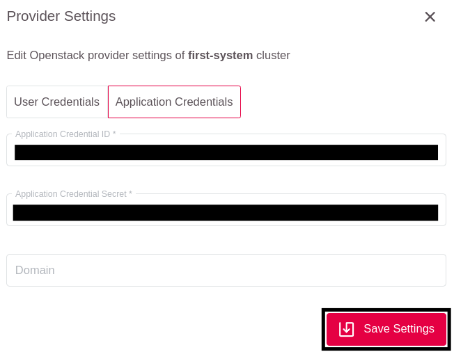

# Using Openstack Application Credentials

In previous parts of the documentation the user needs to authenticate with the Openstack
API to access resources (like compute instances for worker nodes and networks, etc.)
which are used to build a Kubernetes Cluster. This has been shown with the users username
and password. As the openstack-cloud-controller and machine-controller need access to
the same Openstack tenants' resources those credentials are persisted into the cluster
as kubernetes secrets in the kube-system namespace. It follows that everyone with the
cluster-admin role in that cluster will have access to that username and password as well.

There is a way to prevent this. In Openstack exists a feature called
[Openstack Application Credentials](https://docs.gec.io/optimist/specs/application_credentials/).
This Openstack feature allows to create an additional set of credentials with similar
or reduced set of permissions to an Openstack project. The key aspect of this feature
is that it is not possible to login to the Optimist dashboard with Application Credentials,
thus increasing the security of your Openstack tenant.

Another thing to note is that Application Credentials are bound to a project, not a tenant.
This additional separation of concerns makes it easy to have one Openstack tenant with
multiple projects like dev, test and prod, creating Application Credentials for each project
separately thus being able to manage the resources of all projects while still retaining
maximum isolation between your environments.

## Creating Openstack Application Credentials

The creation of Openstack Application Credentials is best described in the
[Openstack documentation here](https://docs.gec.io/optimist/specs/application_credentials/).

## Using the Application Credentials during GKS cluster creation

When creating a GKS cluster in the GKS-dashboard the user is prompted for Openstack
credentials in step 3 (Settings) of the cluster creation wizard. Default is set to *User Credentials*,
but there is another tab to it's right named *Application Credentials*. Clicking that tab will
change the number of fields in the form slightly: there is no need to specify the project
nor the projectID as *Application Credentials* are automatically bound/scoped to a single project.

After entering the *Application Credentials* the GKS cluster creation process continues as
described in previous chapters. As confirmation the summary page in step 5 of the cluster
creation wizard will show the _applicationID_ of your *Application Credentials* instead of
the domain, user- and project-name.

## Updating Application Credentials in a running GKS cluster

Another nice feature of *Openstack Application Credentials* is that they can have an expiry date.
In that case the user will need to replace the current *Application Credentials* with newer ones.
For that the user will need to create a new set of *Application Credentials* before the current
set expires. After creation the user will need to enter the cluster-view in the GKS-dashboard.

To change the *Application Credentials* click on the three-vertical-dots button in the upper right
corner of the page and select the "Edit Provider" option.

The next step will present a dialog with two tabs available: "User Credentials" and "Application Credentials".
The prior will be shown as default. The user needs to actively choose the *Application Credentials* tab.

Switching tabs will reduce the fields in the form down to _Application Credential ID_ and
_Application Credential Secret_.

After entering the correct values the settings need to be saved.
Now the automation will start a process in the background to replace the old *Application Credentials*
set with the one newly entered.

