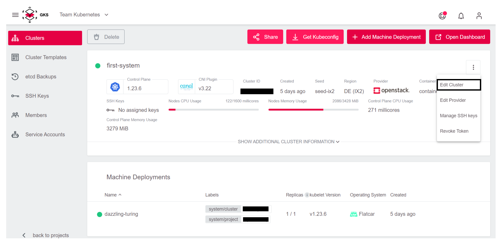
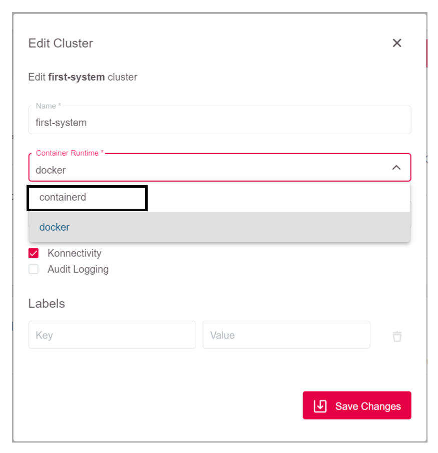
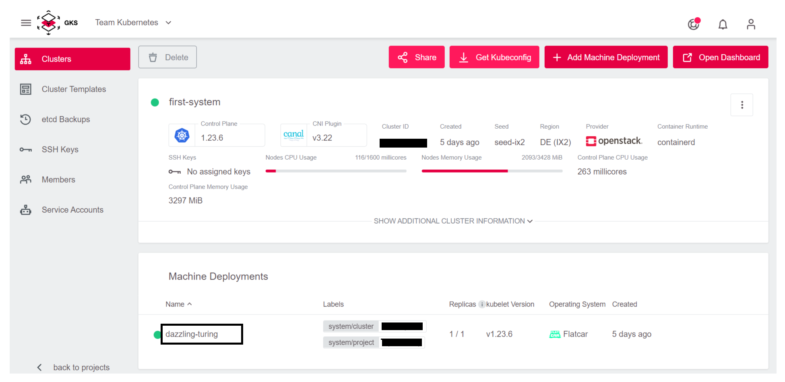
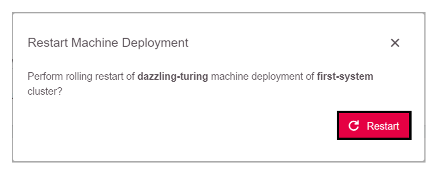

<!-- LTeX:  language=de-DE -->
# Migration Container Runtime Engine

## Informationen zur Container Runtime Engine

Lange Zeit wurde im Unterbau von Kubernetes Docker (genauer gesagt der dockershim)
als Container "Runtime Engine" genutzt. Diese Softwarebasis und Integration
des dockershim zu pflegen und aktuell zu halten wurde mit der Zeit jedoch
immer aufwendiger, so dass die Kubernetes Maintainer sich dazu entschieden,
einen generischeren Standard zu wählen, der weniger Aufwand bedeutet. Heraus
kam dabei der CRI Standard, für den es auch recht schnell Implementierungen
wie containerd oder cri-o gab. Da Docker diesen Standard selbst nicht implementiert,
musste der dockershim entwickelt werden.

Mit dem Kubernetes v1.20 Release wurde der Einsatz von dockershim ab v1.24
abgekündigt. Um GKS Kubernetes Cluster auf die Version v1.24 updaten zu
können, muss vorher die Container Runtime Engine auf eine CRI-Standard
konforme Implementierung migriert werden. Für GKS Cluster ist dies
*containerd*.

## Änderung der Container Runtime Engine Konfiguration

Die Migration wird vorbereitet, indem die aktuelle Container Runtime Engine
des Kubernetes Clusters von *docker* auf *containerd* gestellt wird. Dazu
müssen Sie folgende Schritte ausführen:

1. Editieren Sie die Cluster Konfiguration.

   

1. Ändern Sie den Wert des Feldes *Container Runtime* von *docker* nach *containerd* und speichern Sie anschließend die Änderungen.
   

## Ausführung der Migration

Um die Migration auszuführen, müssen die Worker-Nodes einmal durchgestartet
werden. Dies kann entweder im Rahmen eines Kubernetes Upgrades geschehen,
oder durch einen Neustart des Machine Deployments. Da Ersteres bereits
[hier](/gks/clusterlifecycle/upgradingacluster/) dokumentiert ist, wird
im Folgenden der Neustart im Detail beschrieben. Wichtig ist hierbei zu
beachten, dass ein Neustart des Machine Deployments unweigerlich alle PODs
mindestens einmal neu startet, da alle Worker-Nodes einmal ausgetauscht
werden.

1. Prüfen Sie die aktuelle Container Runtime Engine auf der Konsole mit dem *kubectl*-Kommando.

   ```bash
   $ kubectl describe node  | grep "Container Runtime Version"
   Container Runtime Version:  docker://19.3.15
   Container Runtime Version:  docker://19.3.15
   Container Runtime Version:  docker://19.3.15
   ```

   Die Ausgabe des Befehls zeigt, dass aktuell der dockershim verwendet wird.

1. Starten Sie das Machine Deployment neu:
    1. Wählen Sie das Machine Deployment im Cluster-Bildschirm.

       

    1. Drücken Sie die Restart-Schaltfläche im Machine Deployment Bildschirm.

       

    1. Bestätigen Sie, dass der Neustart des Machine Deployments wirklich durchgeführt werden soll.

       

   Nun werden alle Worker-Nodes nacheinander aus dem Cluster rotiert und
   durch frische Nodes ersetzt. Nachdem der letzte Node durchgetauscht
   wurde, ist der Neustart des Machine Deployments abgeschlossen.

1. Prüfen Sie erneut, welche Container Runtime Engine nach dem Neustart läuft.

   ```bash
   $ kubectl describe node  | grep "Container Runtime Version"
   Container Runtime Version:  containerd://1.5.4
   Container Runtime Version:  containerd://1.5.4
   Container Runtime Version:  containerd://1.5.4
   ```

Damit ist die Migration der Container Runtime Engine von *docker* nach
*containerd* abgeschlossen.

## Weiterführende Themen

* <https://kubernetes.io/blog/2020/12/02/dockershim-faq/>
* <https://kubernetes.io/blog/2020/12/02/dont-panic-kubernetes-and-docker/>
