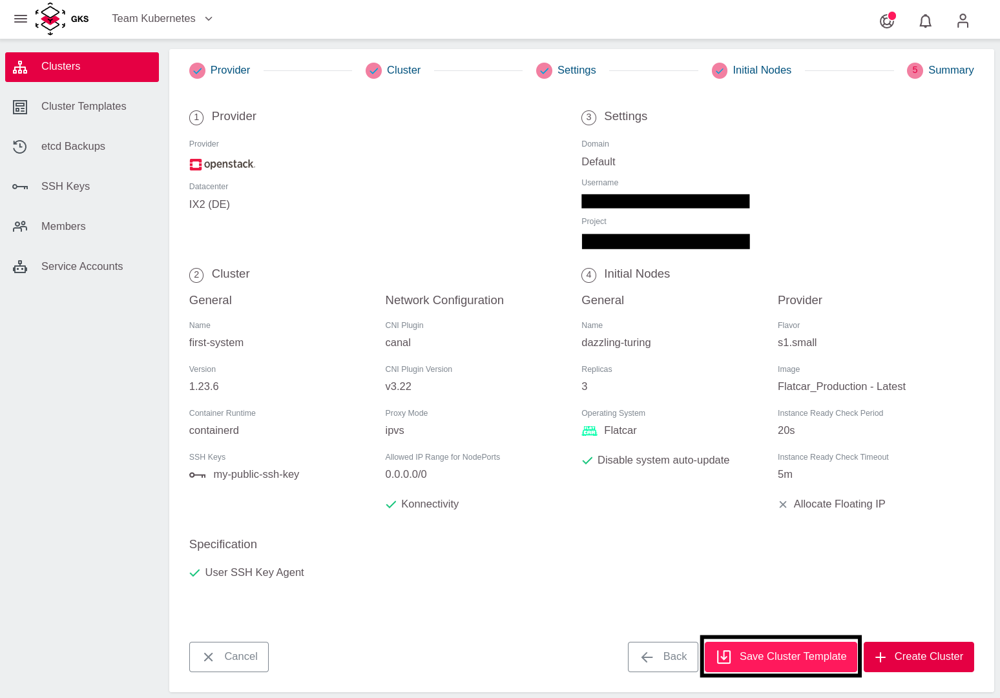
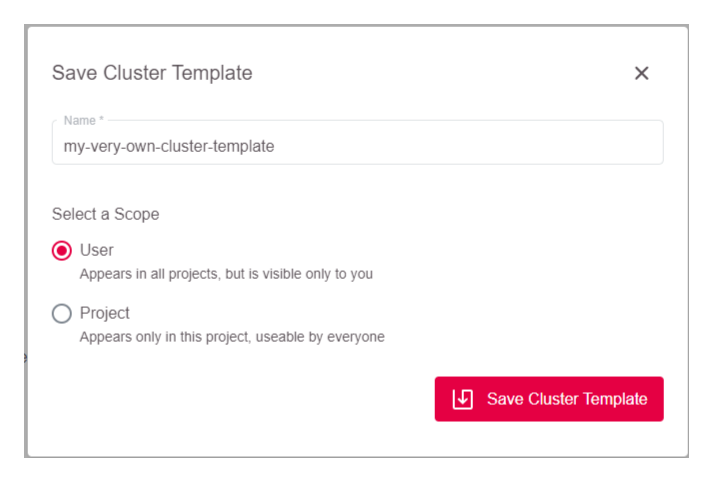
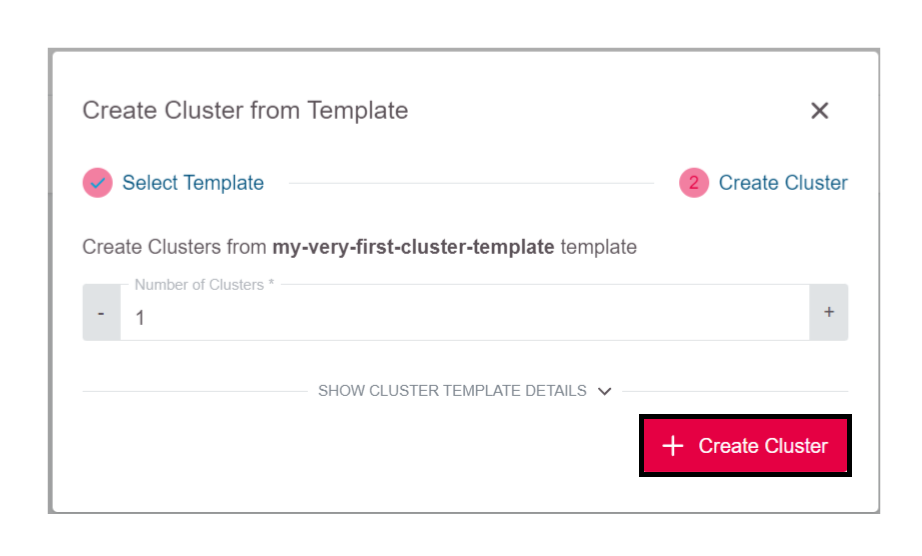
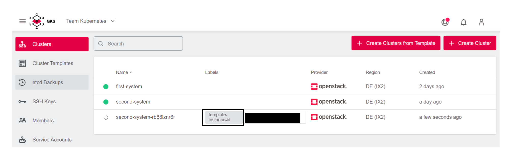
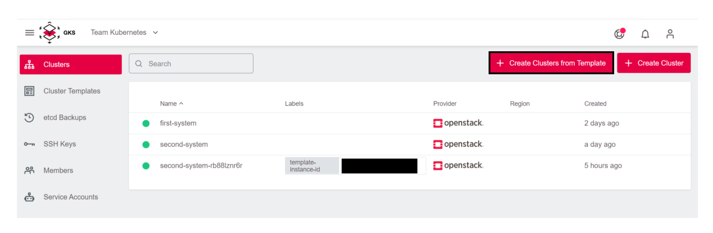
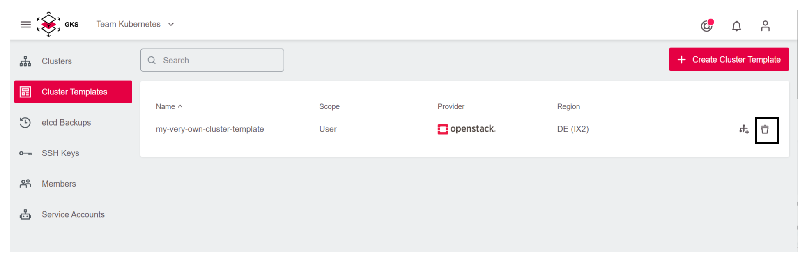

# Cluster Templates

## What Are Cluster Templates?

Cluster templates are templates that enable a fast and uniform creation of Kubernetes clusters. With cluster templates, you can create clusters with a few clicks without having to re-enter settings such as credentials, network settings, and availability zones each time.

## Creating Cluster Templates

To create a `Cluster Template`, select the Cluster Templates menu item in the sidebar and click the `Create Cluster` button.

The cluster creation process known from section [`Creating a cluster`](/gks/clusterlifecycle/creatingacluster/) opens. Enter all required data  for the cluster creation. In the last step "Summary", do **not** click on `Create Cluster` but on `Save Cluster Template`.

Now the dialog `Save Cluster Template` opens. Here you can define the name and storage scope.

Templates can be saved in 2 different scopes:

* On project level: All users of the project can use the template.
* On user level: The template can be used in all projects where the user has write access. Other users cannot use the template.

Confirm the selection with the `Save Cluster Template` button. The cluster template has now been created.

## Creating Clusters from Templates

New clusters can now be easily created from the template you just created.

Select the menu item `Cluster Templates` in the sidebar. Then, select the desired template and click the button `Create Cluster from Template`.

You are asked how many clusters you want to create from this template. Enter a number and confirm the selection with `Create Clusters`.

The cluster or clusters are then created. Clusters created from cluster templates are recognizable by the `template-instance-id` label.

> **Note:**
> Another way to create clusters from templates is available in the `Cluster` menu with the button `Create Clusters from Template`. The function is not different from the one just shown and is just a shortcut in the interface.

## Deleting Cluster Templates

To delete cluster templates, select the menu item `Cluster Templates` in the sidebar and the corresponding template. To delete, click the `Delete Cluster Template` button.

