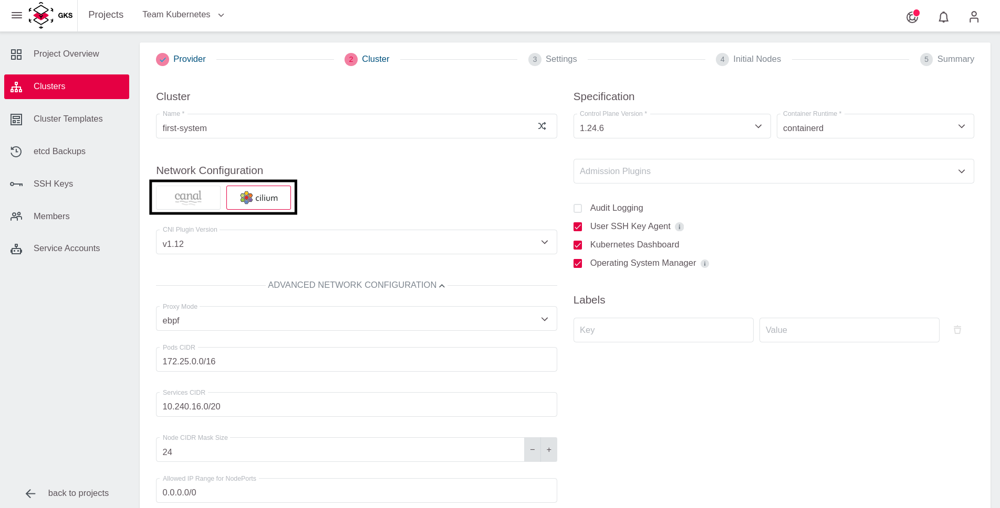
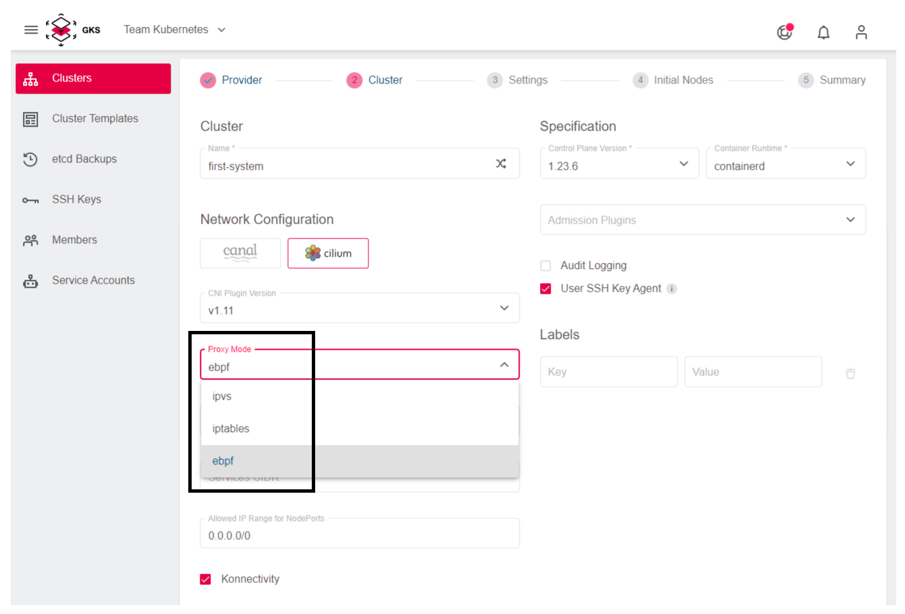
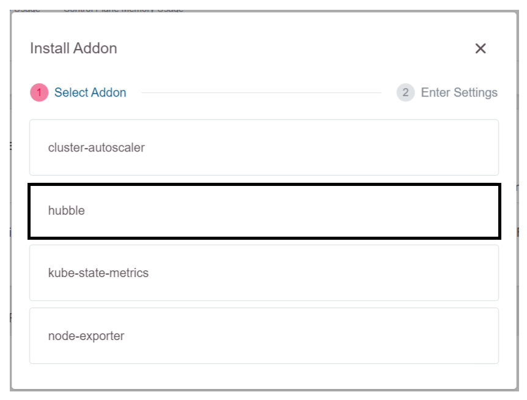

# CNI Choices

Here you find an overview of what CNIs are, why they are used and what features they provide.

## What Is a CNI and Why Do I Need It?

CNI is the abbreviation for ContainerNetworkInterface. Simply put, it is a way for Kubernetes to describe what
network functionality is needed to implement pod-to-pod networking inside a Kubernetes cluster. There
are many different (network) environments where Kubernetes can run. To focus more on the Kubernetes
product the Kubernetes developers decided to just specify what is required in terms of network functionality
and let others do the implementation. This resulted in many different implementations for Kubernetes networking
(CNIs) with very different features for very different environments.

Our Kubernetes platform only supported one CNI implementation for the longest time and therefore did not
provide any means to change that. Recently we added a second one so now you can choose which CNI best
suits your use-case.

## Canal

The CNI solution we used in the past is called *canal*, which is a combination of the two CNIs *flannel*
and *calico*. In these setups flannel is used to implement the pod-to-pod communication while calico is
used to enable network policies. This CNI has been around a long time and is thus mature and battle-tested.

Canal supports both *iptables* as well as *ipvs* as proxy modes.

If you are unsure what to choose, this CNI is the conservative choice.

## Cilium

Cilium is a fairly new CNI which leverages eBPF instead of traditional ways to manage traffic between
Kubernetes pods and nodes. It has advanced observability features like a dedicated looking-glass addon
called *hubble* and improved health checks. Cilium also supports network policies to allow tighter
control of the traffic flow into or out of your cluster as well as inter-cluster traffic.

If you want to take full advantage of the Cilium features, you need to set the proxy mode to *eBPF* after
choosing the CNI (this is only possible if *Konnectivity* is chosen as well). Another requirement for
Cilium (and especially the eBFP proxy mode) is that the OS image needs to run a fairly recent kernel
to be able to support all functionality of the CNI which is the case with our flatcar images.

Cilium is under heavy development so new features as well as bug-fixes are released regularly.

If you are interested in a deeper understanding of the network flows inside your Kubernetes cluster,
then this CNI is for you.

## Installing a CNI

In the cluster creation process, the second step enables you to choose between the two CNIs described
above.

After choosing your CNI you may need to choose a proxy mode as well, depending on the CNI chosen
in the previous step.

The choice of the eBPF proxy implicitly requires the use of *Konnectivity* as your control-plane
connector as well, which is the default in all newly created Kubernetes clusters. More information
on the control-plane connector and Konnectivity is available [here](/gks/clusterlifecycle/controlplaneconnector).

## Installing a Hubble Addon

If Cilium is chosen as a CNI, you can install the graphical visualization addon Hubble. This can be
done after the cluster creation has finished successfully with the Addons tab at the bottom of the cluster
overview.

## Final Note

Choosing an CNI can only be done once in the creation process of the cluster. While it is technically
possible to switch or change CNIs in a running cluster, we do not support this in our platform. So choose your CNI
carefully as this choice cannot be changed without deleting and re-creating the cluster.

## Learn More

* [Flannel GitHub page](https://github.com/flannel-io/flannel)
* [Canal GitHub page](https://github.com/projectcalico/canal)
* [Canal installation docs](https://projectcalico.docs.tigera.io/getting-started/kubernetes/flannel/flannel)
* [Cilium Documentation](https://docs.cilium.io/en/stable/)
