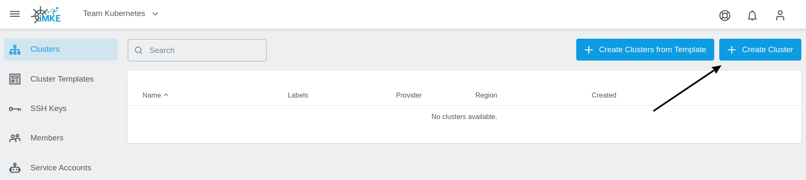
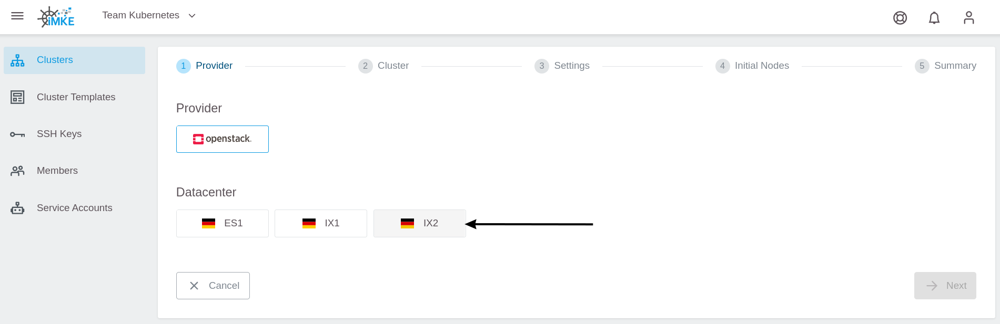
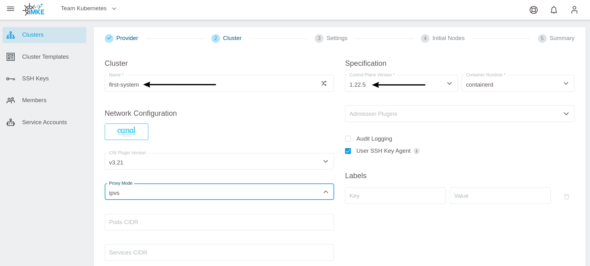
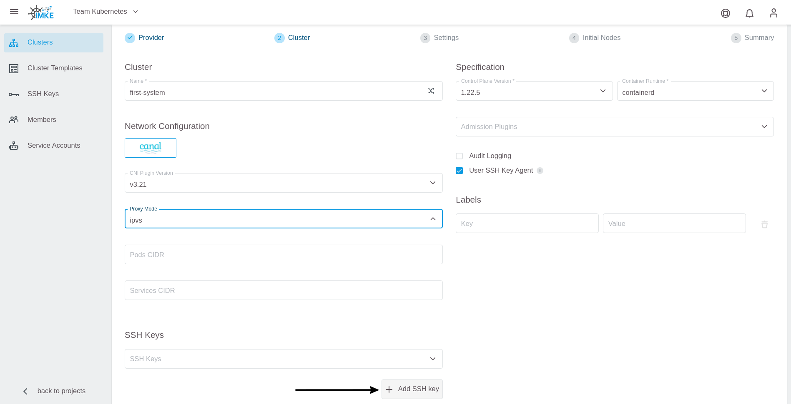
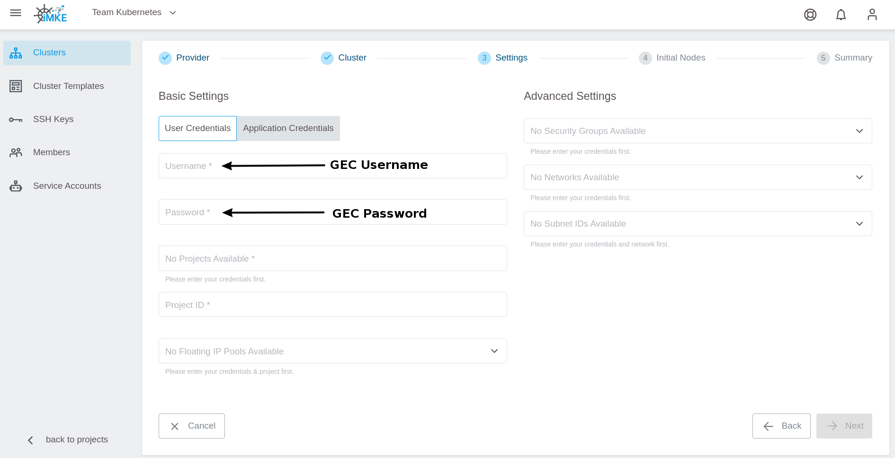
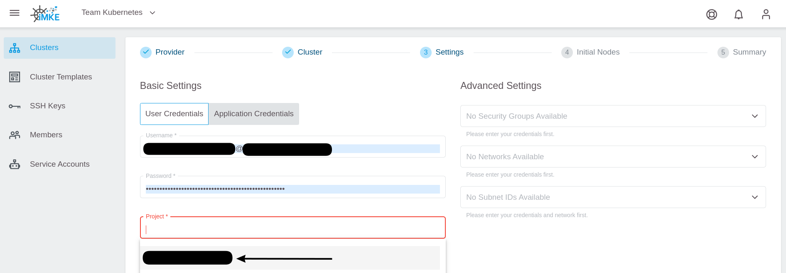

# Creating a Cluster

You can create a cluster in GKS with a couple of clicks.
Before you can do that you need a project.

If you do not have a project yet, [create a project](/gks/managingprojects/creatingaproject) first.

To create the cluster, click on `Create Cluster` in the top right corner:

The first page of the cluster creation procedure opens.
Choose the provider `openstack` and one of the three
datacenters. In this example, we pick `IX2`:

In the next step, you have to configure the cluster details. In the example,
we call our cluster `first-system` and select the desired Kubernetes version:

For occasional SSH access to worker nodes, you can optionally deploy an SSH Key.
To add an SSH Key, click on `Add SSH key`:

After that add the SSH Public Key and give it a memorable name:

To allow GKS to request the required resources from OpenStack, add your
OpenStack credentials. After that the content of `Project` is refreshed
automatically, and you can choose the OpenStack project where you want to run the cluster:

By adding the credentials and selecting the OpenStack project, you could proceed to the next
step. If you do so, a new and dedicated network, subnet, and security group will be automatically created for the cluster.

It is also possible to use an **existing** network to create the cluster. For this, you have to select
the network and the subnet from the dropdown menu, and attach them to a router.
You can create a router from the Optimist dashboard, or from the OpenStack command line.
For details on how to create and attach the router, refer to our [OpenStack documentation](/optimist/guided_tour/step10/).

In the next step, you define the number and the kind of virtual machines that will be initially available as worker nodes
in the cluster.

First, this so-called `Machine Deployment` needs a name. For your test cluster you use the random name generator:

Next, specify the `Replicas` (number of worker nodes in your Kubernetes cluster) and the `Flavor` (machine type), which
defines the amount of CPU and RAM for each worker node:

To finish, click on `Next`. After you verified all settings, click on `Create Cluster`:

Now the cluster is being created. To access the information, return to the cluster
view of the project and click your cluster's name:

This opens a page with all cluster details:

## Summary

Congratulations! You learned and achieved the following:

* What is a GKS cluster
* How to create an GKS cluster

The following sections describe cluster usage examples.
