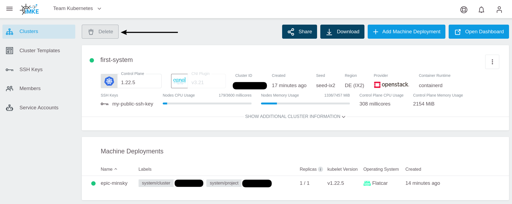

<!-- LTeX:  language=de-DE -->

Einen Cluster in GKS zu löschen ist sehr schnell machbar.
Die Voraussetzung für diesen Guide ist ein existierender
Cluster in einem Projekt.

## Den Cluster finden

Um einen Cluster zu löschen, müssen wir in die Detailansicht
des Clusters gehen.
Hierfür klicken wir auf den Eintrag `first-system`.

Folgend müssen wir uns den Cluster-Namen merken. Um diesen
in die Zwischenablage zu kopieren, klicken wir auf den Namen.

## Den Cluster löschen

Nun klicken wir auf `Delete`.

In dem sich öffnenden Fenster wird als Sicherheitsfrage
der Cluster-Name abgefragt. Da wir diesen zwei Schritte vorher
schon in die Zwischenablage kopiert haben, müssen wir diesen
nur noch einfügen.

Da wir alles löschen wollen, lassen wir die beiden Checkboxen
angekreuzt. Damit werden auch Volumes und Loadbalancer in
OpenStack gelöscht.

## Zusammenfassung

Folgende Schritte wurden erfolgreich durchgeführt und gelernt:

* Wie lösche ich ein Projekt
* Wie lösche ich auch in OpenStack alle Ressourcen

Herzlichen Glückwunsch! Dies sind alle notwendigen Schritte um
einen Kubernetes Cluster in GKS zu löschen.
