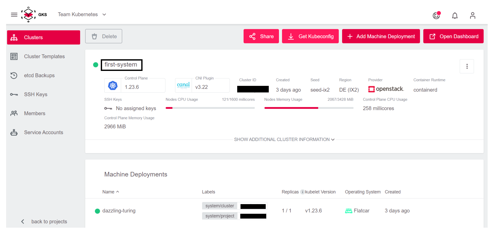
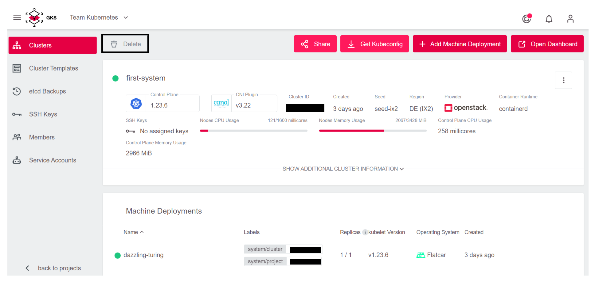

# Deleting a Cluster

It's quick and simple to delete clusters in the GKS dashboard. The
only prerequisite is a running cluster
in a GKS project.

## Finding the Cluster

To delete a cluster, you need to go into the cluster's detail
view. For this, click on `first-system`.

You need to use the cluster name later. To copy it into the
clipboard, click on the name.

## Deleting the Cluster

Now click `Delete`.

This opens a window where you need to enter the cluster name
to avoid sudden and unwanted deletions. Since you copied the name
into your clipboard previously, you can simply paste it here.

Since we also want to free up the resources, leave both check
boxes marked. That way, volumes and load balancers provided by
OpenStack will be removed as well.

## Summary

Congratulations! You learned and achieved the following:

* How to delete a cluster
* How to delete all resources in OpenStack as well
