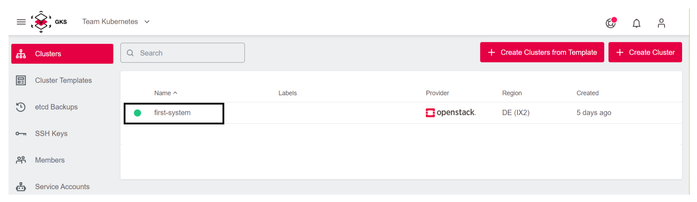

# Changing Openstack Credentials

It is possible to change the credentials that GKS uses to create Openstack resources.
This could be required after you changed the password, or when you need to use a different account.

## Changing the Credentials

To change the credentials perform the following steps:

1. Navigate to the desired cluster.

2. Click the three dots, to open the cluster submenu.

3. Select `Edit Provider`.
 

4. Change the credentials.

Shortly after performing these steps, a confirmation message pops up, and the credentials have been changed successfully.
