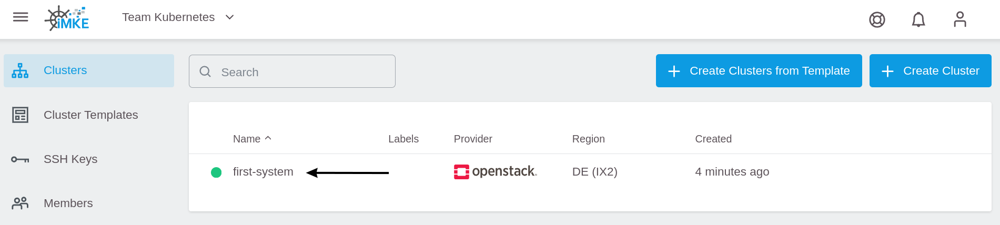
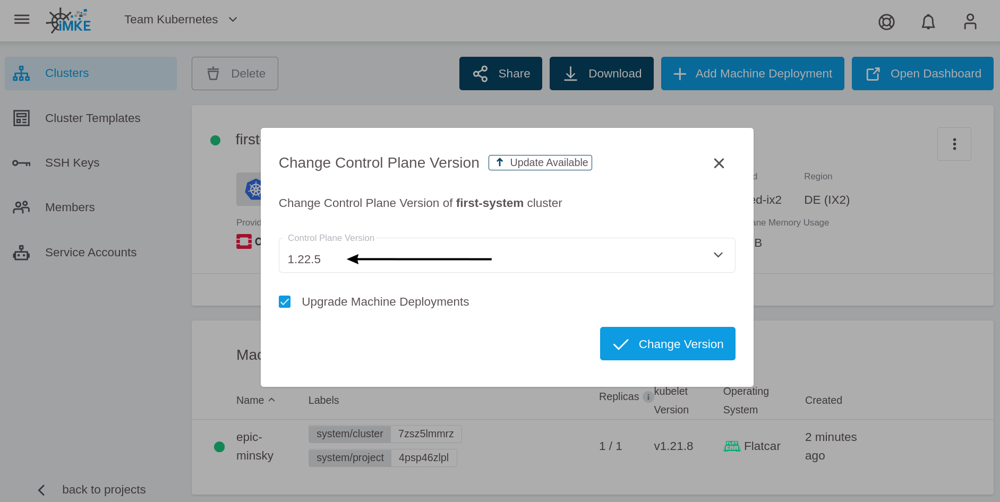
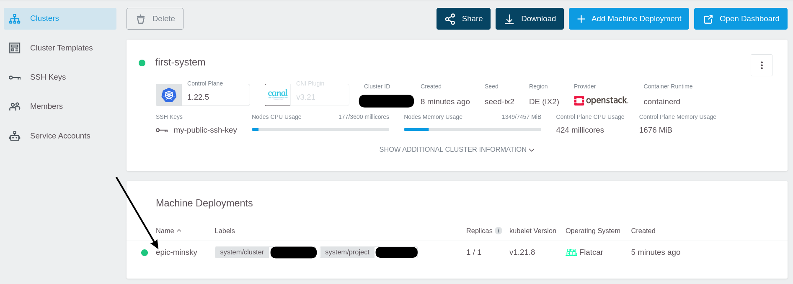
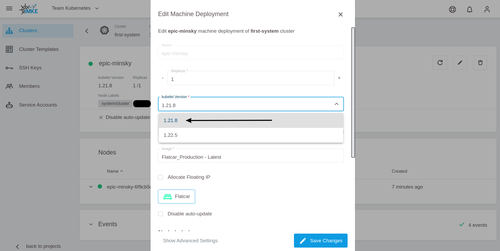

<!-- LTeX:  language=de-DE -->
# Kubernetes Updates

Einen Kubernetes Cluster aktuell zu halten dient mehreren Zwecken.
Einerseits gewährleistet es die Sicherheit des Clusters. Hinzu
kommt, dass Kubernetes auch neue Features mit jedem Release mitbringt.
Um hier auf der sicheren Seite zu sein, empfiehlt
es sich, regelmäßig Kubernetes-Updates zu installieren.

In besonders kritischen Fällen aktualisieren wir die Cluster API
automatisch auf die letzte Minor-Version, um auch unsere eigene
Infrastruktur sicher zu halten. In diesem Fall können Sie den nächsten
Abschnitt "Der Cluster" überspringen. Sie müssen jedoch noch die (Worker-)Nodes
selbst updaten.

Bevor Sie einen Cluster upgraden, lesen Sie das [Changelog](/gks/about/) der Ziel-Kubernetes-Version,
und machen Sie sich mit den bevorstehenden Änderungen vertraut.

Das Tool [Kubepug](https://github.com/rikatz/kubepug) kann bei der Vorbereitung eines Updates helfen.
Es überprüft die Kompatibilität der benutzten Ressourcen zur neuen Kubernetes-Version und warnt vor veralteten (deprecated) oder nicht mehr unterstützten Versionen.

## Der Cluster

In Kubernetes teilt sich die Infrastruktur in Master- (= Kubernetes Controlplane) und (Worker)-Nodes.
Bei GKS Clustern wird der Master verwaltet.

Da mehrere Versionen für den Master angeboten werden, kann man
im GKS Web Interface die Version auswählen. Ein
Update des Masters ist mit ein paar Mausklicks erledigt.

Als Erstes gehen Sie zu dem Cluster, für den Sie ein Update durchführen wollen.



Klicken Sie in das Feld `Master Version` und wählen Sie eine
neue Version für den Master aus.


Wir empfehlen, dabei direkt `Upgrade Machine Deployments` zu aktivieren, um die Worker-Nodes gleich mit upzugraden.



Jetzt aktualisiert GKS den Master (und ggf. auch die Nodes) selbstständig und Sie sind mit
diesem Schritt fertig.

## Die Nodes

Sofern der Master ohne Machine Deployments aktualisiert wurde, oder ein Upgrade der GKS-Plattform selbst zu einem impliziten Upgrade des Master geführt hat (i.d.R. nur Patchlevel), müssen Sie nun noch manuell die Nodes updaten. Auch hier hilft Ihnen das GKS Web Interface.

Beachten Sie jedoch, dass bei einem Update neue Nodes erzeugt
und die alten Nodes gelöscht werden. Dabei werden zwangsweise auch
alle Pods neu gestartet.

Im ersten Schritt klicken Sie auf das Machine Deployment.



Klicken Sie auf das Editier- (Bleistift-)Symbol, um die Update-Ansicht
zu öffnen.


Bei der kubelet Version wählen Sie die Version aus, die auch bei
Ihrem Cluster Controlplane konfiguriert ist (in diesem Beispiel
`1.21.5`) und bestätigen Sie mit `Save Changes`.



Nun aktualisiert GKS automatisch die Node Group auf die neue Version
und Kubernetes sorgt dafür, dass Ihre Applikationen
neu auf die aktualisierten Nodes verteilt werden.

## Zwei-Knoten Cluster

Aufzupassen ist hier bei Clustern mit zwei Knoten. GKS nutzt ein
rollierendes Update als Update-Strategie. Hierbei wird immer
ein Knoten nach dem anderen getauscht. Bei einem Cluster mit zwei oder
weniger Knoten bedeutet dies, dass der zuerst aktualisierte Knoten komplett
geplant wird, noch bevor der zweite fertig ist.

Als Lösung gibt es ein recht einfaches Bash-Script, welches in einem
Namespace alle Pods noch einmal neu erstellen lässt:
<https://github.com/truongnh1992/playing-with-istio/blob/master/upgrade-sidecar.sh>
<!-- the above is a REALLY bad idea as we are linking to contents that can be changed at any time without us noticing ... we need to FIX this -->

Dieses nutzen wir, nachdem das Cluster komplett aktualisiert wurde, in einem Terminal mit konfiguriertem `kubectl`. Im Kapitel [Mit einem Cluster verbinden](/gks/accessmanagement/connectingtoacluster/) zeigen wir, wie Sie Ihr `kubectl` mit Ihrem Cluster verbinden können.

```bash
curl -o upgrade-node.sh https://raw.githubusercontent.com/truongnh1992/playing-with-istio/master/upgrade-sidecar.sh
chmod +x upgrade-node.sh
echo -e "#\!/bin/bash\n$(cat upgrade-node.sh)" > upgrade-node.sh
```

Nun müssen Sie nur noch dieses Script auf alle Ihre Namespaces anwenden.

```bash
kubectl get namespace
NAME              STATUS   AGE
default           Active   36m
kube-node-lease   Active   36m
kube-public       Active   36m
kube-system       Active   36m

# Wir interessieren uns für default Namespace:
./upgrade-node.sh default

Refreshing pods in all Deployments
```

Nun sind alle Pods sauber auf Ihre Knoten verteilt worden.
