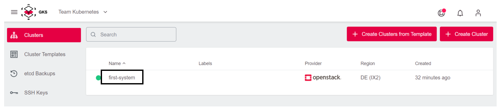
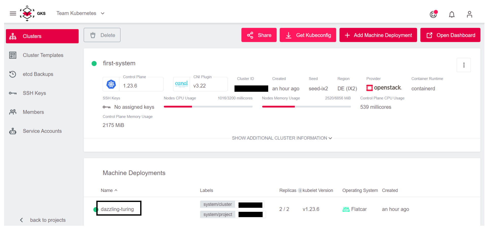
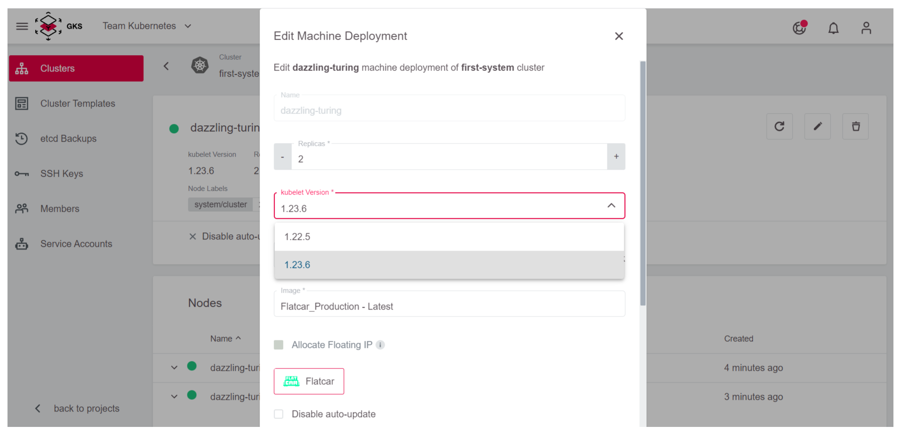

# Kubernetes Updates

Cluster security is paramount, and new features come with
each release. In order to stay safe and up-to-date, Kubernetes updates have to be installed on a regular basis.

In especially critical cases, we will automatically update the
Cluster API to the latest minor version in order to keep our
own infrastructure up-to-date. In this case the below section
*The Cluster* can be skipped. However, nodes must still be updated
manually by you.

Before you upgrade a cluster, refer to the target version's [changelog](/gks/about/)
and familiarize yourself with the upcoming changes.

One tool that can help to prepare the update is [kubepug](https://github.com/rikatz/kubepug).
It checks all deployed resources against the new Kubernetes version and warns about removals and deprecations.

## The Cluster

In Kubernetes, the infrastructure is divided into master (= Kubernetes control plane) and (worker) nodes.
The master is managed by GKS itself.

Since several versions for the master are offered, you can choose the version in the GKS web interface. An
update of the master can be done with a few mouse clicks.

First, select the cluster you'd like to update.



Then click on the field `Master Version`, and choose a new
version for the master.


We recommend selecting `Upgrade Machine Deployments`, as this will upgrade the worker nodes as well.


Now GKS automatically updates the master and optionally the
worker nodes.

## The Nodes

If the master has been updated without upgrading the Machine Deployments, or if a scheduled maintenance of the GKS
platform has led to an implicit upgrade of the master (normally this just updates a patchlevel), you must still update the nodes.
The GKS web interface helps you here as well.

It's worth noting that this update process deletes the old nodes and
replaces them with new ones. This also means that all pods will be
restarted.

First, click on `Machine Deployments`.



Next, click on the pencil icon to open the update view.


Now, under `kubelet Version` select the version, for example
`1.23.6`, which matches the cluster's master version. Confirm the
update by clicking `Save Changes`.



Now GKS automatically updates the node group to the new version,
amd Kubernetes takes care of deploying your applications to the
new nodes.

## Two-Node Cluster

Watch out for clusters with two nodes or less. GKS uses a rolling update
strategy. This means one node after another is swapped. In a cluster
with two or less nodes this means that the first updated node must
be fully scheduled before the second one is ready.

A solution to this is a simple bash script, which per-namespace triggers
the regeneration of all pods.
<https://github.com/truongnh1992/playing-with-istio/blob/master/upgrade-sidecar.sh>
<!-- the above is a REALLY bad idea as we link to content that can be changed at any time without noticing us ... we need to FIX this -->

We use this after the cluster has been completely updated in a terminal with `kubectl` configured. To get `kubectl` working with your cluster, look at chapter [Connecting to a Cluster](/gks/accessmanagement/connectingtoacluster/).

```bash
curl -o upgrade-node.sh https://raw.githubusercontent.com/truongnh1992/playing-with-istio/master/upgrade-sidecar.sh
chmod +x upgrade-node.sh
echo -e "#\!/bin/bash\n$(cat upgrade-node.sh)" > upgrade-node.sh
```

Now you must use this script on all of your namespaces.

```bash
kubectl get namespace
NAME              STATUS   AGE
default           Active   36m
kube-node-lease   Active   36m
kube-public       Active   36m
kube-system       Active   36m

# So for default namespace we would run:
./upgrade-node.sh default
Refreshing pods in all Deployments
```

Now all pods are cleanly distributed across your nodes.
