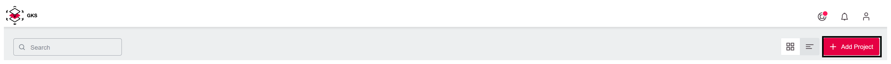
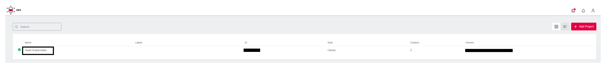
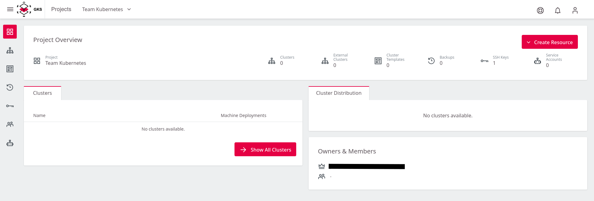
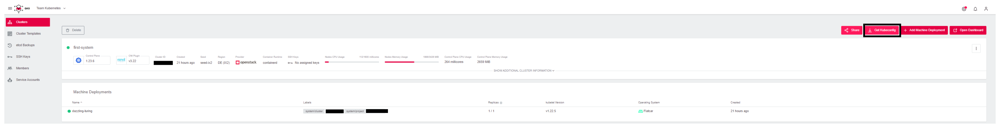
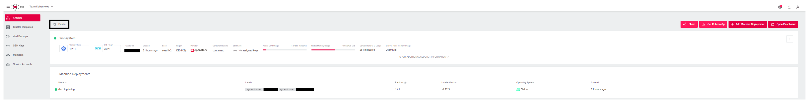
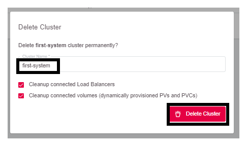

<!-- LTeX:  language=de-DE -->
# Erste Schritte

Diese Anleitung beschreibt, wie Sie Ihr erstes GKS-Projekt inkl. einen ersten
Kubernetes Cluster anlegen, wie Sie auf den Cluster zugreifen und anschließend
die angelegten Ressourcen wieder vollständig löschen können.

## Das erste Projekt anlegen

Nach dem Login in GKS erscheint folgendes Fenster. Klicken Sie auf
`Add Project`.


Danach öffnet sich ein Fenster, in Sie dem Projekt einen Namen geben.
Als Beispiel verwenden Sie hier `Team Kubernetes`.
Klicken Sie dann auf `Save Project`.


Im Anschluss legt GKS das Projekt an und stellt es in der Übersicht dar.
Mit einem Klick auf den Eintrag `Team Kubernetes` sind Sie
im Projekt-Umfeld und können den Cluster anlegen.


Die folgende Seite zeigt das Projekt. Hier sind alle bereits
bestehenden Cluster sowie zugehörige User und weitere Kontroll-Mechanismen
sichtbar.


Im Augenblick ist diese Liste noch leer, bis Sie Ihren ersten Kubernetes
Cluster erstellt haben.

## Den ersten Cluster erstellen

Um einen Cluster anzulegen, klicken Sie im gewünschten Projekt oben rechts auf `Create Cluster`.


Jetzt öffnet sich die erste Seite für den Prozess des Cluster Anlegens.
Wählen Sie den Provider `openstack.`


Wählen Sie anschließend eine der drei Verfügbarkeitszonen aus, in unserem Beispiel
nehmen Sie `IX2`.


Im nächsten Schritt konfigurieren Sie die Cluster-Details. Nennen Sie den Cluster `first-system` und
wählen Sie die gewünschte Kubernetes-Version aus.


Für den gelegentlichen SSH-Zugriff auf Worker-Nodes können Sie optional einen öffentlichen SSH-Schlüssel hinterlegen.
Zum Hinzufügen eines SSH Keys klicken Sie auf `Add SSH Key`.


In dem sich öffnenden Dialog können Sie dann Ihren SSH Public Key eintragen
und ihm einen passenden Namen geben.


Damit GKS in der OpenStack-Infrastruktur die notwendigen Ressourcen erzeugen kann,
geben Sie im nächsten Schritt Ihre Zugangsdaten ein. Danach wird der Inhalt im Feld `Project`
automatisch aktualisiert und Sie können in der Dropdownliste Ihr gewünschtes OpenStack Projekt
auswählen.


Mit dem Hinzufügen Ihrer Zugangsdaten und dem Auswählen des OpenStack-Projekts sind alle
notwendigen Eingaben getätigt und Sie können mit dem nächsten Schritt fortfahren. Wenn Sie das tun,
wird automatisch ein eigenes Netzwerk, Subnetz sowie eine Security Gruppe für den neuen Cluster erstellt.

Es ist allerdings auch möglich, ein existierendes Netzwerk zu verwenden, um den Cluster zu erstellen.
Dazu müssen Sie das Netzwerk und das Subnetz auswählen. Diese müssen allerdings mit einem Router verbunden sein.
In unserer [OpenStack Dokumentation](/optimist/guided_tour/step10/) ist beschrieben, wie Sie einen Router erstellen
und mit einem Netzwerk verbinden können.


Im nächsten Schritt definieren Sie, wie viele und welche virtuellen Maschinen als Worker-Nodes im Cluster verfügbar
sein sollen.

Zuerst geben Sie dem sogenannten `Machine Deployment` einen Namen. Für Ihren Testcluster nutzen Sie dazu den Namensgenerator.


Danach spezifizieren Sie die `Replicas` (Anzahl der Worker-Nodes im Kubernetes Cluster) und den `Flavor` (Maschinentyp), welcher
im Wesentlichen die Anzahl der verfügbaren CPU-Kerne und des RAMs bestimmt.


Wählen Sie `Flatcar` als Betriebssystem für die Worker-Nodes.


Über einen Klick auf `Next` gelangen Sie zum letzten Schritt, wo Sie noch einmal alle Einstellungen verifizieren und mit `Create Cluster`
die Cluster-Erstellung starten können.


Nun wird der Cluster erstellt. Um auf die Informationen zugreifen zu können, müssen
Sie nun wieder zur Cluster-Übersicht des Projektes gehen und dort Ihren Cluster auswählen.


Nachdem Sie Ihren Cluster ausgewählt haben, kommen Sie auf die Seite mit allen Cluster-Details.


## Auf das Cluster zugreifen

Um auf den Cluster zuzugreifen, klicken Sie oben rechts
auf die `Get Kubeconfig` Schaltfläche.


Damit laden Sie eine Datei herunter, die sich im Kubernetes-Jargon
`kubeconfig` nennt. In dieser Datei stehen alle Endpunkte,
Zertifikate sowie Bereiche des Clusters. Mit dieser Datei ist
`kubectl` in der Lage, sich mit dem Cluster zu verbinden.

Um diese Datei zu nutzen, müssen Sie diese auf der Konsole
registrieren. Dafür gibt es zwei Möglichkeiten:

1. `kubectl` schaut als Standard in die Datei `.kube/config`
    im Heimat-Verzeichnis des Benutzers
2. Sie können die `kubeconfig` temporär mit Hilfe einer Umgebungsvariable
    exportieren

Der Einfachheit halber und um auf Ihrem System die Standards
nicht zu verändern, wählen Sie hier die Variante 2.

Dafür benutzen Sie eine Konsole. In den Screenshots wird iTerm2 auf macOS verwendet, es funktioniert jedoch auf Linux und Windows
genau so.

Als Erstes müssen Sie die heruntergeladene Datei finden.
Chrome und Firefox laden diese beide normalerweise in den Downloads-Ordner. Der Dateiname setzt sich jetzt aus zwei Komponenten zusammen.

* `kubeconfig-admin-`
* Ihre Cluster ID

Um diese dann zu registrieren, nutzen Sie folgendes Kommando:

```bash
cd Downloads
export KUBECONFIG=$(pwd)/kubeconfig-admin-CLUSTERID
```

Nun können Sie mit Ihrem Cluster kommunizieren. Das einfachste Kommando ist
hier, sich alle Nodes seines Clusters anzeigen zu lassen:

```bash
kubectl get nodes

NAME                           STATUS   ROLES    AGE   VERSION
musing-kalam-XXXXXXXXX-ks4xz   Ready    <none>   10m   v1.21.5
musing-kalam-XXXXXXXXX-txc4w   Ready    <none>   10m   v1.21.5
musing-kalam-XXXXXXXXX-vc4g2   Ready    <none>   10m   v1.21.5
```

## Aufräumen

Um nach diesem ersten Test den Cluster wieder zu löschen, klicken Sie auf `Delete`:


In dem sich öffnenden Fenster wird als Sicherheitsfrage
der Cluster-Name abgefragt.


Da Sie alles löschen wollen, lassen Sie beide Checkboxen
angekreuzt. Damit werden auch Volumes und Loadbalancer in
OpenStack gelöscht.
