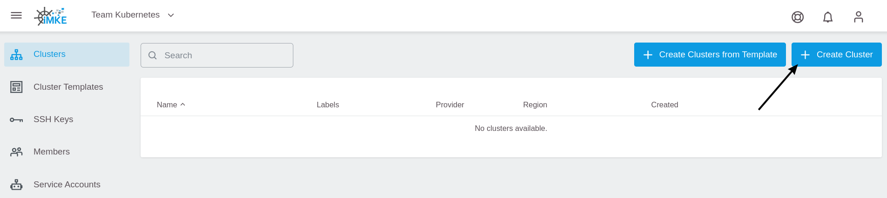
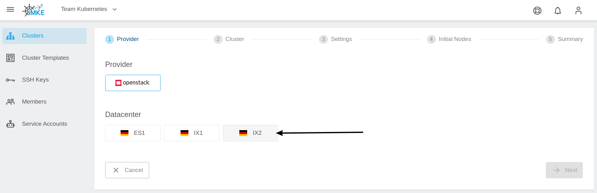
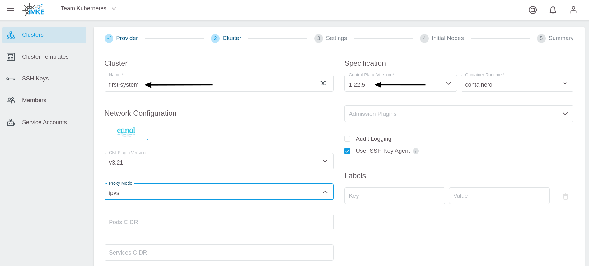
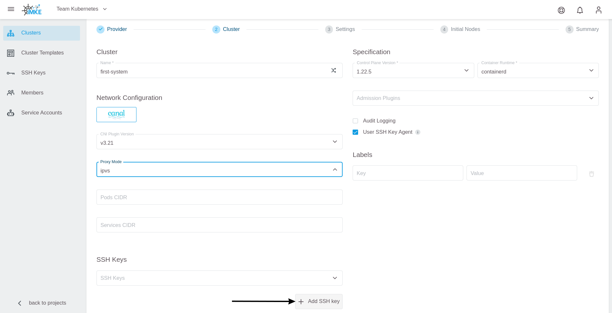
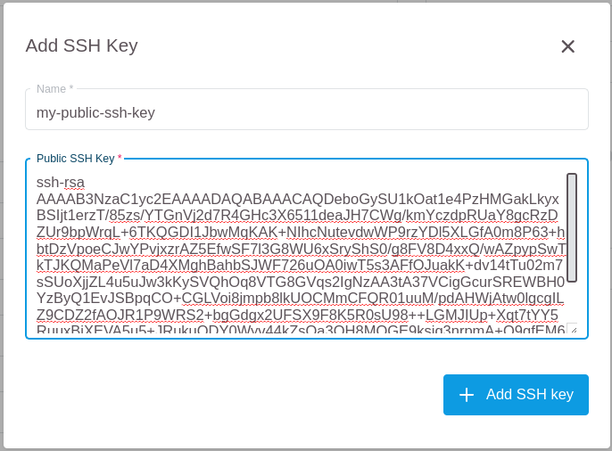
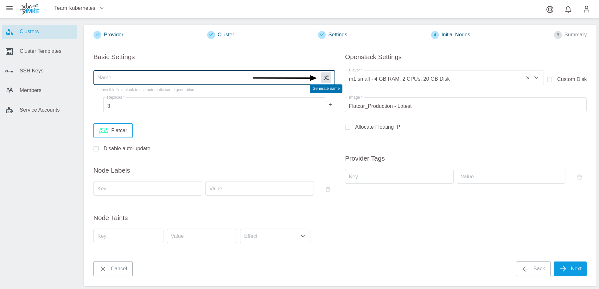
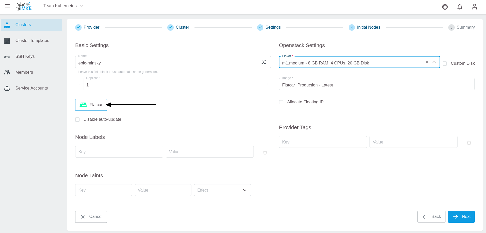
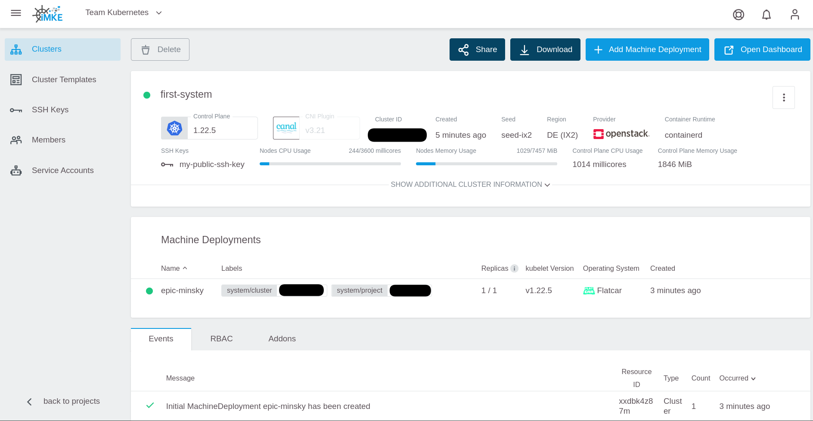
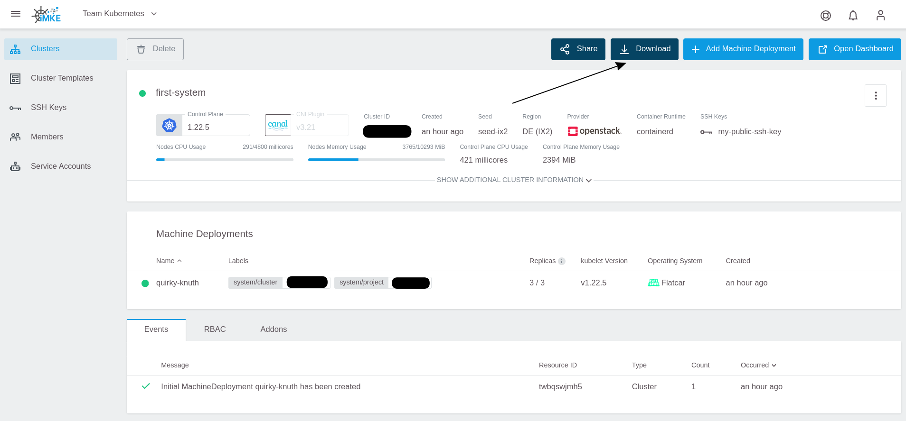

# Getting Started

This documentation describes how to create your first GKS project with a first Kubernetes
cluster, how to connect to that cluster, and how to clean up all resources
afterwards.

## Creating Your First Project

After logging into GKS for the very first time, the following window appears.
Since a project is required to create your first Kubernetes cluster, you
need to click on `Add Project`.


A window opens, where you can name the project. In the
example, we use `Team Kubernetes`.
To finish, click on `Save`.


Now GKS creates your project and adds it to the overview. With a click on
the entry `Team Kubernetes` you enter the project.


This opens a window showing the project. You see a list of all existing
clusters and their users, as well as some other controls.


At the moment, this list is empty until you create your first managed Kubernetes cluster.

## Create Your First Cluster

To create the cluster, click on `Create Cluster` in the upper right corner.


The first page of the cluster creation procedure opens.
Choose the provider `openstack` and one of the three
datacenters. In this example, we pick `IX2`.


In the next step, you have to configure the cluster details. In our example,
we call our cluster `first-system` and select the desired Kubernetes version.


For occasional SSH access to worker nodes, you can optionally deploy an SSH Key.
To add an SSH Key, click on `Add SSH key`.


After that add the SSH Public Key and give it a memorable name.


To allow GKS to request the required resources from OpenStack, add your
OpenStack credentials. After that, the content of `Project` is refreshed
automatically, and you can choose the OpenStack project where you want to run the cluster.


By adding the credentials and selecting the OpenStack project, you could proceed to the next
step. If you do so, a new and dedicated network, subnet, and security group will be automatically created for the cluster.

It is also possible to use an **existing** network to create the cluster. For this, you have to select
the network and the subnet from the dropdown menu, and attach them to a router.
You can create a router from the Optimist dashboard or from the OpenStack command line.
For details on how to create and attach the router, refer to our [OpenStack documentation](/optimist/guided_tour/step10/).


In the next step, you define the number and the kind of virtual machines that will be initially available as worker nodes
in the cluster.

First, this so-called `Machine Deployment` needs a name. For your test cluster you use the random name generator.


Next, specify the `Replicas` (number of worker nodes in your Kubernetes cluster) and the `Flavor` (machine type), which
defines the amount of CPU and RAM for each worker node.


Choose `Flatcar` as the operating system for the worker nodes.


To finish, click on `Next`. After you verified all settings, click on `Create Cluster`.


Now the cluster is being created. To access the information, return to the cluster
view of the project and click your cluster's name.


This opens a page with all cluster details:


## Accessing Your First cluster

To access the cluster, you need to click on the downwards
facing arrow in the top right corner.



This way you download a file which is called `kubeconfig` in
kubernetes jargon. This file contains all end points, certificates
and other information about the cluster. The `kubectl` command uses
this file to connect to the cluster.

To use `kubeconfig`, you need to register it on the console.
There are two ways to do this:

1. `kubectl` by default tries to use the file `.kube/config`
   in your home directory
2. You can temporarily use the `kubeconfig` by exporting it to
   the environment variable KUBECONFIG

To keep things straightforward and to avoid changing standards
on our system, choose the second method in the example.

For this you need to open a terminal. In the screenshots we use
iTerm2 on macOS, but the examples work the same way when using
bash on Linux or Windows.

First, you need to find the downloaded `kubeconfig` file. Browsers
like Chrome or Firefox usually store it in the Downloads folder.
The name is composed of two parts:

* `kubeconfig-admin-`
* The cluster id.

 To register the `kubeconfig`, use the following command:

```bash
cd Downloads
export KUBECONFIG=$(pwd)/kubeconfig-admin-CLUSTERID
```

Now you can interact with the cluster. The simplest command is: "show
all the nodes that comprise my cluster":

```bash
kubectl get nodes

NAME                           STATUS   ROLES    AGE   VERSION
musing-kalam-XXXXXXXXX-ks4xz   Ready    <none>   10m   v1.21.5
musing-kalam-XXXXXXXXX-txc4w   Ready    <none>   10m   v1.21.5
musing-kalam-XXXXXXXXX-vc4g2   Ready    <none>   10m   v1.21.5
```

## Cleanup

To clean up the cluster you created, click `Delete` in the GKS dashboard:


This opens a window where you need to enter the cluster name
to avoid sudden and unwanted deletions:


Since we also want to free up the resources, leave both check
boxes marked. That way, volumes and load balancers provided by
OpenStack will be removed as well.
