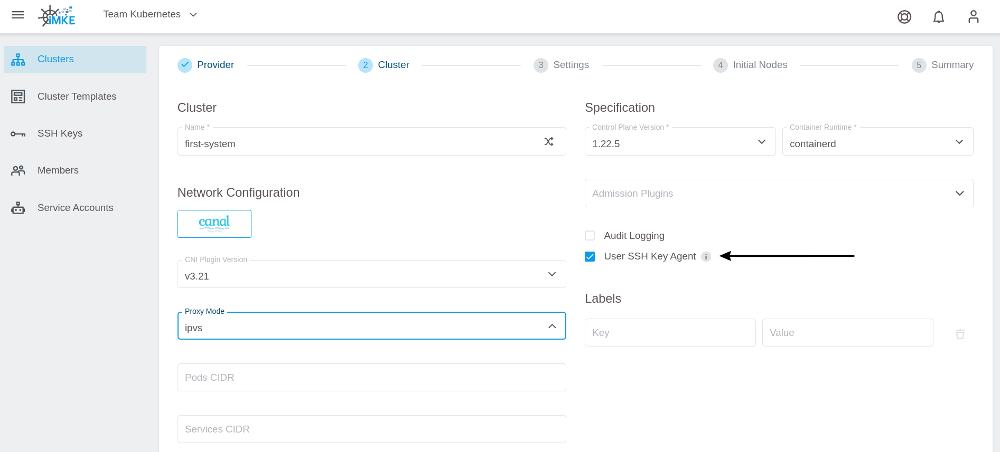
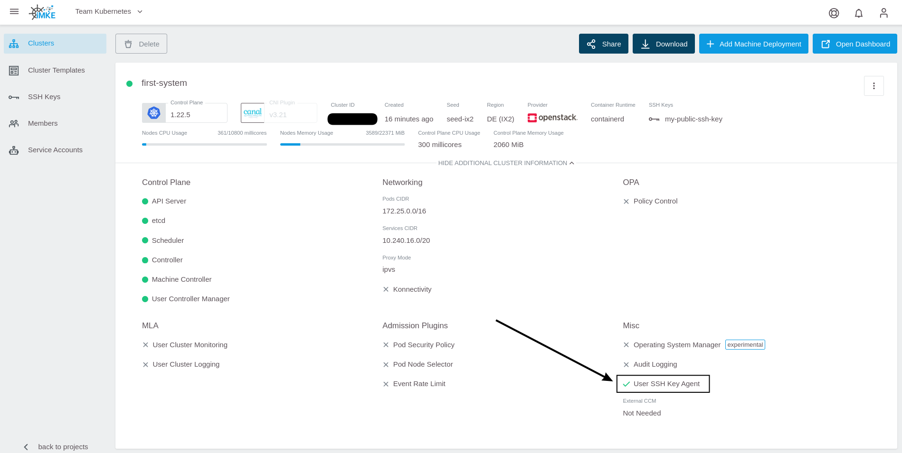
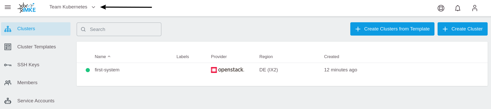
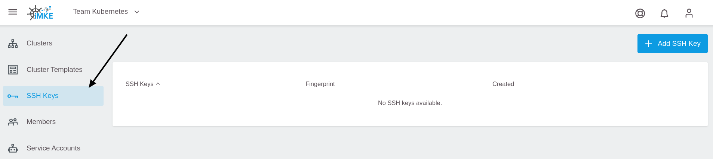
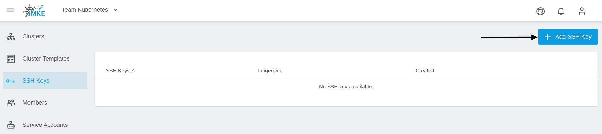
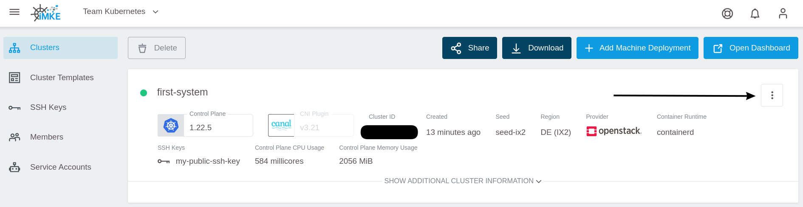
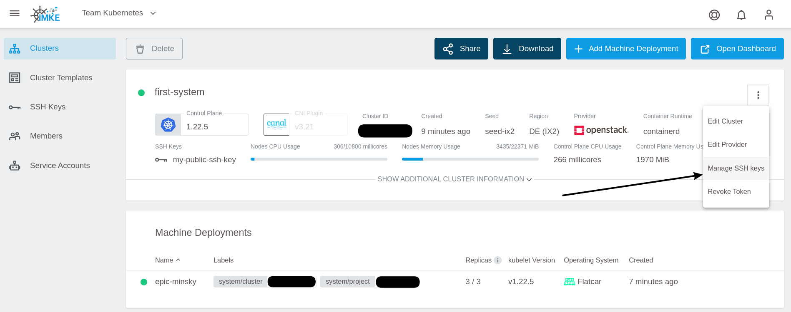
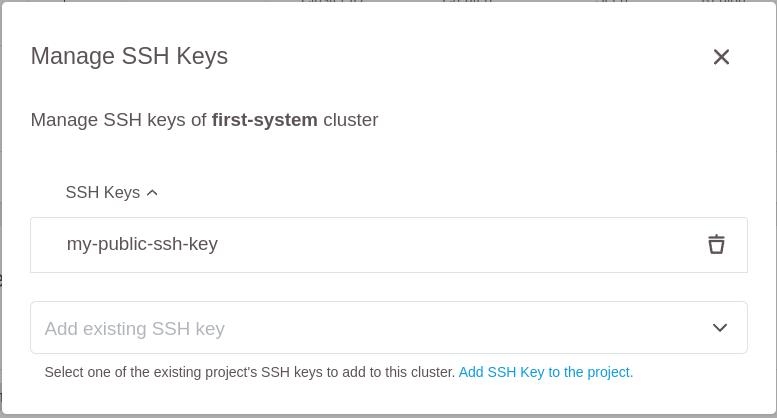
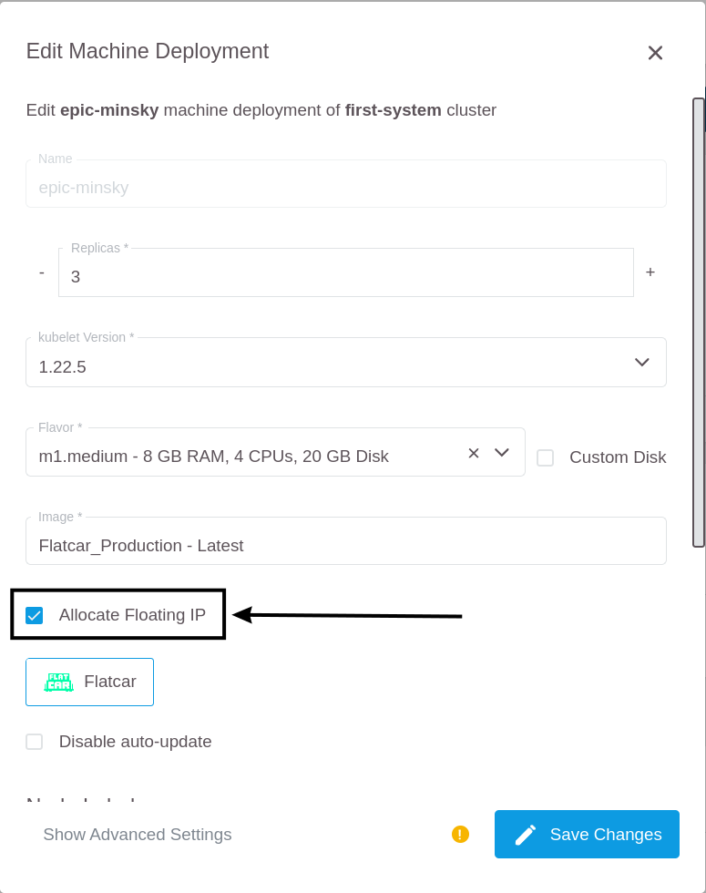

<!-- LTeX:  language=de-DE -->
# SSH Key einem Cluster hinzufügen

Mit der GKS-Plattform können Sie einen SSH-Key auf Worker-Nodes installieren. Dies kann zum Beispiel hilfreich sein, wenn Sie den Cluster oder eine eigene Applikation unmittelbar auf den Worker-Nodes debuggen möchten.

Dafür müssen Sie folgende Schritte ausführen:

- Einen SSH-Key erstellen
- Den `User SSH Key Agent` im Cluster aktivieren
- Den SSH-Key zum Projekt hinzufügen
- Den SSH-Key im Cluster aktivieren

In der Regel muss den Worker-Nodes noch eine Floating IP zugewiesen werden, damit der Zugriff auf die Worker-Nodes auch Netzwerkseitig funktioniert.

## User SSH Key Agent

Um SSH-Keys verwalten zu können, muss der `User SSH Key Agent` im Rahmen der Erstellung des Clusters aktiviert worden sein.



Ist der Agent nicht bei der Erstellung des Clusters aktiviert worden, können Sie nachträglich keine SSH-Keys zum Cluster hinzufügen bzw. ändern. Weiterhin kann auch der User SSH Key Agent nur während der Erstellung des Clusters aktiviert werden, eine nachträgliche Aktivierung ist nicht möglich.

### Den Status des User SSH Key Agents überprüfen

Sie können den aktuellen Status des User SSH Key Agents auf der Übersichtsseite des Clusters einsehen. Klappen Sie dazu die erweiterte Clusteransicht auf.


Nun können Sie im unteren Abschnitt den Status des User SSH Key Agents ablesen.



Wenn der Agent aktiviert ist, können Sie jederzeit SSH-Keys zum Cluster hinzufügen oder ändern.

### Alternativen zur Verwendung des User SSH Key Agents

Cluster können auch **ohne** aktivierten User SSH Key Agent angelegt werden. In diesem Fall wird während der gesamten Lebenszeit des Clusters jede neue Worker-Node ohne SSH-Keys erstellt. Eine Änderung dieser Eigenschaft ist auch nachträglich nicht möglich. Sie könnten dann die SSH-Keys der Worker-Nodes mit anderen Tools wie beispielsweise Saltstack, Puppet oder Chef verwalten, wenn  Worker-Nodes mit einem eigenen Image erstellt werden, die diese Konfiguration unterstützt. Es ist nicht möglich, den User SSH Key Agent nachträglich zu aktivieren, um solche Setups nicht negativ in ihrer Funktion zu beeinflussen.

## Einen SSH-Key zu einem bestehenden Cluster hinzufügen

Die folgenden Schritte beschreiben, wie Sie einen SSH-Key zu einem bestehenden Cluster hinzufügen können, welcher den User SSH Key Agent aktiviert hat.

### Einen SSH-Key erstellen

Sie können ein Schlüsselpaar am einfachsten mit dem Tool `ssh-keygen` erzeugen.

```bash
ssh-keygen
```

Die erzeugten Schlüssel (öffentlich und privat) werden standardmäßig in `.ssh/id_rsa.pub` abgelegt.

### Den SSH-Key dem Projekt hinzufügen

1. Wählen Sie zuerst das richtige Projekt aus.

    

2. Gehen Sie danach zur SSH-Key-Seite.

    

3. Benutzen Sie die "Add SSH Key"-Schaltfläche.

    

4. Um den Schlüssel leichter identifizieren zu können, geben Sie dem Key einen Namen und fügen Sie den öffentlichen (nicht den privaten!)
   Schlüssel in das dafür vorgesehene Feld ein.

    

Jetzt können Sie den Key in jedem Cluster des Projekts benutzen.
Dies gilt auch für die Erstellung eines neuen Clusters im gleichen Projekt.

### Den SSH-Key einem Cluster hinzufügen

1. Wählen Sie den Cluster aus.

    

2. Um das Cluster-Menü zu öffnen, klicken Sie auf die drei Punkte.

    

3. Wählen Sie im Menü `Manage SSH keys` aus.

    

4. Nun können Sie den eben erstellten SSH-Key aus einer Dropdown Liste auswählen.

    

5. Nach der Auswahl wird der Key in der Liste angezeigt und kann dort bei Bedarf auch wieder gelöscht werden.

    

Dein Key wird nun allen Worker-Nodes in allen Machine Deployments hinzugefügt.

## Einen SSH-Key während der Cluster-Erstellung hinzufügen

Es ist auch möglich, einen SSH-Key bereits zum Zeitpunkt der Cluster Erstellung zu konfigurieren. Das genaue Vorgehen dazu ist im Abschnitt "[Einen Cluster anlegen](/gks/clusterlifecycle/creatingacluster/)" beschrieben.

## Am Worker anmelden

Sobald der bzw. die SSH-Keys zum Cluster hinzugefügt wurden, muss den Worker-Nodes noch eine öffentliche (Floating) IP zugewiesen werden, damit diese netzwerkseitig erreichbar sind.

Dazu Editieren Sie die Machine Deployments.


Dort sollten Sie sicherstellen, dass `Allocate Floating IP` aktiviert ist.



Wenn sich hier ein Setting ändert, werden alle Worker neu erstellt. Danach kann man sich per SSH-Key einloggen.

Der Standarduser für Flatcar heisst `core`.

```bash
 ssh -A core@PUBLIC_IP
```
