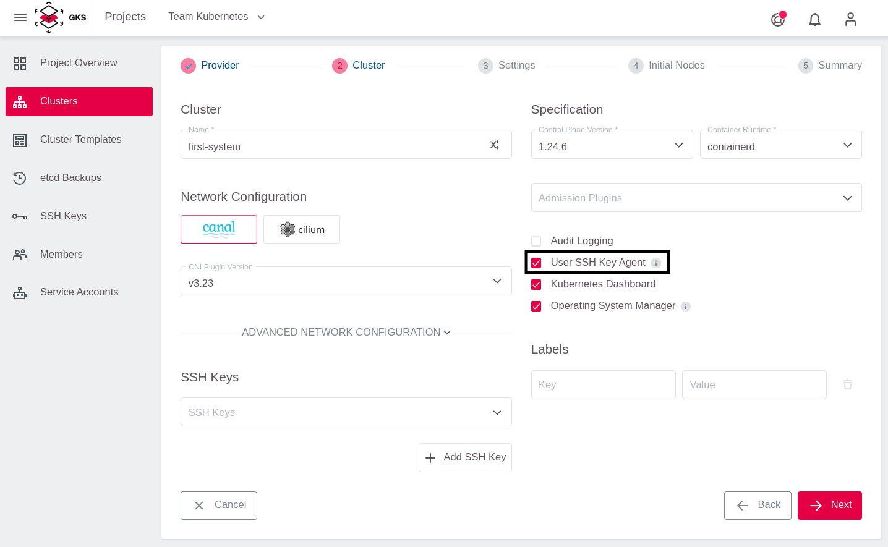
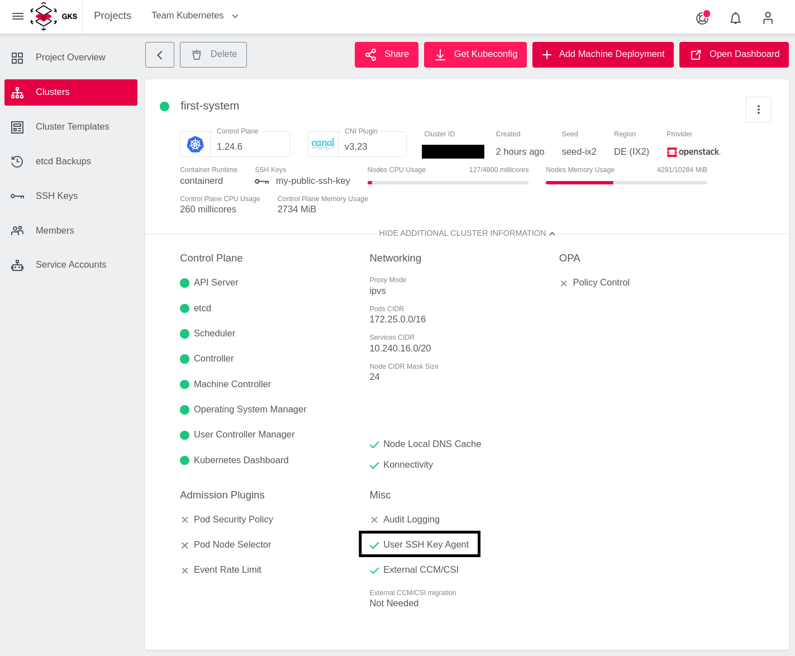
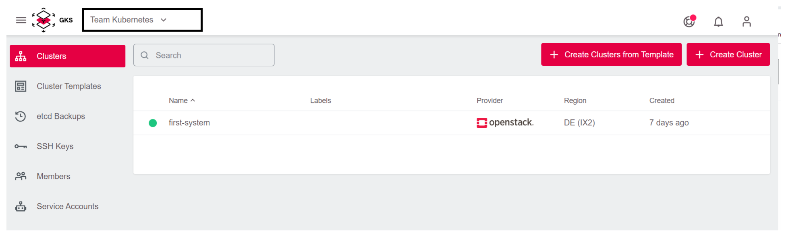
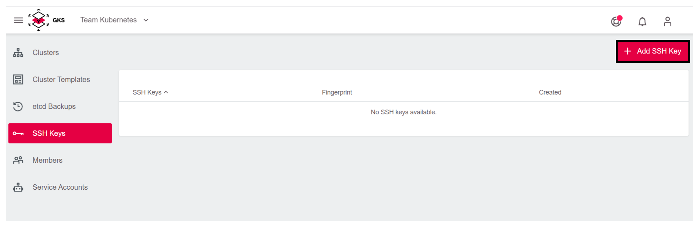
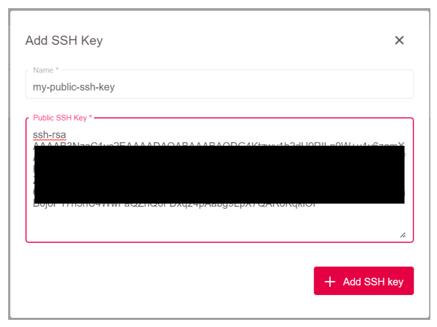
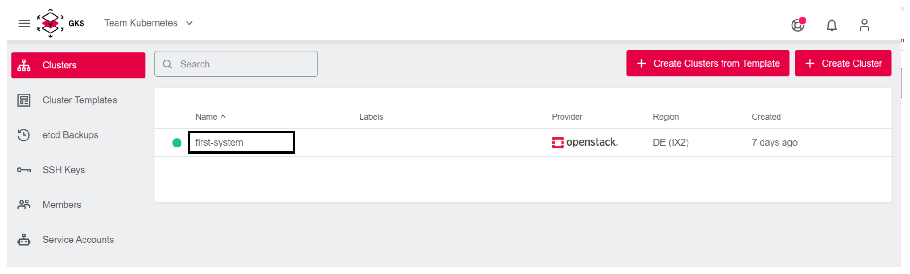
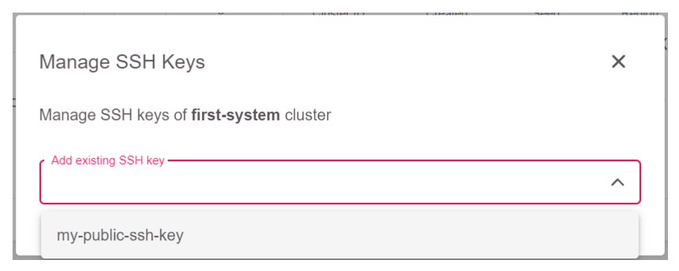
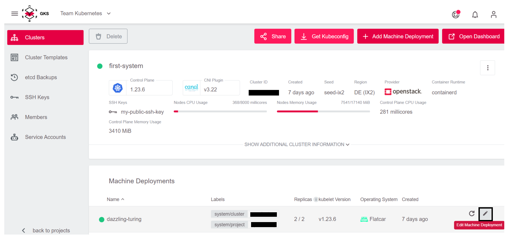

# Adding an SSH Key to an Existing Cluster

With the GKS platform you can add SSH keys to worker nodes.
This might be useful if you want to debug your Kubernetes clusters and your application directly from the worker nodes.

To achieve this, you need to:

- Create an SSH key
- Have a cluster with `User SSH Key Agent` enabled
- Add the key to the project
- Enable it in the cluster

In most cases you also need to assign a Floating IP to your worker nodes to be able to access them.

## User SSH Key Agent

To manage SSH keys on the worker nodes, you must enable the `User SSH Key Agent` during cluster creation:



If you do not activate this setting during cluster creation, you cannot add/modify SSH keys later on. You can only add the
User SSH Key Agent during cluster creation. If you did not enable the User SSH Key Agent during cluster creation, you cannot enable it later on.

### Checking the Status of the User SSH Key Agent

To check if the User SSH Key Agent is enabled for a certain cluster, check the cluster status page. To do so, open the additional cluster information view.


You can now see the status in the lower right corner.



If the User SSH Key Agent is activated, you can add SSH keys any time as described below.

### Other Ways of Managing User SSH Keys

You can create a cluster **without** enabling the User SSH Key Agent. In this case all worker nodes are created without any SSH keys added - and SSH keys cannot be changed when using our platform. This would allow other methods/agents of managing SSH keys like saltstack, puppet, or chef if the worker nodes are created from a custom image supporting this. It is not possible to add the User SSH Key Agent
after cluster creation in order to not interfere and accidentially break such setups.

## Adding an SSH Key to an Existing Cluster

If you want to add an SSH Key to an existing cluster which has the User SSH Key Agent is enabled, follow the steps below.

### Creating an SSH Key

The simplest way to generate a key pair is to run `ssh-keygen` without arguments:

```bash
ssh-keygen
```

An SSH key will be created. The default path for the SSH key is: `~/.ssh/id_rsa.pub`.

### Adding the SSH Key to the Project

1. Select the project.



2. Go to the SSH Key page.


3. Use the `Add SSH Key` button.



4. Name the key and paste the public SSH key that was created by `ssh-keygen` (not the private key!).

    

Now you can use the key in any cluster in this project.

### Adding the SSH Key to the Cluster

1. Select a cluster where you want to add the key.

    

2. Click the three dots, to open the cluster submenu.

    

3. Select `Manage SSH keys`.

    

4. Now the newly created SSH key can be selected from a drop-down list.

    

5. After the selection, the key is displayed in the list and can also be deleted from it if required.

    

Your key will now be added to all worker nodes in all machine deployments.

## Adding an SSH Key During Cluster Creation

You can also add SSH keys during cluster creation.
For more information, see section [Creating a Cluster](/gks/clusterlifecycle/creatingacluster/).

## Access to the Node

Once you added the SSH key to the cluster, you need to attach a Floating IP to the `Machine Deployment` to be able to access the worker nodes with SSH.

To achieve this, you have to edit the `Machine Deployment`:



Make sure `Allocate Floating IP` is selected:


Once the node is fully created and has an external IP, you can access the node with the key.
The default user for Flatcar is `core`.

```bash
 ssh -A core@PUBLIC_IP
```
