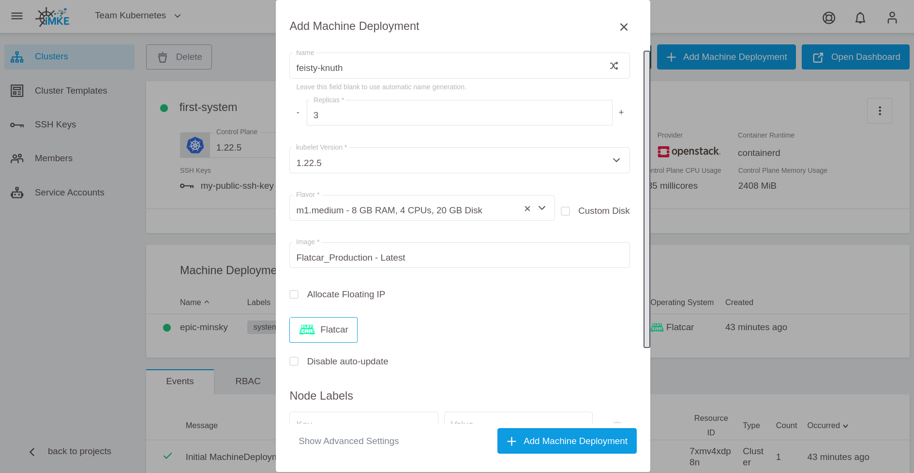
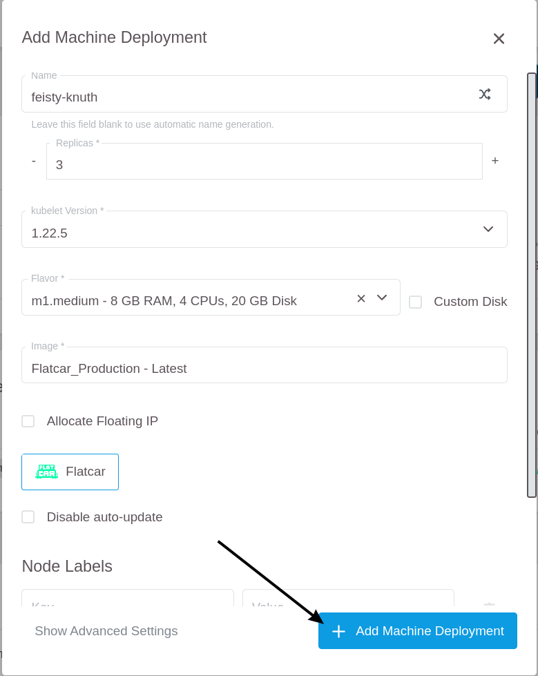
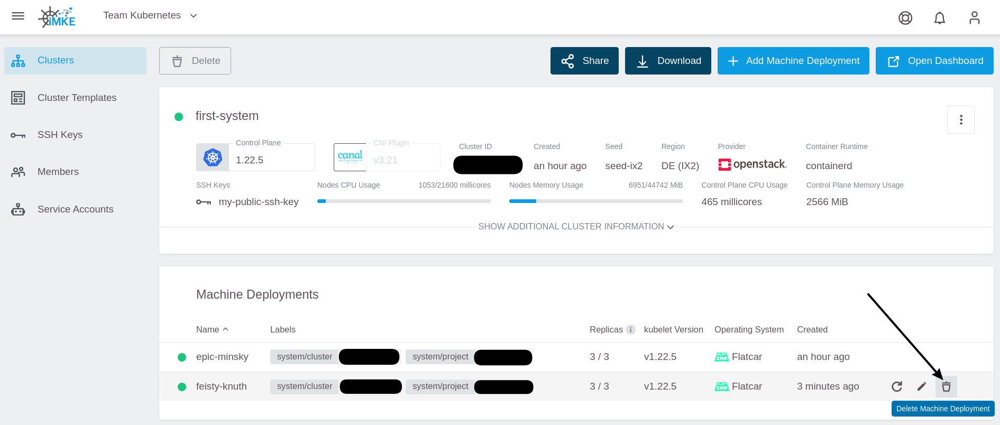

<!-- LTeX:  language=de-DE -->
# Machine Deployments

## Machine Deployment hinzufügen

Um ein Machine Deployment hinzuzufügen, klicken Sie auf die `Add Machine Deployment` Schaltfläche in der oberen rechten Ecke.

Der `Add Machine Deployment` Dialog erscheint.

Zum Speichern klicken Sie auf `Add Machine Deployment`.

Die neuen Nodes werden jetzt angelegt. Den aktuellen Status bekommen Sie in den Machine Deployment Details.

Wählen Sie das neue Machine Deployment aus.

Warten Sie bis alle Nodes grün sind.

## Machine Deployments löschen

Um ein Machine Deployment zu löschen, können Sie das Löschsymbol in der Machine Deployment Liste benutzen.

Sie können auch das Löschsymbol auf der Detailseite verwenden.

## Machine Deployments umbenennen

Machine Deployments können nicht umbenannt werden.

Es muss daher ein neues Machine Deployment [angelegt](#machine-deployment-hinzufügen) werden und anschließend das alte [gelöscht](#machine-deployments-löschen) werden.

Dabei kann es aber, je nach Replica Einstellung und Anzahl der Nodes, zu kurzen Ausfällen kommen.

Sicherer ist es, wenn das alte Machine Deployment langsam reduziert wird - 1 Replica nach dem anderen – bis keine Node mehr übrig ist und dann erst löscht. Bei der Prozedur kann es passieren, dass Pods nicht nur auf die neuen Nodes umgezogen werden, sondern auch auf noch aktive alte. Dann wird ein Pod ggf. mehrfach umgezogen. Das können Sie umgehen, indem Sie vor dem Reduzieren erst alle alten Nodes mit `kubectl cordon <node name>` aus dem Scheduler entfernen.
