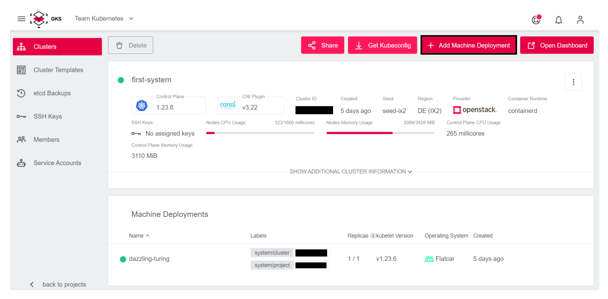
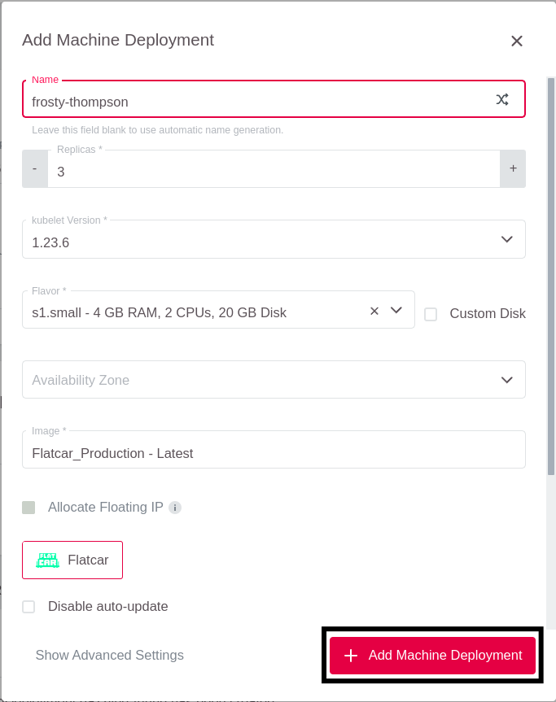
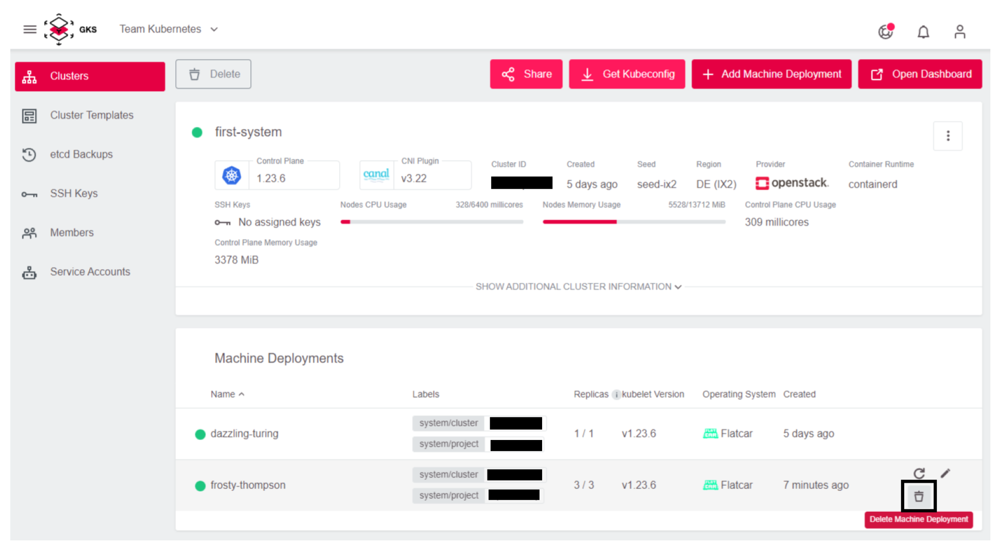
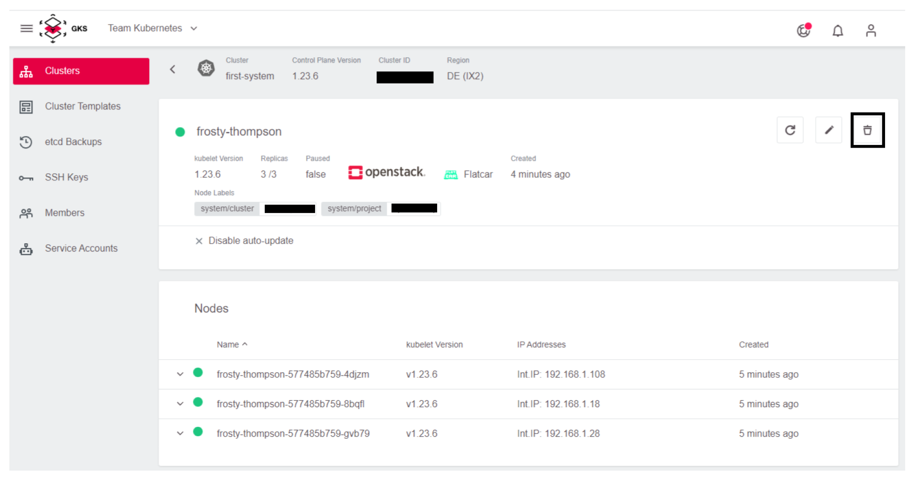

# Machine Deployment

## Adding a Machine Deployment

To add a new Machine Deployment, use the `Add Machine Deployment` button in the upper right corner.

This opens the `Add Machine Deployment`window, which has the same options as at cluster creation time.

Add your data, and click `Add Machine Deployment` to create the new nodes.

You can look at the progress in the Machine Deployment details.

Click on the new Machine Deployment.

Wait until all nodes are green.

## Deleting a Machine Deployment

To delete a Machine Deployment, use the trash symbol in the list.

Alternatively, you can use the trash symbol on the details page.

## Renaming a Machine Deployment

Machine Deployment cannot be renamed. Therefore, you need to [create](#add-machine-deployment) a second one and [delete](#delete-machine-deployment) the old one.

Deleting a Machine Deployment deletes all nodes at the same time. Depending on your replicas and number of nodes this can lead to a downtime.

To mitigate this, you should reduce the replica of the Machine Deployment step-by-step until it is 0 and then delete the Machine Deployment.

The pods will be most likely rescheduled to the new host directly, but it might be that some pod will end up on old nodes. This will lead to many rescheduled ones. If this is a problem, you can first cordon all old nodes with `kubectl cordon <node name>` and then slowly reduce the replicas.
