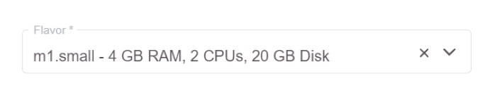
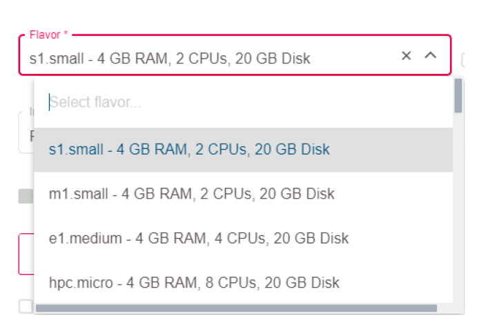
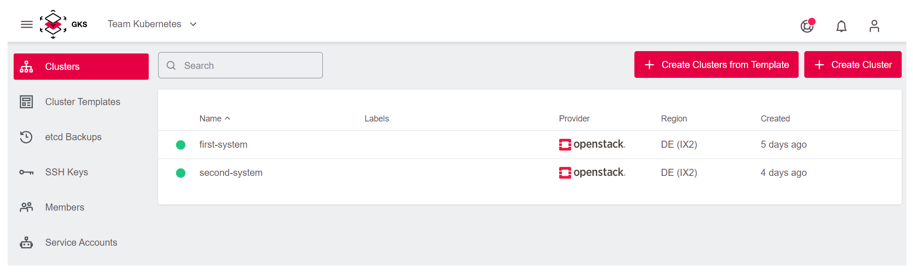
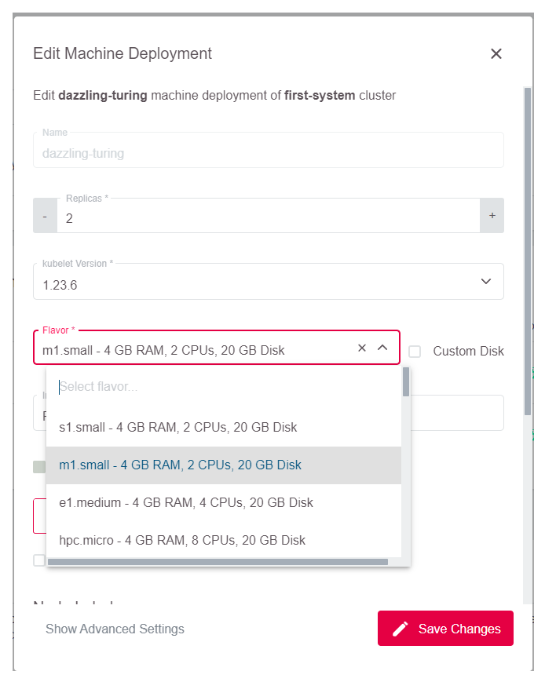
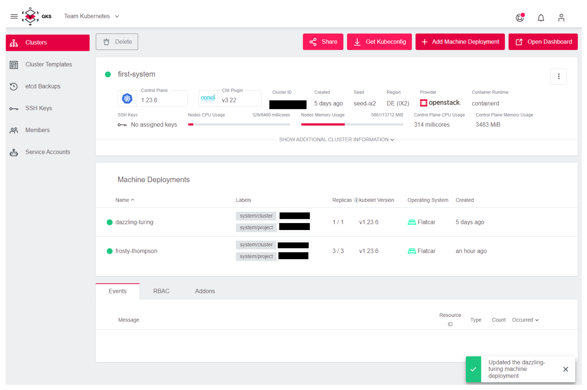

# Choosing Node Flavors/Sizes

During the setup of new nodes in a cluster you can select a respective "flavor" for that node.

Flavors determine the amount of processing cores ("CPUs"), Memory ("GB RAM"), and disk space ("GB Disk") of the respective node.

A good practice for choosing the right flavor for your project is going through the following steps:

1. Start by selecting a small flavor.
2. Evaluate the performance of the desired use case.
3. Pick a larger flavor in case of any issues.

## Changing Flavors

Changing the flavor of a node at any point in time is as easy as following these steps:

1. Navigate to the desired cluster.

    

1. Click the Edit icon on the node for which you would like to select another flavor. The icon becomes visible when hovering over the node with your mouse.

    

1. Select the desired flavor and click the `Save Changes`button.

    

1. Soon after performing these steps, a confirmation message pops up, and your node flavor has been changed successfully.

    
