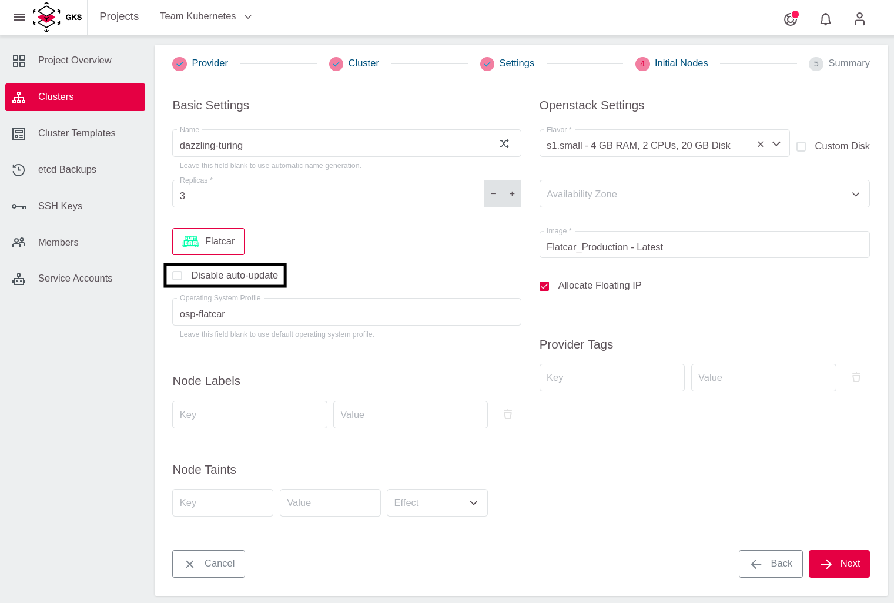
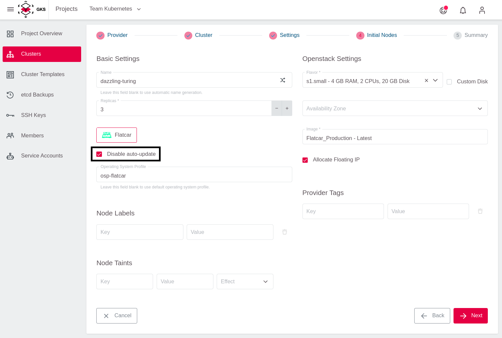
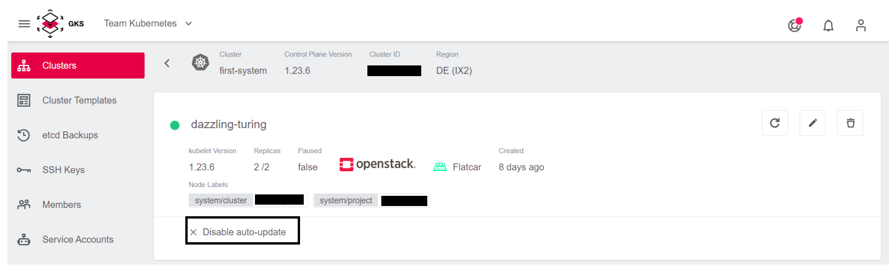
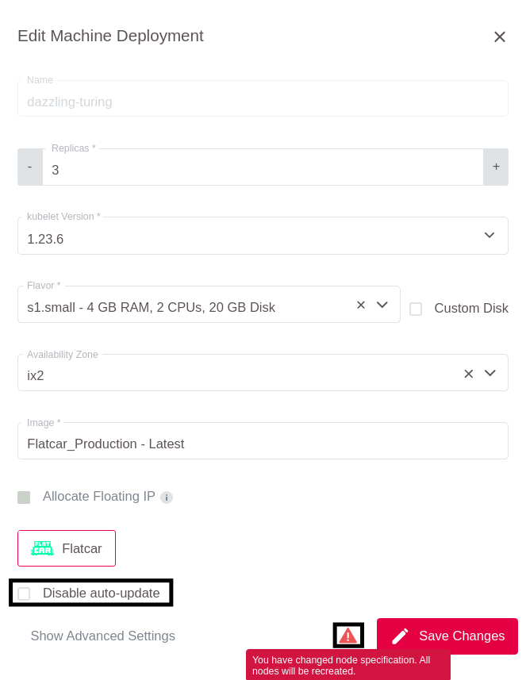
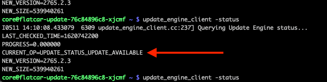
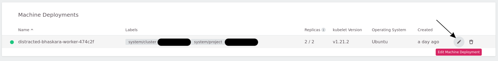
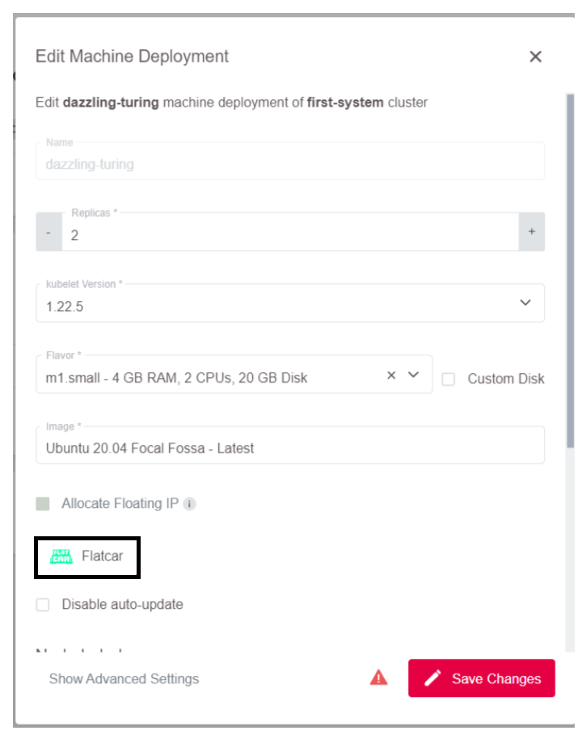
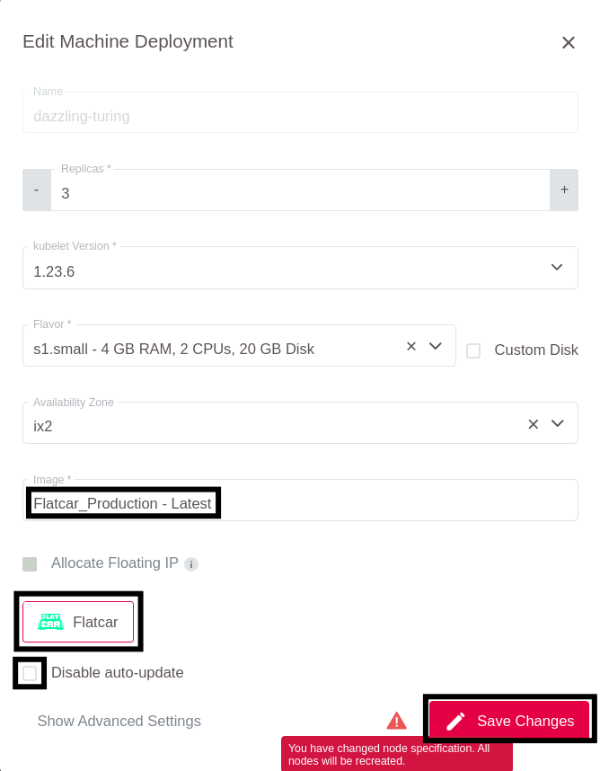

<!-- LTeX:  language=de-DE -->

# Aktualisierung des Betriebssystems auf Worker-Nodes

## Flatcar

### Flatcar Worker-Nodes automatisch aktualisieren

GKS bietet die Funktionalität, um das Betriebssystem von Flatcar-basierten Worker-Nodes auf dem neuesten Stand zu halten.
Diese Funktion installiert automatisch alle Updates auf den Worker-Nodes, die vom Upstream-Anbieter (Kinvolk) für Flatcar veröffentlicht werden.

Die Auto-Update-Funktion verwendet [FLUO](https://github.com/kinvolk/flatcar-linux-update-operator), den Flatcar Linux Update Operator im Hintergrund.
Wenn nach dem Aktualisieren des Systems ein Neustart erforderlich ist, wird der Node vor dem Neustart evakuiert. Der Operator koordiniert den Neustart
mehrerer Nodes im Cluster, und stellt sicher, dass immer nur ein Node gleichzeitig neu gestartet wird.

Die Verwendung der Auto-Update-Funktion ist standardmäßig aktiviert. Der folgende Screenshot zeigt die Erstellung eines Machine Deployments mit aktiviertem Auto-Updater:



Wenn Sie sich selbst um Betriebssystemaktualisierungen (und Neustarts) kümmern möchten, können Sie die automatischen Aktualisierungen der Worker-Nodes deaktivieren, indem Sie das Kontrollkästchen `Disable auto-update` aktivieren:



> Wir empfehlen unseren Benutzern dringend, die Auto-Updater-Funktion zu verwenden, um die Sicherheit ihrer Infrastruktur zu gewährleisten.

#### Prüfen der Auto-Updater-Einstellungen eines Clusters

Um zu prüfen, ob Ihre Nodes automatische Betriebssystemaktualisierungen erhalten, klicken Sie auf das Machine-Deployment:


Kontrollieren Sie, ob vor dem Kästchen `Disable auto-update` ein grünes Häkchen angezeigt wird (die automatische Aktualisierung ist deaktiviert):


Oder prüfen Sie, ob es ausgegraut ist (die automatische Aktualisierung ist an):



#### Aktivieren / Deaktivieren des automatischen Updaters für ein vorhandenes Machine-Deployment

Um den Status des automatischen Updaters zu ändern, klicken Sie auf die Schaltfläche `Edit Machine Deployment` der Machine-Deployment.


(De)aktivieren Sie das Kontrollkästchen entsprechend.



Nachdem Sie auf `Save Changes` geklickt haben, führen alle Worker-Nodes ein rollierendes Update durch und starten neu.

### Flatcar Worker-Nodes manuell aktualisieren

Um einen Flatcar Worker-Node manuell aktualisieren zu können, wird ein [SSH-Zugriff](/gks/machinedeployments/add_ssh_key/) benötigt.

Die aktuelle OS-Version finden Sie unter `/etc/os-release`.

```bash
$ grep VERSION_ID /etc/os-release
VERSION_ID=2765.2.2
```

Im nächsten Schritt müssen Sie den Dienst `update-engine` demaskieren und starten.

```bash
$ sudo systemctl unmask update-engine.service
Removed /etc/systemd/system/update-engine.service.
$ sudo systemctl start update-engine.service
```

Nun können Sie nach verfügbaren Updates suchen und sie installieren lassen.

```bash
sudo update_engine_client -check_for_update
sudo update_engine_client -status
```

Der Update-Engine-Client lädt jetzt die letzte verfügbare Version von Flatcar herunter und passt
automatisch die Boot-Reihenfolge so an, dass beim nächsten Boot schon die neue Version gebootet wird.



Wenn der Status sich von `UPDATE_STATUS_UPDATE_AVAILABLE` in `UPDATE_STATUS_DOWNLOADING`,
und danach in `UPDATE_STATUS_UPDATED_NEED_REBOOT` geändert hat, können Sie den Worker-Node rebooten
und den Vorgang für alle Worker-Nodes durchführen.

````bash
sudo systemctl reboot
````

> Wir empfehlen unseren Benutzern dringend, die Auto-Updater-Funktion zu verwenden, um die Sicherheit ihrer Infrastruktur zu gewährleisten.

## Ubuntu

Ubuntu wurde im Juli 2021 aus dem Support für GKS genommen, aktualisieren Sie daher Ihre bestehenden Machine Deployments.

### Auf Flatcar aktualisieren

Um auf Flatcar zu aktualisieren, klicken Sie auf die `Machine Deployment Edit` Schaltfläche.



Dann klicken Sie auf das Flatcar Logo.



Es wurde das Image gewechselt und die Autoupdate Option angezeigt.



Die Nodes werden nun neu gebaut und der Cluster ist wieder aktuell.

## Zusammenfassung

In dieser Anleitung haben Sie Folgendes gelernt:

* Was ist die Auto-Update-Funktion?
* Wie aktiviert oder deaktiviert man die Auto-Update-Funktion für ein Flatcar Machine-Deployment?
* Wie aktualisiert man manuell einen Flatcar Worker-Node?
* Wie aktiviert man die automatische Reboots der Ubuntu Worker-Nodes?

## Weiterführende Themen

* [Auto-Updating Flatcar Container Linux](https://kinvolk.io/docs/lokomotive/git-main/how-to-guides/auto-update-flatcar/)
* [FLUO on Github](https://github.com/kinvolk/flatcar-linux-update-operator)
* [The Flatcar partitioning scheme](https://kinvolk.io/docs/flatcar-container-linux/latest/reference/developer-guides/sdk-disk-partitions/)
