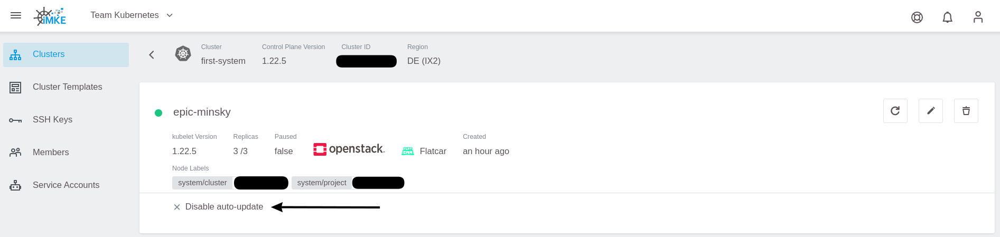
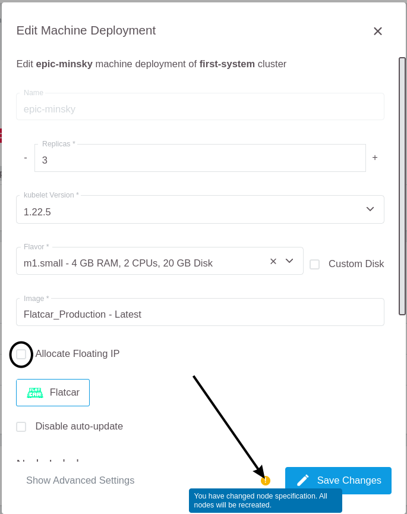
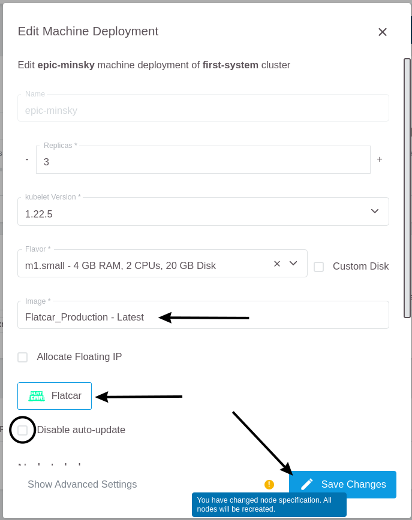

## Flatcar

### Automatic updates of Flatcar worker nodes

GKS provides the functionality to keep the operating system of Flatcar based worker nodes up to date.
This feature will automatically install any updates released by the upstream vendor (Kinvolk) for Flatcar
on the worker nodes.

The auto-update feature uses [FLUO](https://github.com/kinvolk/flatcar-linux-update-operator), the Flatcar Linux Update Operator in the background.
When a reboot is needed after updating the system, it will drain the node before rebooting it. It coordinates the reboots of multiple nodes in the cluster,
ensuring that only one node is rebooting at once.

Using the auto-update functionality is enabled by default. The following screenshot shows the creation of a machine deployment with auto-updater enabled:


If you would like to take care of OS updates (and the reboots) yourself, it is possible to disable the automatic updates of the worker nodes by selecting the `Disable auto-update` checkbox:


> We highly encourage our users to use the auto-update feature to keep your infrastructure safe.

### Checking the state of the auto-updater

To check if your nodes receive automatic OS-updates, click on the machine deployment:


and check if the `Disable auto-update` option has a green checkmark in front of it (auto-updater is off):



or if it's greyed out (auto-updater is on):


### Enabling/disabling auto-updater on an existing machine deployment

To change the status of the auto-updater, click on the edit button of the machine deployment:


and (de)-select the checkbox accordingly:



After clicking on `Save Changes`, all worker nodes will perform a rolling update and reboot.

### Update Flatcar Worker-Nodes manually

To update a Flatcar worker node manually, [access via SSH](/gks/machinedeployments/add_ssh_key/) is required.

You can find out the actual installed OS version from `/etc/os-release`:

```bash
$ grep VERSION_ID /etc/os-release
VERSION_ID=2765.2.2
```

In the next step we'll unmask and start the systemd unit `update-engine`:

```bash
$ sudo systemctl unmask update-engine.service
Removed /etc/systemd/system/update-engine.service.
$ sudo systemctl start update-engine.service
```

Now we can check for available updates and install them:

```bash
$ sudo update_engine_client -check_for_update
$ sudo update_engine_client -status
```

The Update-Engine client will now download the latest available release of Flatcar and adjusts
the boot order automatically so that the new release will be activated at the next boot.


As soon as the status has changed from `UPDATE_STATUS_UPDATE_AVAILABLE` to `UPDATE_STATUS_DOWNLOADING`,
and then to `UPDATE_STATUS_UPDATED_NEED_REBOOT`, we can now reboot the worker node and repeat the steps
for all nodes in the machine deployment.

````bash
$ sudo systemctl reboot
````

> We highly recommend using the auto-updater feature, in order to ensure the security and integrity of your infrastructure.

## Ubuntu

Ubuntu support in GKS got removed in July 2021. Read here how to update to supported Flatcar OS for existing machine deployments

### Update to Flatcar

To update from Ubuntu to Flatcar click on the edit button of the machine deployment


Then click on the flatcar logo


It changed the Image and enabled the auto-update feature.



The node will now be recreated, and your cluster is up-to-date.

## Summary

In this guide you've learned the following:

* What the auto-update feature is
* How to enable and disable the auto-update feature for a Flatcar machine deployment
* How to apply the updates on a Flatcar worker node manually
* How you can enable the automatic reboots of Ubuntu-based worker nodes

**Further reading**

* [Auto-Updating Flatcar Container Linux](https://kinvolk.io/docs/lokomotive/git-main/how-to-guides/auto-update-flatcar/)
* [FLUO on Github](https://github.com/kinvolk/flatcar-linux-update-operator)
* [The Flatcar partitioning scheme](https://kinvolk.io/docs/flatcar-container-linux/latest/reference/developer-guides/sdk-disk-partitions/)
