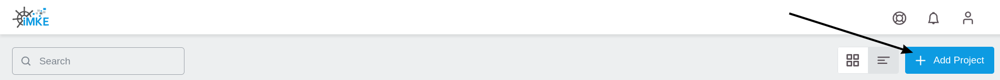
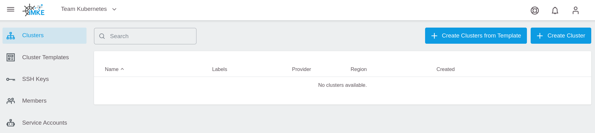

<!-- LTeX:  language=de-DE -->
# Ein Projekt anlegen

Nach dem Login in GKS erscheint folgendes Fenster, in dem Sie auf
`Add Project` klicken.

Geben Sie in dem sich öffnenden Fenster dem Projekt einen Namen.
Als Beispiel verwenden Sie hier `Team Kubernetes`.
Klicken Sie danach auf `Save`.

Im Anschluss legt GKS das Projekt an und stellt es in der Übersicht dar.
Mit einem Klick auf den Eintrag `Team Kubernetes` sind Sie
im Projekt-Umfeld und können den Cluster anlegen.

Die folgende Seite stellt das Projekt dar. Hier sind alle bereits
bestehenden Cluster sowie zugehörige User und weitere Kontroll-Mechanismen
sichtbar.

Mit einem Klick auf die Seitenleiste links öffnen Sie die Navigation im
Projekt-Umfeld und können die weiteren Bereiche erkunden.

