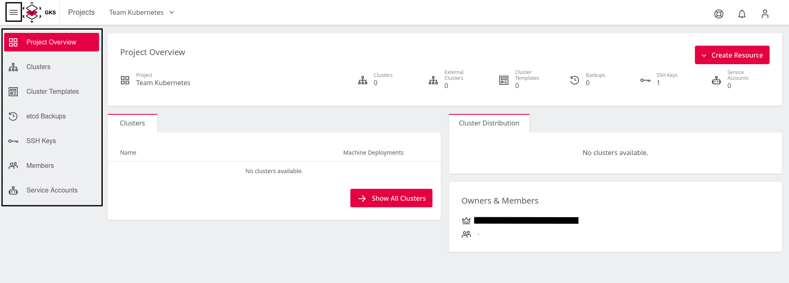

# Creating a Project

After logging into GKS, you see the following window, where you
need to click on `Add Project`.

This opens a window, where you can give the project a name. In the
example, `Team Kubernetes` is used.
To finish, click on `Save Project`.

Now GKS creates your project and adds it to the Overview. With a click on
the entry `Team Kubernetes` you enter the project and can create
the cluster.

This opens a view showing you the project. You find a list of all existing
clusters and their users, as well as some other controls. This list is empty until you create your first managed Kubernetes cluster.

Clicking on the sidebar opens the navigation in the Project view, which
allows you to explore the other areas.

