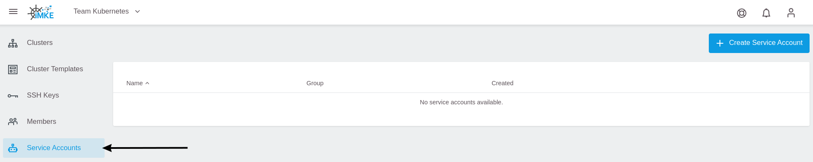
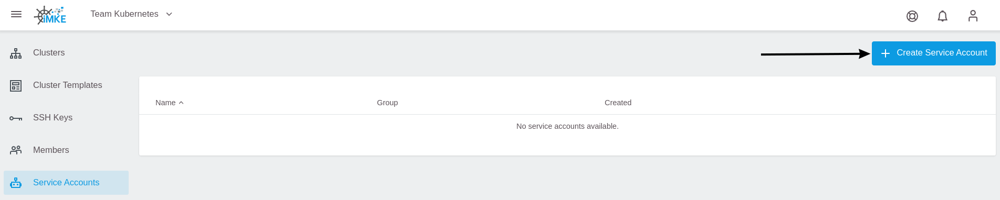
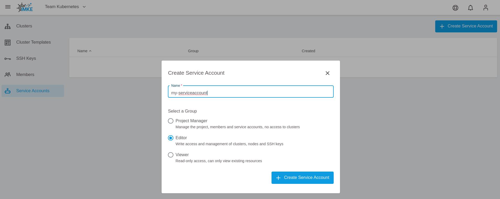
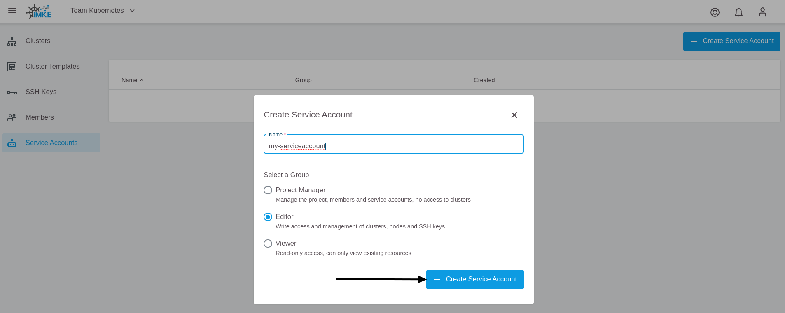
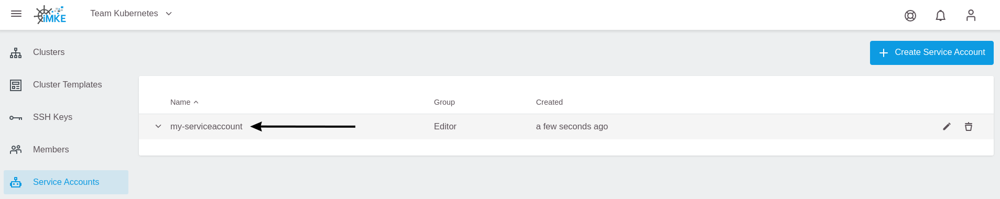
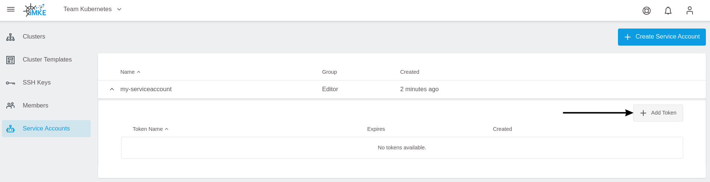
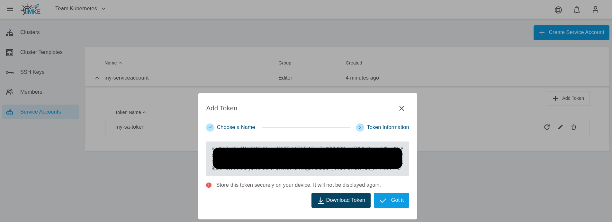

<!-- LTeX:  language=de-DE -->

# Service Account Tokens verwalten

## Service Accounts

Service Accounts ermöglichen die Nutzung eines langlebigen Tokens, welchen man für Authentifizierung mit der GKS API nutzen kann.

Ein Service Account ist ein spezielles Userkonto, welches einem GKS **Projekt**, und nicht einem individuellen Endbenutzer gehört. Die Ressourcen des Projekts nehmen die Identität des Service Accounts an, um die GKS API anzusprechen, so dass die Benutzer nicht direkt involviert sind. Ein Service Account kann einen oder mehrere JTW Tokens haben, welcher für die Authentifizierung bei der GKS API verwendet werden kann. Ein JWT Token ist standardmäßig 3 Jahre lang gültig.

## Kernkonzept

Service Accounts sind Ressourcen eines Projekts. Nur der Eigentümer eines Projekts kann einen Service Account anlegen.
Es ist nicht notwendig, eine neue Gruppe für die Service Accounts zu erstellen. Wir können die Service Accounts einer bereits existierenden Gruppen: `Project Manager`, `Editor` oder `Viewer` zuweisen.

Ein Service Account ist automatisch durch ein `UserProjectBinding` mit dem Projekt verknüpft, welche eine Bindung zwischen dem Service Account und dem Projekt definiert. Ein Service Account wird nach dem Löschen eines Projekts automatisch entfernt.

## Erstellen eines Service Accounts mit Token

1. Wählen Sie ein Projekt aus.

    

1. Gehen Sie zur Service Accounts Seite.

    

1. Benutzen Sie die `Add Service Account` Schaltfläche.

    

1. Geben Sie den Namen des Service Accounts und die Gruppe (`Project Manager`, `Editor` oder `Viewer`) an.

    

1. Fügen Sie den SA hinzu mit `Add Service Account`.

    

Nun wurde ein Service Account angelegt. Um einen Token mit dem SA zu verknüpfen, gehen Sie folgendermaßen vor:

1. Wählen Sie den Service Account aus.

    

1. Benutzen Sie  die `+ Add Token` Schaltfläche.

    

1. Geben Sie einen Namen an und fügen Sie den Token mit `Add Token` hinzu.

    

1. Nun wird der generierte Token angezeigt. Laden Sie diesen mit dem Pfeil Icon als Datei herunter oder sichern Sie ihn mit Copy&Paste.

    

 > **Wichtiger Hinweis:** Stellen Sie sicher, dass dieser Token an einem sicheren Ort und nur auf Ihrem eigenen Gerät gesichert wird. Der Token kann nicht nochmal angezeigt werden, nachdem das Dashboard Fenster geschlossen wurde.

## Zugriff an die API durch einen Service Account Token

Ein Client kann sich bei dem Server authentifizieren, indem er ein `Authorization` Request Header Feld mit dem SA Token inkludiert.

```HTTP
Authorization: Bearer aaa.bbb.ccc
```

Beispiel: Um eine Liste der Cluster abzufragen, können Sie den folgenden API-Aufruf nutzen:

```bash
curl -X GET "https://gks.gec.io/api/v1/projects?displayAll=true" -H "accept: application/json" -H "authorization: Bearer eyJhbXxXXxXxX..."  | jq
```

Das Ergebnis sieht dann etwa so aus:

```JSON
[
  {
    "id": "q3jXY4ZYx8",
    "name": "My-project",
    "creationTimestamp": "2020-12-08T21:55:47Z",
    "status": "Active",
    "owners": [
      {
        "name": "your.email@your-company.de",
        "creationTimestamp": "0001-01-01T00:00:00Z",
        "email": "your.email@your-company.de"
      }
    ],
    "clustersNumber": 1
  }
]
```

## Service Accounts und Tokens verfolgen

Es können mehrere Service Accounts für ein Projekt erstellt werden. Der Name des SA muss jedoch eindeutig für das Projekt sein. Ein Service Account kann mehrere Tokens mit eindeutigen Namen haben.

Der Anzeigename des Service Accounts und Tokens ist eine gute Möglichkeit, um weitere, erklärende Informationen - wie zum Beispiel den Zweck des SAs - zu erfassen.

## Service Accounts und Tokens verwalten

Es ist möglich, einen Service Account zu löschen und mit dem gleichen Namen neu zu erstellen. Das Gleiche gilt für den Service Account Token.

Der Name eines Service Accounts oder Tokens kann nach dem Anlegen geändert werden.

Der Service Account Token ist nur während des Erstellens des Users sichtbar.

Der Benutzer kann einen Token erneuern, aber der vorherige Token wird dabei ungültig.
