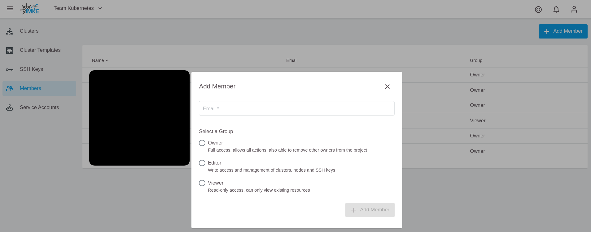

<!-- LTeX:  language=de-DE -->
# Benutzer Management im Projekt

## Benutzer hinzufügen

Sie können mit ein paar Klicks einen Benutzer zu einem vorhandenen GKS-Projekt hinzufügen.

Dazu brauchen Sie:

* Den Projektnamen
* Die Benutzer-E-Mail

**Der Benutzer muss sich vorher einmalig in GKS anmelden, bevor er verwendet werden kann.**

Wählen Sie zuerst das korrekte Projekt aus.

Klicken Sie dann in der linken Seitenleiste auf `Members`.

Als nächstes klicken Sie oben rechts auf `Add Member`.

Geben Sie zum Schluss die Benutzer-E-Mail-Adresse und die gewünschte Rolle (Owner, Editor, oder Viewer) ein.

## Benutzer entfernen

Um einen Benutzer zu entfernen, gehen Sie wieder in den Members-Bereich des Projekts.

Wählen Sie zuerst das Projekt aus.

Klicken Sie dann in der linken Seitenleiste auf `Members`.

Mit dem Löschen-Symbol können Sie den Benutzer entfernen.

## Benutzer Offboarding

Vor dem endgültigen Offboarding eines Benutzers sollte dieser zuerst aus allen Projekten entfernt werden.
Beachten Sie, dass Projekte, in denen der Benutzer alleiniges Mitglied ist, nicht gesehen werden können. Diese Projekte werden bei einem Löschauftrag an den GKS-Support jedoch automatisch entfernt, sofern diese keine aktiven Cluster mehr enthalten. Bei aktiven Clustern erfolgt eine Rückfrage, diese werden nicht automatisch gelöscht.
