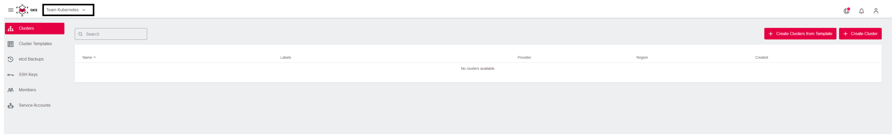
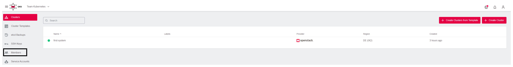
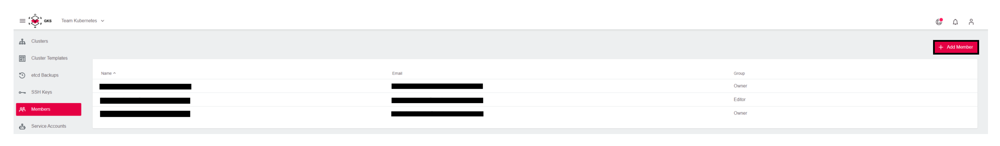
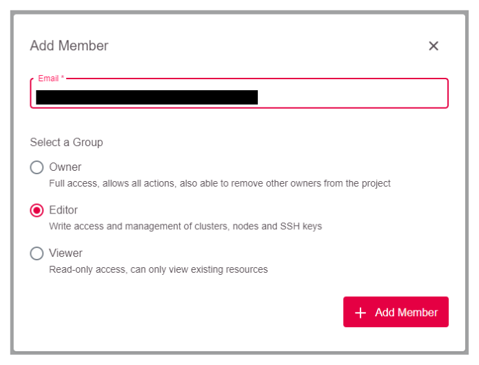
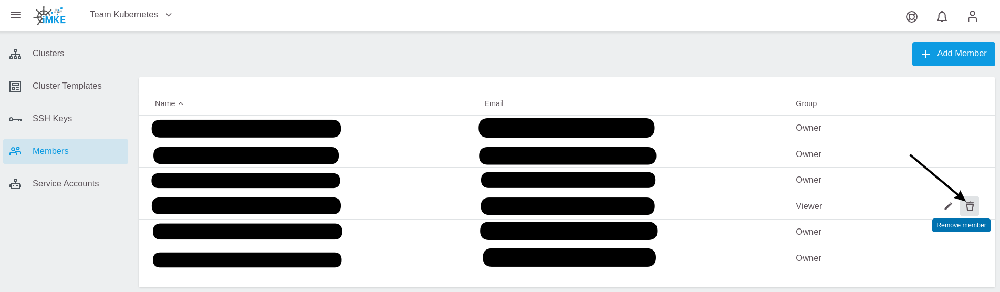

# Managing Users in a Project
## Adding Users

You can add a user to an existing GKS project with a couple of clicks.

To achieve this, you need:

* The project name
* The user email

The user needs to log in once, before it is usable.

First, select the correct project.

Then click on `Members` in the left sidebar.

Next click `Add Member` on the top right.

Finally, enter the user email and the desired role (Owner, Editor, or Viewer).

## Removing Users

To remove a user from a project go back to the member section of the project.

First, go to the project.

Then click on `Members` in the left sidebar.

Use the *Deletion* icon to remove the user.

## Offboarding Users

You should remove the user from all projects before requesting to offboard the user.
Note that you cannot see projects/clusters where only the user is member of the project. In case those projects do not contain any active cluster, they will be automatically deleted by the GKS support during the process of the offboarding requests. In case there are active clusters left, those will not be automatically deleted and support will ask how to proceed with those.
