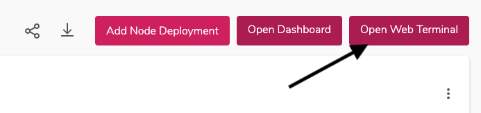
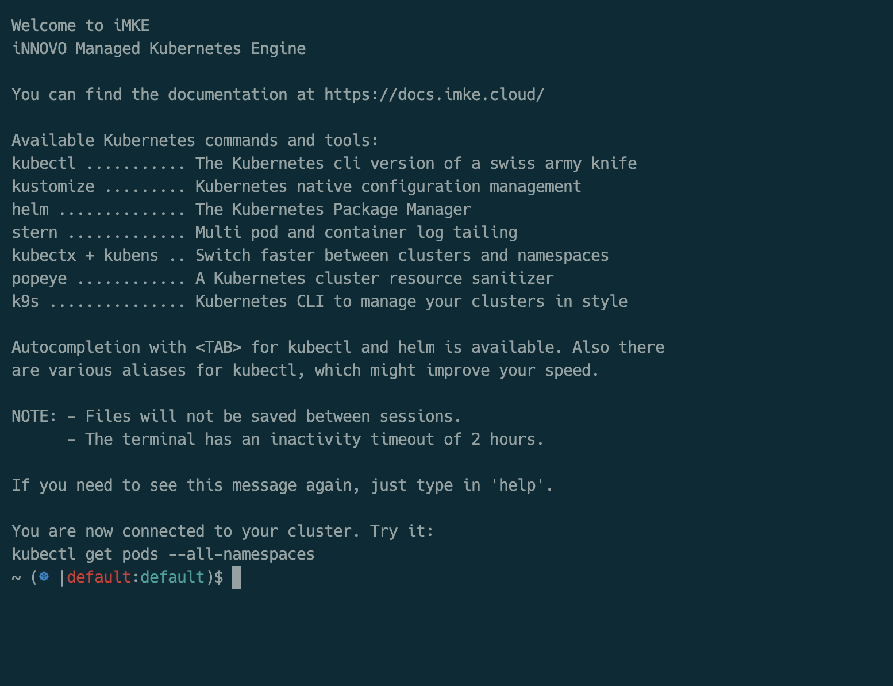

The iMKE Web Terminal allows the administration of Kubernetes
clusters in the cloud. A browser is required. Also, an open
port `22` for SSH is also needed, since the shell is redirected
via the browser.

The Web Terminal is reset with each new launch. Nothing is kept in
the filesysytem, and any subsequently installed software must be reinstalled
for each session.

## Connection

In order to connect to the Web Terminal, we must first select a cluster.


There we click on `Open Web Terminal`.


Next the Web Terminal will start. This can take up to two minutes.


Finally the terminal opens automatically.


## Functions

The Web Terminal is a fully functional Linux Shell, using `zsh` by default.

In order to make the administration of Kubernetes as sinple as possible,
some pratical tools are already preinstalled. A list of these commands
can be accessed via the command `help`. This is the same output seen at
the start of each new Web Terminaln session.

```bash
Welcome to iMKE
iNNOVO Managed Kubernetes Engine

You can find the documentation at https://docs.imke.cloud/

Available Kubernetes commands and tools:
kubectl ........... The Kubernetes cli version of a swiss army knife
kustomize ......... Kubernetes native configuration management
helm .............. The Kubernetes Package Manager
stern ............. Multi pod and container log tailing
kubectx + kubens .. Switch faster between clusters and namespaces
popeye ............ A Kubernetes cluster resource sanitizer
k9s ............... Kubernetes CLI to manage your clusters in style

Autocompletion with <TAB> for kubectl and helm is available. Also there
are various aliases for kubectl, which might improve your speed.

NOTE: - Files will not be saved between sessions.
      - The terminal has an inactivity timeout of 20 minutes.

If you need to see this message again, just type in 'help'.

You are now connected to your cluster. Try it:
kubectl get pods --all-namespaces
```

## kubens

Kubernetes offers the option to provide application namespaces.
These namespaces are quite simple to switch using the `kubens` tool.
As an example we will take a look in the MachineDeployments.

```bash
~ (☸ |default:default)$ kubectl get machinedeployment
No resources found.
~ (☸ |default:default)$ kubens kube-system
Context "default" modified.
Active namespace is "kube-system".
~ (☸ |default:kube-system)$ kubectl get machinedeployment
NAME           AGE    DELETED   REPLICAS   AVAILABLEREPLICAS   PROVIDER    OS       VERSION
musing-kalam   3d3h             3          3                   openstack   coreos   1.15.0
```

## k9s

As an alternative to the Kuberetes Dashboard, many users desired a
graphical version of `kubectl`. In response `k9s` was created. As a console tool,
it visualizes the resources in the cluser, just like `htop` does for system load.


Exit `k9s` via the command `Ctrl-c`.

## stern

As soon as one has deployed containers to the cluster, the wish arises for the
ability to follow logs from all of them simultaneously. As an alternative to
log management solutions there is `stern`. This tool connects to the log streams
of all conatiners specified in the filter and prints them collectively to the console.

```bash
kubens kube-system
Context "default" modified.
Active namespace is "kube-system".

stern canal
+ canal-qrnct › calico-node
+ canal-qrnct › kube-flannel
+ canal-t7rt5 › calico-node
+ canal-t7rt5 › kube-flannel
+ canal-4kj84 › calico-node
+ canal-4kj84 › kube-flannel
...
```

## popeye

`popeye` scans Kubernates clusters and provides recommendations for clean,
functional deployments. Simply enter `popeye` on the console and take
a look at what's recommended.
