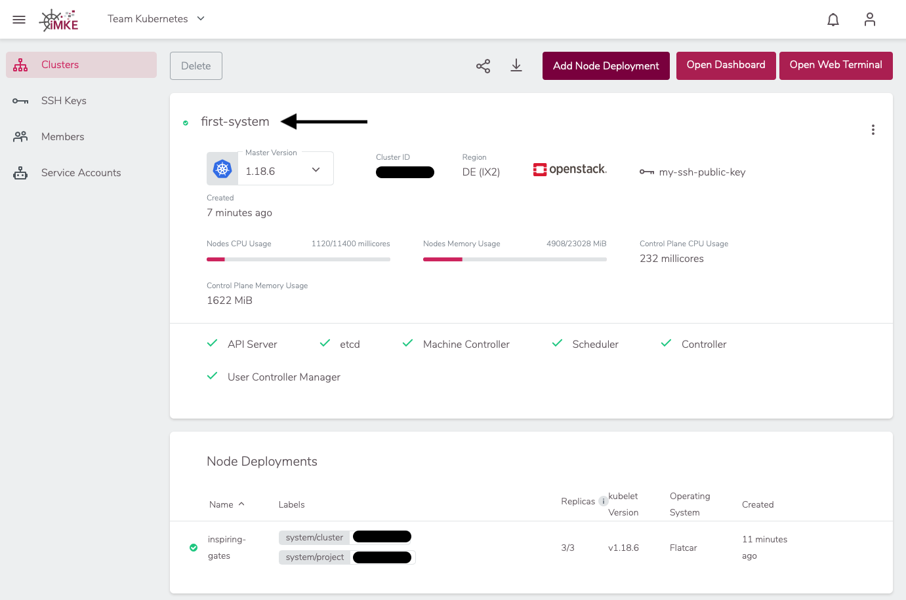

It's quick and simple to delete Clusters in iMKE. The
only prerequisiste is that you need a running Cluster
in an iMKE Project.

## Finding the Cluster

To delete a Cluster, we need to go into the Cluster's detail
view. For this we click on `first-system`:

We need to use the cluster name later. To copy it into the
clipboard, we click on the name:

## Deleting the Cluster

Now we click `Delete`.

This opens a window where we need to enter the cluster name
to avoid sudden and unwanted deletions. Since we copied the name
into our clipboard previously, we can simply paste
it here.

Since we also want to free up the resources, we leave both check
boxes marked. That way, volumes and load balancers provided by
OpenStack will be removed as well.

## Summary

We learnt and achieved the following:

* How to delete a Cluster
* How to delete all Resources in OpenStack as well.

Congratulations! That's all you need to know to delete a Cluster in iMKE.
