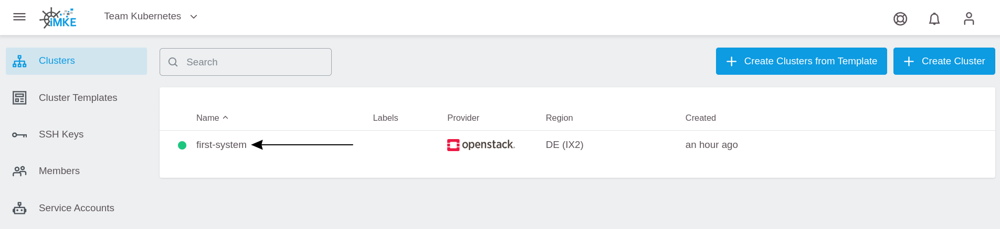
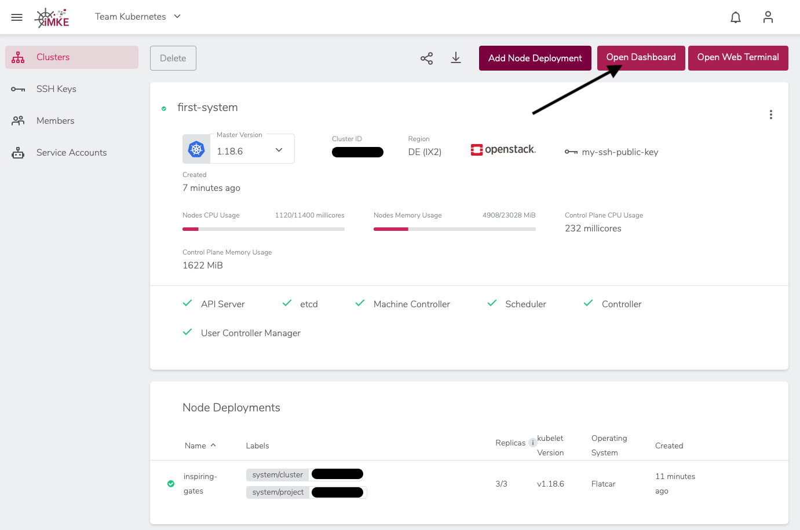
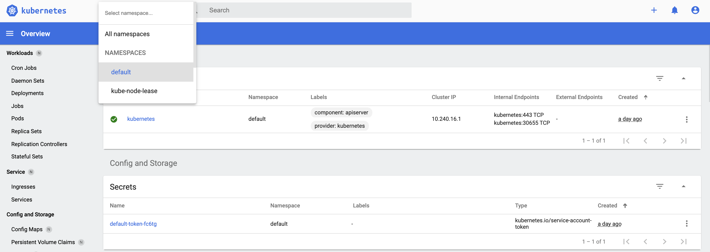

Nachdem wir in iMKE einen Cluster angelegt haben wird
es Zeit, sich mit diesem zu verbinden. Das ist notwendig um
Applikationen zu deployen und zu managen.

## Den Cluster finden

Um einen Cluster zu finden, müssen wir in die Detailansicht
des Clusters gehen.
Hierfür klicken wir auf den Eintrag `first-system`.


## Die Zugangsdaten downloaden

Wir klicken rechts oben auf den nach unten gerichteten Pfeil.


Damit laden wir eine Datei herunter, die sich im Kubernetes-Umfeld
`kubeconfig` nennt. In dieser Datei stehen alle Endpunkte,
Zertifikate sowie Bereiche des Clusters. Mit dieser Datei ist
`kubectl`  in der Lage, sich mit dem Cluster zu verbinden.

Um diese Datei zu nutzen, müssen wir sie auf der Konsole
registrieren. Dafür gibt es zwei Möglichkeiten:

1. `kubectl` schaut als Standard in die Datei `.kube/config`
    im Heimat-Verzeichnis des Benutzers.
2. Wir können die `kubeconfig` temporär mittels einer Umgebungsvariable
    exportieren.

Der Einfachheit halber und um auf unserem System die Standards
nicht zu verändern, gehen wir hier mit Variante 2.

Dafür benutzen wir eine Konsole. In den Screenshots verwenden
ich iTerm2 auf macOS, es funktioniert jedoch auf Linux und Windows
bash genau so.

Als erstes müssen wir die herunter geladene Datei finden.
Chrome und Firefox laden diese beide normalerweise in den Downloads
Ordner. Der Dateiname setzt sich jetzt aus zwei Komponenten zusammen:

* `kubeconfig-admin-`
* unser Cluster ID

Um diese dann zu registrieren nutzen wir folgendes Kommando:

```bash
cd Downloads
export KUBECONFIG=$(pwd)/kubeconfig-admin-CLUSTERID
```

Nun können wir mit unserem Cluster reden. Das einfachste Kommando ist
hier: "zeige mir alle Nodes meines Clusters":

```bash
kubectl get nodes

NAME                           STATUS   ROLES    AGE   VERSION
musing-kalam-XXXXXXXXX-ks4xz   Ready    <none>   10m   v1.15.0
musing-kalam-XXXXXXXXX-txc4w   Ready    <none>   10m   v1.15.0
musing-kalam-XXXXXXXXX-vc4g2   Ready    <none>   10m   v1.15.0
```

## Kubernetes Dashboard

In iMKE können wir mit einem Klick auf das Kubernetes Dashboard zugreifen.
Um dies im Browser zu öffnen, müssen wir oben rechts auf die Schaltfläche `Open Dashboard` klicken.



Nun sehen wir das Kubernetes Dashboard und können
unseren Cluster grafisch erkunden.


## Zusammenfassung

Folgende Schritte wurden erfolgreich durchgeführt und gelernt:

* Wie komme ich an meine `kubectl` Konfiguration
* Wie konfiguriere ich `kubectl` auf meinem Computer
* Wie verbinde ich mich mit dem Kubernetes Dashboard

Herzlichen Glückwunsch! Dies sind alle notwendigen Schritte, um sich
mit einem Kubernetes Cluster zu verbinden.
