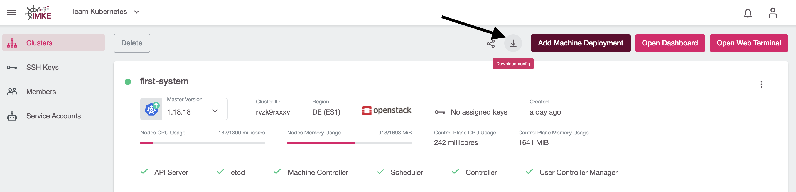
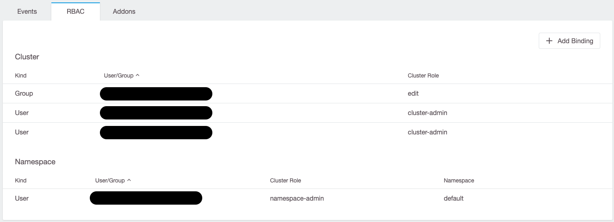

There are two ways how we can grant other users access to an iMKE cluster:

* granting users access to a complete iMKE project (which grants access to all clusters in that project as well)
* use role-based access control (RBAC) to define more fine-grained access control directly to the cluster.

## Project-based access

> This is the recommended method of granting other users access to a cluster.

Giving users access on a project level (like described [here](/imke/managingprojects/creatingaproject)) provides them access to *all* clusters in this project. Users with this level of access can log in to the iMKE dashboard, see and (dependent on the level of access) also edit or create clusters. They can also [download their kubeconfig](connectingtoacluster/) directly:

All users with the same level of project-access effectively share the same kubeconfig. This kubeconfig uses a token-based authentication, and the token is bound to the level of access (read-only/admin access). In case access needs to be removed for such a user, the tokens needs to be revoked and all users need to download their kubeconfig again.

## Role-based Access Control (RBAC)

Using role-based access control allows a project admin to provide more fine-grained access based on predefined `ClusterRoles` and `Roles`. Via the iMKE Dashboard, the admin can easily create (cluster-wide) `ClusterRoleBindings` and (namespace-scoped) `RoleBindings`:

A user with this level of access can download a specific kubeconfig, which can be directly downloaded using a direct link (see below). Such a user does not need access to the iMKE Dashboard at all.

More on Kubernetes RBAC can be found [here](https://kubernetes.io/docs/reference/access-authn-authz/rbac/).

**Further reading**
* [Project access: Connecting to a Cluster](/imke/accessmanagement/connectingtoacluster/)
* [Role-Based Access Control (RBAC)](/imke/accessmanagement/usingrbac/)
* [The Web Terminal](/imke/accessmanagement/webterminal/)
