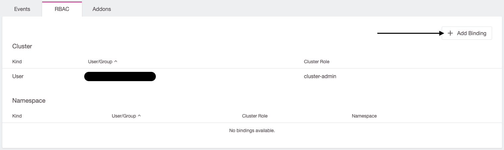
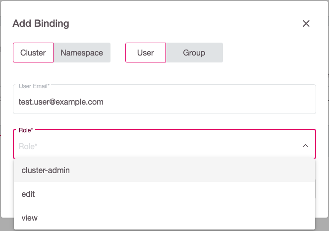
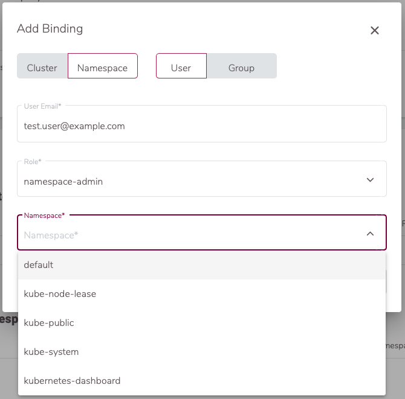
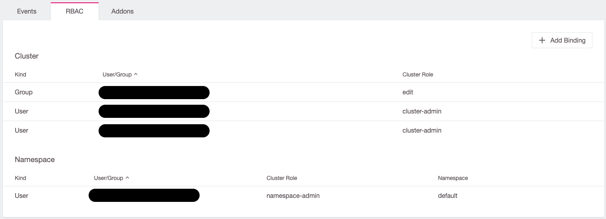
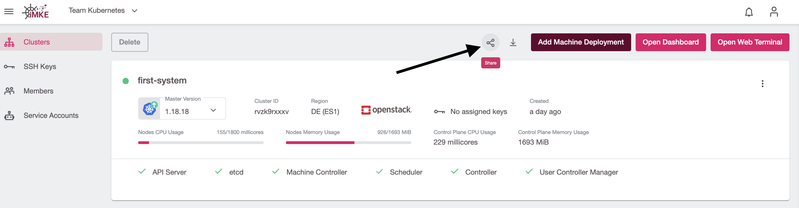
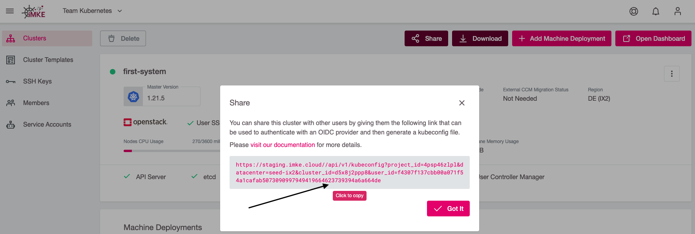
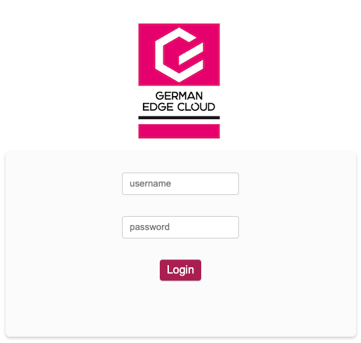

<!-- LTeX:  language=de-DE -->

Um einem Benutzer RBAC-basierten Zugriff auf einem Cluster einzurichten, klicken Sie im RBAC-Widget auf `Add Binding`:



### Cluster-weiter Zugriff

Um dann einen Cluster-weiten Zugriff zu gewähren, sollte im folgenden Pop-up weiter `Cluster` ausgewählt, die E-Mail-Adresse des Benutzers eingetragen und die entsprechende Rolle ausgewählt werden:



Dabei sollten Sie jedoch beachten, dass der Benutzer prinzipiell für iMKE autorisiert ist, da dieser Zugriff notwendig ist um die
`kubeconfig` herunterladen zu können. Die auswählbaren Rollen sind übrigens als `ClusterRoles` angelegt und können via `kubectl` betrachtet werden:

```bash
kubectl get clusterrole $NAME_OF_CLUSTERROLE -o yaml
```

### Namespace-weiter Zugriff

Wenn der Zugriff auf einen Namespace beschränkt werden soll, muss im `Add Binding`-Dialog auf `Namespace` gewechselt sowie die E-Mail-Adresse angegeben werden.

Im nächsten Schritt muss wiederum die Rolle ausgewählt werden, die dem Benutzer zugewiesen werden soll:


Zuletzt muss noch der Namespace ausgewählt werden, in dem diese Berechtigung gelten soll:



Die für diese Rollen gewährten Zugriffsberechtigungen können ebenfalls via `kubectl` abgefragt werden. Da `Roles` im Gegensatz zu `ClusterRoles` aber auf einen bestimmten Namespace bezogen sind, muss in diesem Fall auch der Namespace mit angegeben werden:

```bash
kubectl get role $NAME_OF_ROLE -n $NAMESPACE -o yaml
```

Nachdem Sie den Zugriff entsprechend gewährt haben, sollten die gewährten Rechte im Dashboard sichtbar sein:



## Den Benutzern die kubeconfig zur Verfügung stellen

Sobald einem Benutzer RBAC-Rechte zugewiesen wurden, können Sie diesem seine persönliche `kubeconfig` über einen speziellen Link zur Verfügung stellen.

Um dies zu tun, müssen Sie den `Share kubeconfig` Link im iMKE Dashboard öffnen:



Im nächsten Schritt müssen Sie den angezeigten Link kopieren und an den Nutzer schicken:



Der Link zeigt zu einer Login-Seite. Dort muss sich der Benutzer authentifizieren und kann danach direkt seine `kubeconfig` herunterladen:



Sobald ein Benutzer seine `kubeconfig` heruntergeladen hat, werden alle eventuellen weiteren Änderungen an den RBAC-Rechten sofort aktiv. Insbesondere ein entziehen der Rechte ist sofort umgesetzt, ein `Revoke Token` ist damit nicht notwendig.
