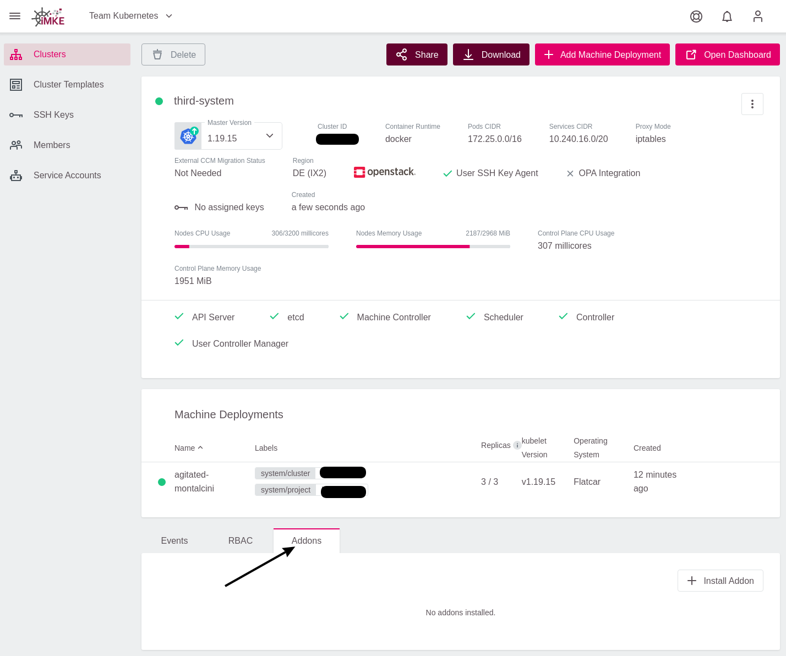
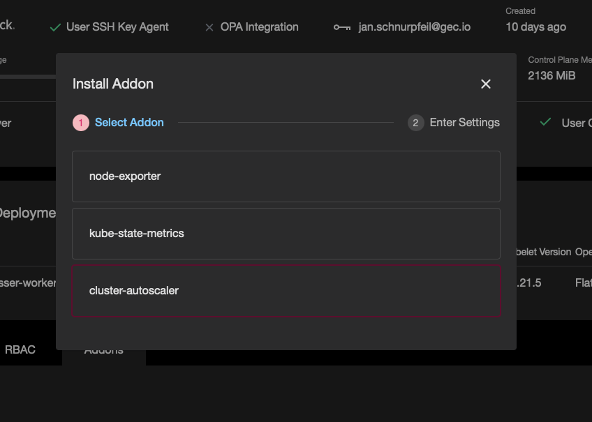
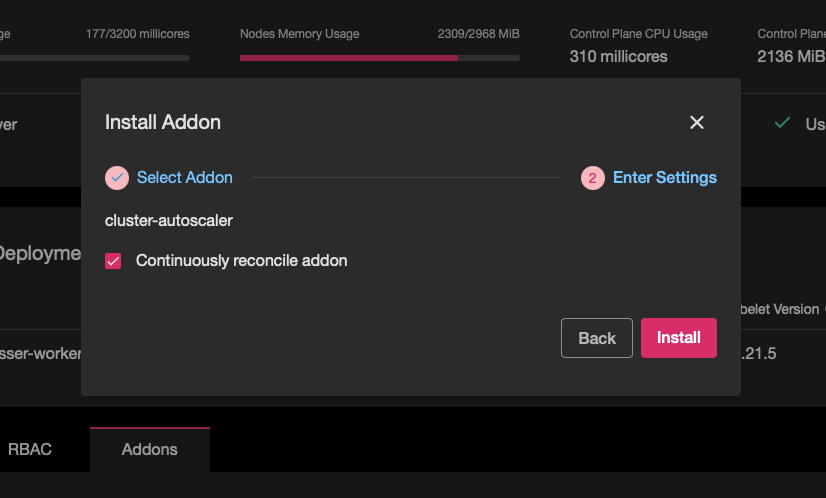
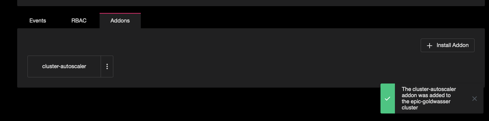
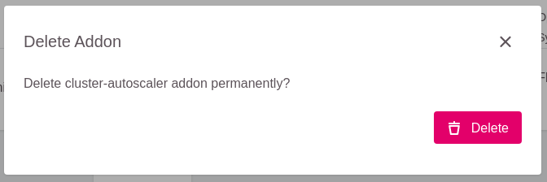

## What is a Cluster Autoscaler in Kubernetes?

Kubernetes Cluster Autoscaler is a tool that automatically adjusts the number of worker nodes in a cluster up or down depending on the consumption. This means that the Autoscaler, for example, scales up a Cluster by increasing the amount of nodes automatically when there are not enough node resources for Cluster workload scheduling and scales down when the node resources have continuously stayed idle, or more than enough node resources were available for Cluster workload scheduling. In a nutshell, it is a component that automatically adjusts the size of a Kubernetes Cluster so that all pods have a place to run and there are no unneeded nodes.

## Cluster Autoscaler Usage

The Kubernetes Autoscaler in the iMKE Cluster automatically scaled up/down when one of the following conditions is satisfied:

* Some pods failed to run in the cluster due to insufficient resources
* There are nodes in the cluster that have been underutilized for an extended period (10 minutes by default) and can place their Pods on other existing nodes

## Requirements

Using a Kubernetes cluster autoscaler in the iMKE cluster must meet specific minimum requirement:

* Kubernetes cluster running Kubernetes v1.18 or newer is required

## Installing Kubernetes Autoscaler on iMKE Clusters

You can install Kubernetes Autoscaler on a running iMKE Cluster using the iMKE addon mechanism, which is already built into the iMKE Cluster dashboard.

### Step 1

Create a iMKE Cluster by selecting your project on the dashboard and click on “Create Cluster”. More details can be found on [our documentation page](/imke/clusterlifecycle/creatingacluster/).

### Step 2

When the Cluster is ready, check the Pods in the kube-system Namespace to know if any Autoscaler is running.

```bash
$ kubectl get deployment -n kube-system
NAME                            READY   UP-TO-DATE   AVAILABLE   AGE
coredns                         2/2     2            2           1d
flatcar-linux-update-operator   1/1     1            1           1d
openvpn-client                  1/1     1            1           1d
```

As shown above, the Autoscaler is not part of the running Kubernetes components within the Namespace.

### Step 3

Add the Autoscaler to the Cluster under the addon section on the dashboard by clicking on the "Addons" and then "Install Addon".


Select `cluster-autoscaler`:


Select `Install`:



### Step 4

Go over to the cluster and check the pods in the kube-system namespace using the kubectl command.

```bash
$ kubectl get deployment -n kube-system
NAME                            READY   UP-TO-DATE   AVAILABLE   AGE
cluster-autoscaler              1/1     1            1           6m27s
coredns                         2/2     2            2           1d
flatcar-linux-update-operator   1/1     1            1           1d
openvpn-client                  1/1     1            1           1d
```
As shown above, the Autoscaler has been provisioned and running.

## Annotating MachineDeployments for autoscaling

The Cluster Autoscaler only considers MachineDeployment with valid annotations. The annotations are used to control the minimum and the maximum number of replicas per MachineDeployment. You don’t need to apply those annotations to all MachineDeployment objects, but only on MachineDeployments that Cluster Autoscaler should consider.

```
cluster.k8s.io/cluster-api-autoscaler-node-group-min-size - the minimum number of replicas (must be greater than zero)
cluster.k8s.io/cluster-api-autoscaler-node-group-max-size - the maximum number of replicas
```

You can apply the annotations to MachineDeployments once the Cluster is provisioned and the MachineDeployments are created and running by following the steps below.

### Step 1

Run the following `kubectl` command to check the available MachineDeployments:

```
$ kubectl get machinedeployments -n kube-system 
NAME                            AGE   DELETED   REPLICAS   AVAILABLEREPLICAS   PROVIDER    OS        VERSION
epic-goldwasser-worker-289mgt   1d              2          2                   openstack   flatcar   1.21.5
```

### Step 2

The annotation command will be used with one of the MachineDeployments above to annotate the desired MachineDeployments. In this case the `test-cluster-worker-v5drmq` will be annotated and the minimum and maximum will be set.

Minimum annotation:

```bash
$ kubectl annotate machinedeployment -n kube-system epic-goldwasser-worker-289mgt cluster.k8s.io/cluster-api-autoscaler-node-group-min-size="1"
machinedeployment.cluster.k8s.io/epic-goldwasser-worker-289mgt annotated
```

Maximum annotation:

```bash
$ kubectl annotate machinedeployment -n kube-system epic-goldwasser-worker-289mgt cluster.k8s.io/cluster-api-autoscaler-node-group-max-size="5"
machinedeployment.cluster.k8s.io/epic-goldwasser-worker-289mgt annotated
```

### Step 3

Check the MachineDeployment description:

```bash
$ kubectl describe machinedeployments -n kube-system epic-goldwasser-worker-289mgt
Name:         epic-goldwasser-worker-289mgt
Namespace:    kube-system
Labels:       <none>
Annotations:  cluster.k8s.io/cluster-api-autoscaler-node-group-max-size: 5
              cluster.k8s.io/cluster-api-autoscaler-node-group-min-size: 1
              machinedeployment.clusters.k8s.io/revision: 1
API Version:  cluster.k8s.io/v1alpha1
Kind:         MachineDeployment
Metadata:
  Creation Timestamp:  2021-10-04T09:44:48Z
  Finalizers:
    foregroundDeletion
  Generation:  1
  Managed Fields:
    API Version:  cluster.k8s.io/v1alpha1
    Fields Type:  FieldsV1

[...]
```

As shown above, the MachineDeployment has been annotated with a minimum of 1 and a maximum of 5. Therefore, the Autoscaler will consider only the annotated MachineDeployment on the Cluster.

## Delete Autoscaler

To delete the Autoscaler, click on the three dots in front of the Cluster Autoscaler in the Addons section of the Cluster dashboard and select delete.




Once it has been deleted, you can check the Cluster to ensure that the Autoscaler has been deleted using `kubectl get deployment -n kube-system` command.

## Summary

That is it! You have successfully deployed a Kubernetes Autoscaler on a iMKE Cluster and annotated the desired MachineDeployment, which Autoscaler should consider. Please check the learn more section below for more resources on Kubernetes Autoscaler and how to provision a iMKE Cluster.

### Learn More

* Read more on [Kubernetes autoscaler here](https://github.com/kubernetes/autoscaler/blob/master/cluster-autoscaler/FAQ.md#what-is-cluster-autoscaler).
