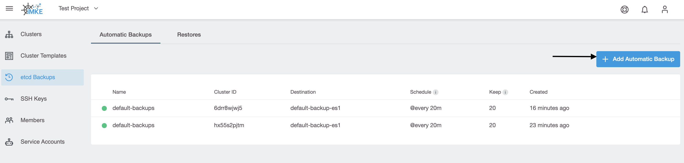
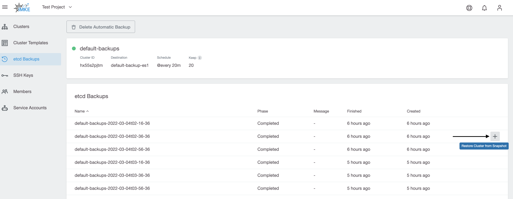

iMKE introduces a new backup and restore feature, which is enabled by default for all clusters.
The default backup configuration resource is created with a default of @every 20m interval and 20 backup retention.

However, it’s possible to create additional backup configuration if needed.

> Before starting please keep in mind that this is an etcd backup and restore. The only thing that is restored is the etcd state, not application data or similar.

## Creating Etcd Backups

EtcdBackups and Restores are resources bounded to a project, and you can manage them in the Project view.

To create a new backup, you need to click on the Add Automatic Backup button. You have a choice of preset daily, weekly or monthly backups, or you can create a backup with a custom interval and keep time.

To see all the available backups, click on a backup you are interested in,

and then you will see the list of the completed backups.

## Restoring Etcd Backups
If you want to restore a backup, you need to click on the restore from backup icon in the UI.

After that the cluster will get paused, etcd will get deleted, and then it will be recreated from the backup. When it’s done, the cluster will be unpaused again.
In the meantime, an EtcdRestore object will be created in the project, and you can observe its progress in the EtcdRestore list.

In the cluster view, you may notice that your cluster is in a Restoring state, and you can not interact with it until it is done.

When it’s done, the cluster will get un-paused and un-blocked, so you can use it. 
The Etcd Restore will go into a Completed state.

