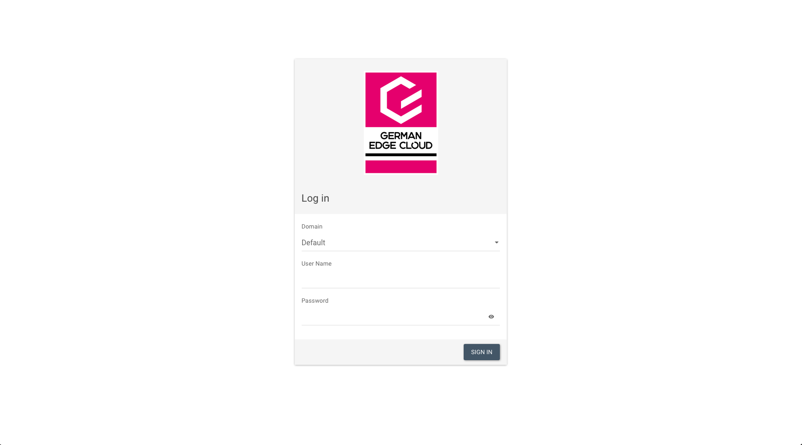

# Howto restore a PVC from an existing Openstack volume

Normally, creating a PVC (PersistentVolumeClaim) in one of our Kubernetes clusters triggers the creation of a *new* PV (PersistentVolume) in Kubernetes and a *new* Volume in Openstack respectively. But it is also possible to use an *existing* Openstack volume for that purpose. This document describes how to achieve this.

## Prerequisites

As a prerequisite, you of course need to have an available, unused volume in Openstack. This could be the case for example if you have deleted a cluster without deleting all atached PVCs before or if you want to move a volume from one cluster to another. In any case, if you follow these instructions, you likely know what you are doing and why.

To be able to use an existing Openstack volume in a Kubernetes cluster, we need to find out its ID. To do so, you have go to the [Openstack/Optimist Dashboard](https://dashboard.optimist.innovo.cloud/auth/login/):



There you have to log in with your credentials. The credentials of the Kubernetes UI and Openstack Dashboard are identical. Once you are logged in, navigate to `Volumes` and search for the volume which you want to use. That volume should not be used by any machine as of now and thus should have the status "Available". (Note: A volume can only be used by one instance at a time, so if it still in use, you have to detach it from the old instance first.)


After you found the volume you want to use, click on its name. This brings you to the volume details page where you can find the ID of the volume. Note down this ID.


## Adding the PV with the existing volume

To manually create a PV which references an existing volume, you have to specify the volume ID in the `spec.csi.volumeHandle`-key in the `PersistentVolume`-manifest:

```yaml
apiVersion: v1
kind: PersistentVolume
metadata:
  name: test-pv-restore
spec:
  accessModes:
  - ReadWriteOnce
  capacity:
    storage: 3Gi
  csi:
    driver: cinder.csi.openstack.org
    volumeHandle: 6515d33b-287d-43e1-a3c5-e347d2fc8135
  persistentVolumeReclaimPolicy: Delete
  storageClassName: cinder-csi
  volumeMode: Filesystem
```

Now apply this manifest and check if the PV got created successfully:

```bash
# kubectl apply -f restore-pv.yaml
persistentvolume/test-pv-restore created
# kubectl get pv
NAME              CAPACITY   ACCESS MODES   RECLAIM POLICY   STATUS      CLAIM   STORAGECLASS   REASON   AGE
test-pv-restore   3Gi        RWO            Delete           Available           cinder-csi              3s
```

This example created a PV named `test-pv-restore` which referenced the existing Openstack volume.

## Adding the PVC referencing the correct PV

As a next step, a PVC needs to be build which references the PV we just created. To do so, the PVC needs to have the `spec.volumeName`-key set to the PV name:

```yaml
apiVersion: v1
kind: PersistentVolumeClaim
metadata:
  name: test-pvc
spec:
  accessModes:
    - ReadWriteOnce
  resources:
    requests:
      storage: 3Gi
  volumeName: test-pv-restore
```

Applying this manifest should result in a PVC in state "Bound":

```bash
# kubectl apply -f restore-pvc.yaml
persistentvolumeclaim/test-pvc created
# kubectl get pvc
NAME       STATUS   VOLUME            CAPACITY   ACCESS MODES   STORAGECLASS   AGE
test-pvc   Bound    test-pv-restore   3Gi        RWO            cinder-csi     2s
```

This PVC named "test-pvc" is now ready to be used by a Pod.

## Creating a Test-Pod to inspect the data

As you may want to inspect the PVC before actually using it, let's create a test-pod to inspect the data on the volume:

```yaml
apiVersion: v1
kind: Pod
metadata:
  name: test-pod
spec:
  containers:
    - name: test-pod
      image: ubuntu
      command:
        - "sleep"
        - "604800"
      volumeMounts:
        - mountPath: "/restore"
          name: test-pvc
  volumes:
    - name: test-pvc
      persistentVolumeClaim:
        claimName: test-pvc
```

The important part in the above example is that the `claimName` is set correctly to the PVC which we just created. After applying the manifest and creating the Pod, the volume from our example is mounted under */restore* -- which we can check by executing into the pod and opening a shell:

```bash
# kubectl apply -f pvc-example/test-pod.yaml
pod/test-pod created
# kubectl get pod -w
NAME       READY   STATUS              RESTARTS   AGE
test-pod   0/1     ContainerCreating   0          5s
test-pod   0/1     ContainerCreating   0          17s
test-pod   1/1     Running             0          22s
^C
# kubectl exec -ti test-pod -- /bin/bash
root@test-pod:/# ls /restore/
lost+found  my_data.txt
root@test-pod:/# exit
exit
```

That's basically it -- you have used an existing Openstack volume and added to a Pod in your Kubernetes cluster.
