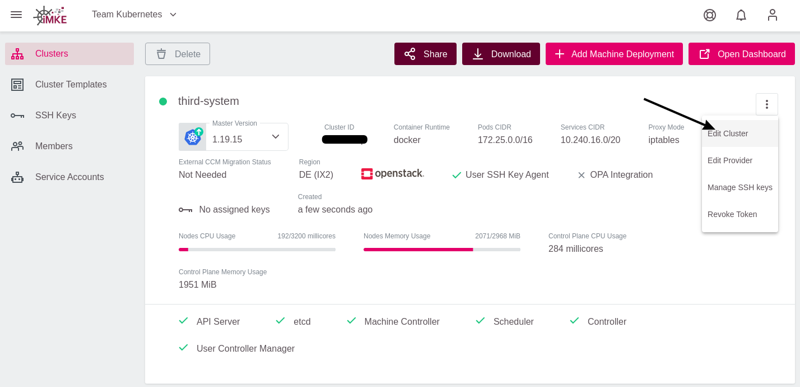
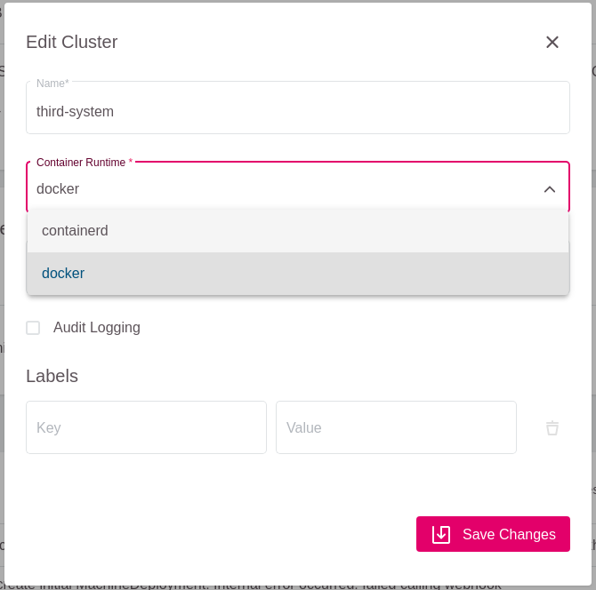
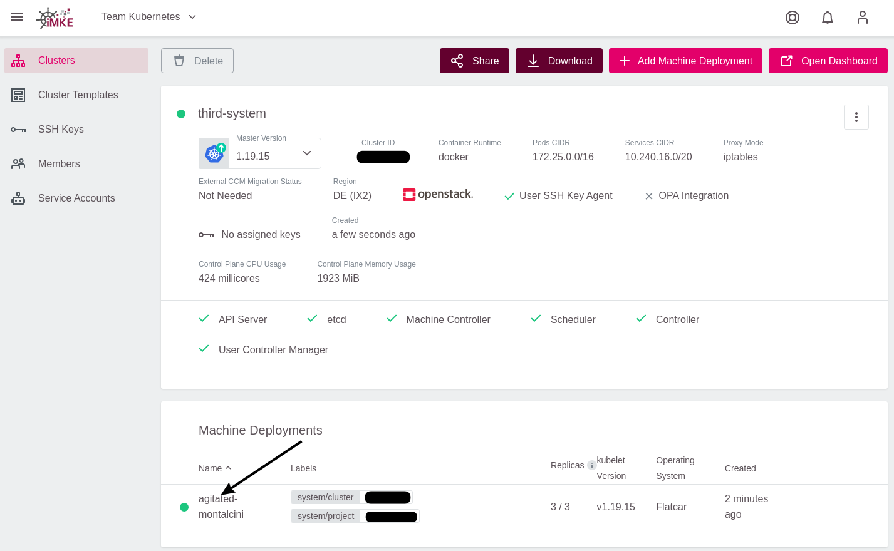
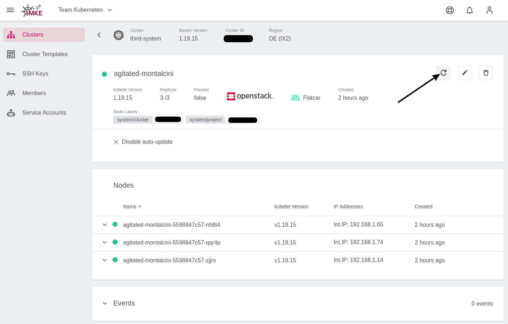
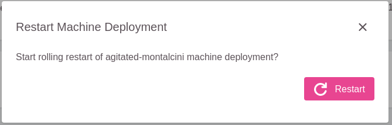

<!-- LTeX:  language=de-DE -->

## Informationen zur Container Runtime Engine

Lange Zeit wurde im Unterbau von Kubernetes docker (genauer gesagt der dockershim)
als Container Runtime Engine genutzt. Diese Softwarebasis und Integration
des dockershim zu pflegen und aktuell zu halten wurde mit der Zeit jedoch
immer aufwendiger, so dass die Kubernetes Maintainer sich dazu entschieden
einen generischeren Standard zu wählen, der weniger Aufwand bedeutet. Heraus
kam dabei der CRI Standard, für den es auch recht schnell Implementierungen
wie containerd oder cri-o gab. Da docker diesen Standard selbst nicht implementiert
musste der dockershim entwickelt werden.

Mit dem Kubernetes v1.20 Release wurde der Einsatz von dockershim ab v1.24
abgekündigt. Um iMKE Kubernetes Cluster auf die Version v1.24 updaten zu
können muss vorher die Container Runtime Engine auf eine CRI-Standard
konforme Implementierung migriert werden. Für iMKE cluster ist dies
*containerd*.


## Änderung der Container Runtime Engine Konfiguration

Die Migration wird vorbereitet indem die aktuelle Container Runtime Engine
des Kubernetes Clusters von *docker* auf *containerd* gestellt wird. Dazu
sind folgende Schritte notwendig:

1. Editieren der Cluster Konfiguration

   

1. Ändern des Werts des Feldes *Container Runtime* von *docker* nach *containerd* und anschließendes Speichern

   


## Ausführung der Migration

Um die Migration auszuführen müssen die Worker-Knoten einmal durchgestartet
werden. Dies kann entweder im Rahmen eines Kubernetes Upgrades geschehen,
oder durch einen Neustart des MachineDeployments. Da Ersteres bereits
[hier](/imke/clusterlifecycle/upgradingacluster/) dokumentiert ist wird
im Folgenden der Neustart im Detail beschrieben. Wichtig ist hierbei zu
Beachten dass ein Neustart des Machinedeployments unweigerlich alle PODs
mindestens einmal neu startet, da alle Worker-Knoten einmal ausgetauscht
werden.

1. Prüfung der aktuellen Container Runtime Engine auf der Konsole mit dem *kubectl*-Kommando:
   ```bash
   $ kubectl describe node  | grep "Container Runtime Version"
   Container Runtime Version:  docker://19.3.15
   Container Runtime Version:  docker://19.3.15
   Container Runtime Version:  docker://19.3.15
   ```
   Die Ausgabe des Befehls zeigt dass aktuell der dockershim verwendet wird.

1. Neustart des MachineDeployment durch:
    1. Auswählen des MachineDeployments im Cluster-Bildschirm

       

    1. Drücken des Restart-Knopfs im MachineDeployment Bildschirm

       

    1. Bestätigen dass der Neustart des MachineDeployments wirklich durchgeführt werden soll:

       

   Nun werden alle Worker Knoten nacheinander aus dem Cluster rotiert und
   durch frische Knoten ersetzt. Nachdem der letzte Knoten durchgetauscht
   wurde ist der Neustart des MachineDeployments abgeschlossen.

1. Erneute Prüfung welche Container Runtime Engine nach dem Neustart läuft:
   ```bash
   $ kubectl describe node  | grep "Container Runtime Version"
   Container Runtime Version:  containerd://1.5.4
   Container Runtime Version:  containerd://1.5.4
   Container Runtime Version:  containerd://1.5.4
   ```

Damit ist die Migration der Container Runtime Engine von *docker* nach
*containerd* abgeshlossen.

## Weitere Informationen

Für weitere Hintergrundinformationen sind folgende Links empfehlenswert:

* <https://kubernetes.io/blog/2020/12/02/dockershim-faq/>
* <https://kubernetes.io/blog/2020/12/02/dont-panic-kubernetes-and-docker/>
