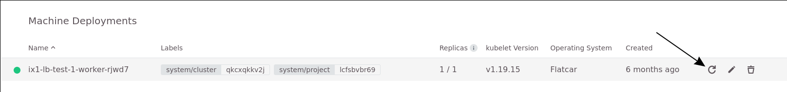

It is now possible to migrate cluster that still uses the in-tree to the external cloud provider.

**This need to be done latest before the upgrade to kubernetes 1.22.** as the in-tree provider will be removed in that version.

You can verify the if you need to migrate in the cluster details page.

# Migration Process

If you need special assistance, please contact the GEC Support.

## Step 1 start migration

Press the update button and ok.

That will trigger the control plane update and migrate al pv to the new cinder csi plugin.

**Loadblancer will get a new IP**

While migrating all old netron loadblancer will be replaced with a new octavia loadblancer.

At this state you will have two lbs, the old neutron loadblancer with the old IP and a new octavia loadblancer with a new IP.

## Step 2 fix/update IP/DNS setting

You can either update your DNS settings now or move the old FIP from the neutron to the new octavia loadblancer.

Changing DNS has no downtime and should be prepared with a reduction of the TTL before starting the migration.

Change the FIP will lead to a small downtime, while detatching it from the neutron and reattachin to the octavia loadblancer.

**NOTE: don't recreate your node before finisch this step! That will lead to a downtime, as the old loadblancer will not be updated**

## Step 3 rotate machinedeployment

rotate your machines to finisch the migration.

**Note: the old neutron loadblancer will stop working at that point**

## Step 4 cleanup

Delete the old neutron loadblancer.
